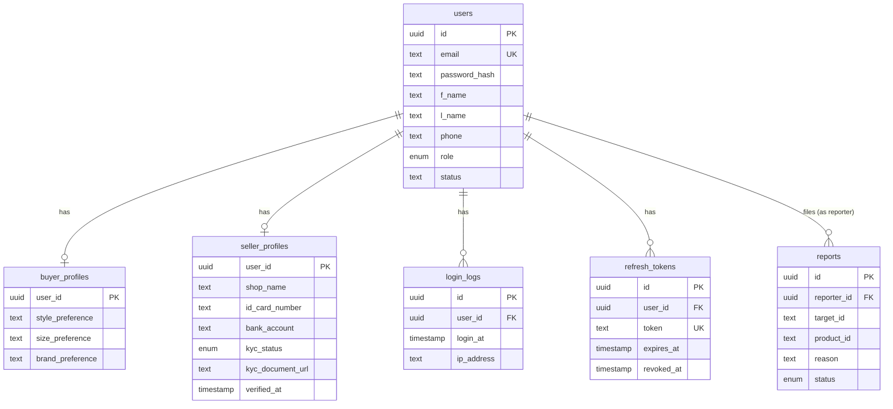

# RE-LOOP — Database schema (current)

Every table that exists right now, across every service database. Generated from the live
Prisma schemas — see [`ER-changes.md`](./ER-changes.md) for *why* each table looks the way it
does versus the original ER diagram, and the `.prisma` files in this folder for the raw source.

| Database | Owning service | Tables |
|---|---|---|
| `reloop_auth` | `auth-service` | 6 |
| `reloop_product` | `product-service` | — not created yet |
| `reloop_order` | `order-service` | — not created yet |
| `reloop_chat` | `chat-service` | — not created yet |
| `reloop_review` | `review-service` | — not created yet |

---

## `reloop_auth`

Source: [`auth-service.prisma`](./auth-service.prisma)

### `users`

| Column | Type | Constraints | Notes |
|---|---|---|---|
| id | uuid | PK, default `uuid()` | |
| email | text | unique, not null | |
| password_hash | text | not null | bcrypt hash |
| f_name | text | not null | ER: `FName` |
| l_name | text | not null | ER: `LName` |
| phone | text | nullable | |
| role | enum `Role` | not null, default `BUYER` | `BUYER` \| `SELLER` \| `ADMIN` |
| status | text | not null, default `'ACTIVE'` | |
| created_at | timestamp | not null, default `now()` | |
| updated_at | timestamp | not null, auto-update | |

Relations: has one `buyer_profiles`, one `seller_profiles`, many `login_logs`,
many `refresh_tokens`, many `reports` (as reporter).

### `buyer_profiles`

| Column | Type | Constraints | Notes |
|---|---|---|---|
| user_id | uuid | PK, FK → `users.id` | 1:1 with `users` |
| style_preference | text | nullable | filled by the Phase 2 style quiz — not populated yet |
| size_preference | text | nullable | " |
| brand_preference | text | nullable | " |

### `seller_profiles`

| Column | Type | Constraints | Notes |
|---|---|---|---|
| user_id | uuid | PK, FK → `users.id` | 1:1 with `users` |
| shop_name | text | not null | |
| id_card_number | text | nullable | |
| bank_account | text | nullable | |
| kyc_status | enum `KycStatus` | not null, default `NONE` | `NONE` \| `PENDING` \| `VERIFIED` \| `REJECTED` |
| kyc_document_url | text | nullable | |
| verified_at | timestamp | nullable | |

No rows are created here yet — seller onboarding ("เปิดร้านค้า") has no endpoint yet, table
only exists so the shape is ready when that phase lands.

### `login_logs`

| Column | Type | Constraints | Notes |
|---|---|---|---|
| id | uuid | PK, default `uuid()` | |
| user_id | uuid | FK → `users.id`, not null | |
| login_at | timestamp | not null, default `now()` | |
| ip_address | text | nullable | from `req.ip` |

Written on every successful `POST /api/auth/login`.

### `refresh_tokens`

| Column | Type | Constraints | Notes |
|---|---|---|---|
| id | uuid | PK, default `uuid()` | |
| user_id | uuid | FK → `users.id`, not null | |
| token | text | unique, not null | the signed JWT itself; includes a random `jti` so two tokens issued in the same second never collide |
| expires_at | timestamp | not null | 7 days from issue |
| revoked_at | timestamp | nullable | set on logout |
| created_at | timestamp | not null, default `now()` | |

Not in the original ER diagram — added to support JWT refresh/revoke (see `ER-changes.md`).

### `reports`

| Column | Type | Constraints | Notes |
|---|---|---|---|
| id | uuid | PK, default `uuid()` | |
| reporter_id | uuid | FK → `users.id`, not null | |
| target_id | text | nullable | reported user/seller — plain string, no FK (may not be a user) |
| product_id | text | nullable | reported product — plain string, no FK (owned by `product-service`'s own database) |
| reason | text | not null | |
| status | enum `ReportStatus` | not null, default `OPEN` | `OPEN` \| `REVIEWED` \| `ACTIONED` \| `DISMISSED` |
| reported_at | timestamp | not null, default `now()` | |

No submission endpoint yet — table only, per the "no ER table gets cut" rule.

### Enums (`reloop_auth`)

| Enum | Values |
|---|---|
| `Role` | `BUYER`, `SELLER`, `ADMIN` |
| `KycStatus` | `NONE`, `PENDING`, `VERIFIED`, `REJECTED` |
| `ReportStatus` | `OPEN`, `REVIEWED`, `ACTIONED`, `DISMISSED` |

### Entity relationship diagram

---

## Other services

`product-service`, `order-service`, `chat-service`, `review-service` don't have a Prisma schema
yet — their databases (`reloop_product`, `reloop_order`, `reloop_chat`, `reloop_review`) exist
(created by `infra/postgres/init-databases.sql`) but are empty. This file gets a new section per
service as each one's schema is built — see `plan/00-master-plan.md` section 2 for the planned
table list per service.
