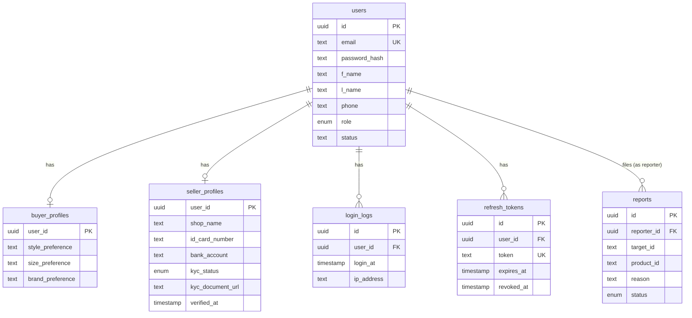
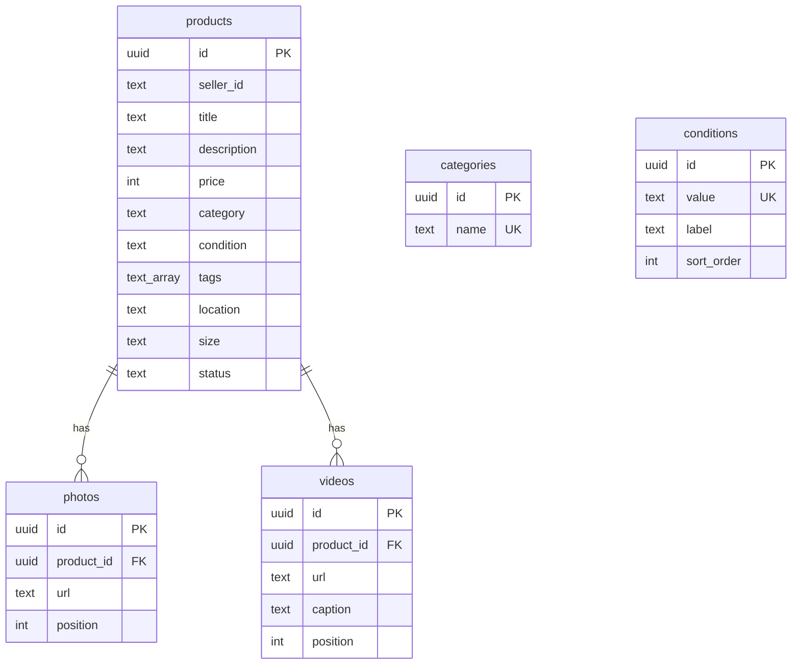
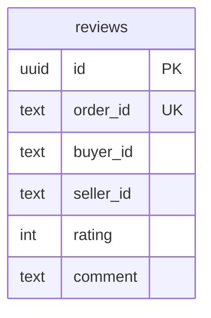

# RE-LOOP — Database schema (current)

Every table that exists right now, across every service database. Generated from the live
Prisma schemas — see [`ER-changes.md`](./ER-changes.md) for _why_ each table looks the way it
does versus the original ER diagram, and the `.prisma` files in this folder for the raw source.

| Database         | Owning service    | Tables            |
| ---------------- | ----------------- | ----------------- |
| `reloop_auth`    | `auth-service`    | 6                 |
| `reloop_product` | `product-service` | 5                 |
| `reloop_order`   | `order-service`   | 1                 |
| `reloop_review`  | `review-service`  | 1                 |
| `reloop_chat`    | `chat-service`    | — not created yet |

---

## `reloop_auth`

Source: [`auth-service.prisma`](./auth-service.prisma)

### `users`

| Column        | Type        | Constraints                  | Notes                          |
| ------------- | ----------- | ---------------------------- | ------------------------------ |
| id            | uuid        | PK, default `uuid()`         |                                |
| email         | text        | unique, not null             |                                |
| password_hash | text        | not null                     | bcrypt hash                    |
| f_name        | text        | not null                     | ER: `FName`                    |
| l_name        | text        | not null                     | ER: `LName`                    |
| phone         | text        | nullable                     |                                |
| role          | enum `Role` | not null, default `BUYER`    | `BUYER` \| `SELLER` \| `ADMIN` \| `EXECUTIVE` |
| status        | text        | not null, default `'ACTIVE'` |                                |
| created_at    | timestamp   | not null, default `now()`    |                                |
| updated_at    | timestamp   | not null, auto-update        |                                |

Relations: has one `buyer_profiles`, one `seller_profiles`, many `login_logs`,
many `refresh_tokens`, many `reports` (as reporter).

### `buyer_profiles`

| Column           | Type | Constraints         | Notes                                                |
| ---------------- | ---- | ------------------- | ---------------------------------------------------- |
| user_id          | uuid | PK, FK → `users.id` | 1:1 with `users`                                     |
| style_preference | text | nullable            | filled by the Phase 2 style quiz — not populated yet |
| size_preference  | text | nullable            | "                                                    |
| brand_preference | text | nullable            | "                                                    |

### `seller_profiles`

| Column           | Type             | Constraints              | Notes                                           |
| ---------------- | ---------------- | ------------------------ | ----------------------------------------------- |
| user_id          | uuid             | PK, FK → `users.id`      | 1:1 with `users`                                |
| shop_name        | text             | not null                 |                                                 |
| id_card_number   | text             | nullable                 |                                                 |
| bank_account     | text             | nullable                 |                                                 |
| kyc_status       | enum `KycStatus` | not null, default `NONE` | `NONE` \| `PENDING` \| `VERIFIED` \| `REJECTED` |
| kyc_document_url | text             | nullable                 |                                                 |
| verified_at      | timestamp        | nullable                 |                                                 |

No rows are created here yet — seller onboarding ("เปิดร้านค้า") has no endpoint yet, table
only exists so the shape is ready when that phase lands.

### `login_logs`

| Column     | Type      | Constraints               | Notes         |
| ---------- | --------- | ------------------------- | ------------- |
| id         | uuid      | PK, default `uuid()`      |               |
| user_id    | uuid      | FK → `users.id`, not null |               |
| login_at   | timestamp | not null, default `now()` |               |
| ip_address | text      | nullable                  | from `req.ip` |

Written on every successful `POST /api/auth/login`.

### `refresh_tokens`

| Column     | Type      | Constraints               | Notes                                                                                                |
| ---------- | --------- | ------------------------- | ---------------------------------------------------------------------------------------------------- |
| id         | uuid      | PK, default `uuid()`      |                                                                                                      |
| user_id    | uuid      | FK → `users.id`, not null |                                                                                                      |
| token      | text      | unique, not null          | the signed JWT itself; includes a random `jti` so two tokens issued in the same second never collide |
| expires_at | timestamp | not null                  | 7 days from issue                                                                                    |
| revoked_at | timestamp | nullable                  | set on logout                                                                                        |
| created_at | timestamp | not null, default `now()` |                                                                                                      |

Not in the original ER diagram — added to support JWT refresh/revoke (see `ER-changes.md`).

### `reports`

| Column      | Type                | Constraints               | Notes                                                                              |
| ----------- | ------------------- | ------------------------- | ---------------------------------------------------------------------------------- |
| id          | uuid                | PK, default `uuid()`      |                                                                                    |
| reporter_id | uuid                | FK → `users.id`, not null |                                                                                    |
| target_id   | text                | nullable                  | reported user/seller — plain string, no FK (may not be a user)                     |
| product_id  | text                | nullable                  | reported product — plain string, no FK (owned by `product-service`'s own database) |
| reason      | text                | not null                  |                                                                                    |
| status      | enum `ReportStatus` | not null, default `OPEN`  | `OPEN` \| `REVIEWED` \| `ACTIONED` \| `DISMISSED`                                  |
| reported_at | timestamp           | not null, default `now()` |                                                                                    |

No submission endpoint yet — table only, per the "no ER table gets cut" rule.

### Enums (`reloop_auth`)

| Enum           | Values                                      |
| -------------- | ------------------------------------------- |
| `Role`         | `BUYER`, `SELLER`, `ADMIN`, `EXECUTIVE`     |
| `KycStatus`    | `NONE`, `PENDING`, `VERIFIED`, `REJECTED`   |
| `ReportStatus` | `OPEN`, `REVIEWED`, `ACTIONED`, `DISMISSED` |

### Entity relationship diagram

---

## `reloop_product`

Source: [`product-service.prisma`](./product-service.prisma)

### `products`

| Column      | Type      | Constraints                     | Notes                                                                          |
| ----------- | --------- | ------------------------------- | ------------------------------------------------------------------------------ |
| id          | uuid      | PK, default `uuid()`            |                                                                                |
| seller_id   | text      | not null                        | no FK — owned by `auth-service`'s database, cross-service refs aren't possible |
| title       | text      | not null                        |                                                                                |
| description | text      | not null, default `''`          |                                                                                |
| price       | int       | not null                        | whole baht, no decimals                                                        |
| category    | text      | not null                        | denormalized name — see `categories` below                                     |
| condition   | text      | not null, default `'Good'`      | validated against `conditions.value`, not a DB constraint                      |
| tags        | text[]    | not null, default `{}`          | freeform, no taxonomy table                                                    |
| location    | text      | not null, default `''`          |                                                                                |
| size        | text      | not null, default `'Free size'` |                                                                                |
| status      | text      | not null, default `'available'` | `available` \| `reserved` \| `sold` \| `removed`                               |
| created_at  | timestamp | not null, default `now()`       |                                                                                |
| updated_at  | timestamp | not null, auto-update           |                                                                                |

Relations: has many `photos`, many `videos`.

### `photos`

| Column     | Type      | Constraints                                  | Notes                                        |
| ---------- | --------- | -------------------------------------------- | -------------------------------------------- |
| id         | uuid      | PK, default `uuid()`                         |                                              |
| product_id | uuid      | FK → `products.id`, not null, cascade delete |                                              |
| url        | text      | not null                                     | `/uploads/<file>`, served by product-service |
| position   | int       | not null, default `0`                        | display order; `0` is the cover              |
| created_at | timestamp | not null, default `now()`                    |                                              |

### `videos`

| Column     | Type      | Constraints                                  | Notes                                            |
| ---------- | --------- | -------------------------------------------- | ------------------------------------------------ |
| id         | uuid      | PK, default `uuid()`                         |                                                  |
| product_id | uuid      | FK → `products.id`, not null, cascade delete |                                                  |
| url        | text      | not null                                     |                                                  |
| caption    | text      | not null, default `''`                       |                                                  |
| position   | int       | not null, default `0`                        | shares the same order space as `photos.position` |
| created_at | timestamp | not null, default `now()`                    |                                                  |

### `categories`

| Column     | Type      | Constraints               | Notes                                                                      |
| ---------- | --------- | ------------------------- | -------------------------------------------------------------------------- |
| id         | uuid      | PK, default `uuid()`      |                                                                            |
| name       | text      | unique, not null          | source of truth for category names — used to be a hardcoded frontend array |
| created_at | timestamp | not null, default `now()` |                                                                            |

New rows are created automatically the first time a seller types a category name that
doesn't already exist (see `productModel.ensureCategory`) — sellers can still enter categories
freely, but every name used ends up as real, queryable data instead of living only in a
listing's `category` string.

### `conditions`

| Column     | Type | Constraints           | Notes                                           |
| ---------- | ---- | --------------------- | ----------------------------------------------- |
| id         | uuid | PK, default `uuid()`  |                                                 |
| value      | text | unique, not null      | `New` \| `Like New` \| `Good` \| `Fair`         |
| label      | text | not null              | Thai display label, e.g. `"ใหม่มาก (Like New)"` |
| sort_order | int  | not null, default `0` |                                                 |

Fixed set, seeded by `prisma/seed.js`. `products.condition` is validated against this table's
`value` column at write time instead of a hardcoded array in the controller.

### Entity relationship diagram

---

## `reloop_order`

Source: [`order-service.prisma`](./order-service.prisma)

### `orders`

| Column        | Type      | Constraints                   | Notes                                                        |
| ------------- | --------- | ----------------------------- | ------------------------------------------------------------ |
| id            | uuid      | PK, default `uuid()`          |                                                              |
| buyer_id      | text      | not null                      | no FK — owned by `auth-service`                              |
| seller_id     | text      | not null                      | no FK — owned by `auth-service`                              |
| product_id    | text      | not null                      | no FK — owned by `product-service`                           |
| product_title | text      | not null                      | snapshot at purchase time                                    |
| price         | int       | not null                      | snapshot at purchase time                                    |
| status        | text      | not null, default `'pending'` | `pending` (cart-locked) → `completed` (paid), or `cancelled` |
| created_at    | timestamp | not null, default `now()`     |                                                              |
| updated_at    | timestamp | not null, auto-update         |                                                              |

---

## `reloop_review`

Source: [`review-service.prisma`](../backend/services/review-service/prisma/schema.prisma)

### `reviews`

| Column     | Type      | Constraints                | Notes                                                             |
| ---------- | --------- | --------------------------- | -------------------------------------------------------------------- |
| id         | uuid      | PK, default `uuid()`        |                                                                       |
| order_id   | text      | unique, not null            | no FK — owned by `order-service`; one review per completed order     |
| buyer_id   | text      | not null                    | no FK — owned by `auth-service`                                      |
| seller_id  | text      | not null, indexed           | no FK — owned by `auth-service`                                      |
| rating     | int       | not null                    | 1–5, validated at the API layer                                      |
| comment    | text      | not null, default `''`      | truncated to 1000 chars at write time                                |
| created_at | timestamp | not null, default `now()`   |                                                                       |

Not in the original ER diagram at all — added because second-hand listings sell exactly once, so
a review rates the **seller** (the party the buyer keeps dealing with across purchases), not the
individual product.

### Entity relationship diagram

## Other services

`chat-service` doesn't have a Prisma schema yet — its database (`reloop_chat`) exists (created by
`infra/postgres/init-databases.sql`) but is empty. This is the only remaining service without a
schema. See `plan/00-master-plan.md` section 2 for the planned table list.
