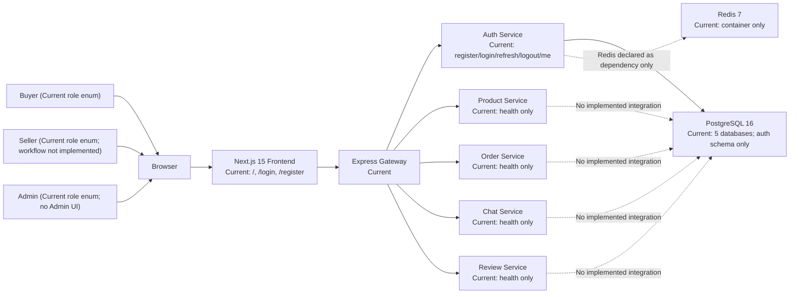
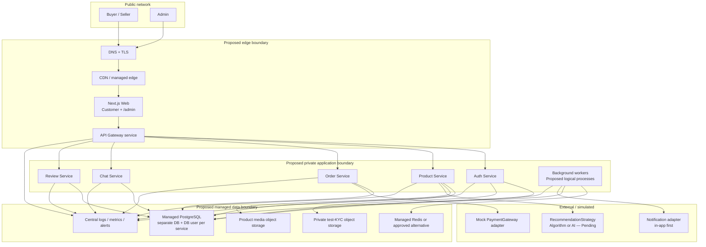
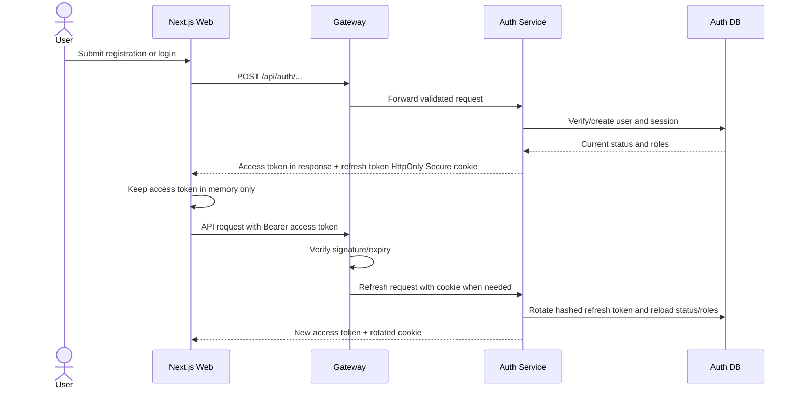
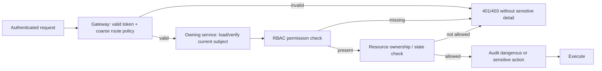
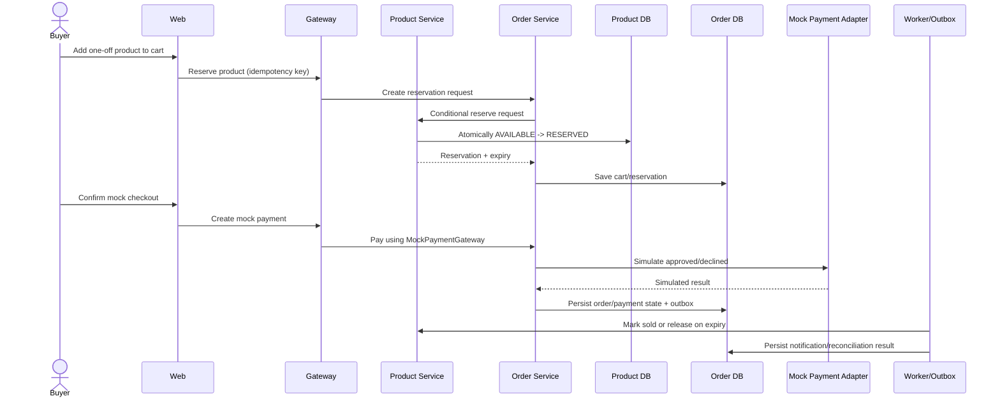
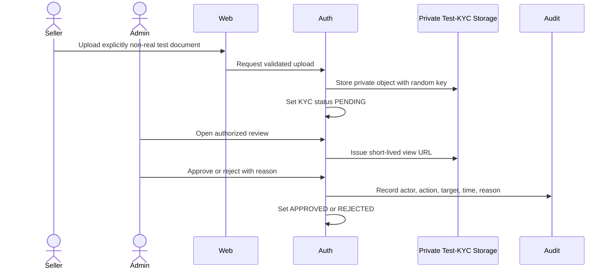
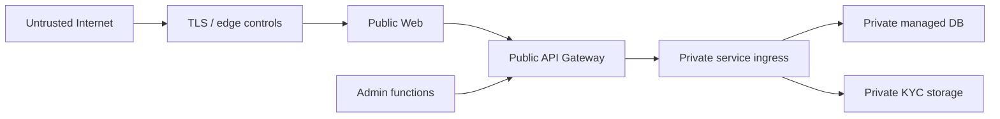
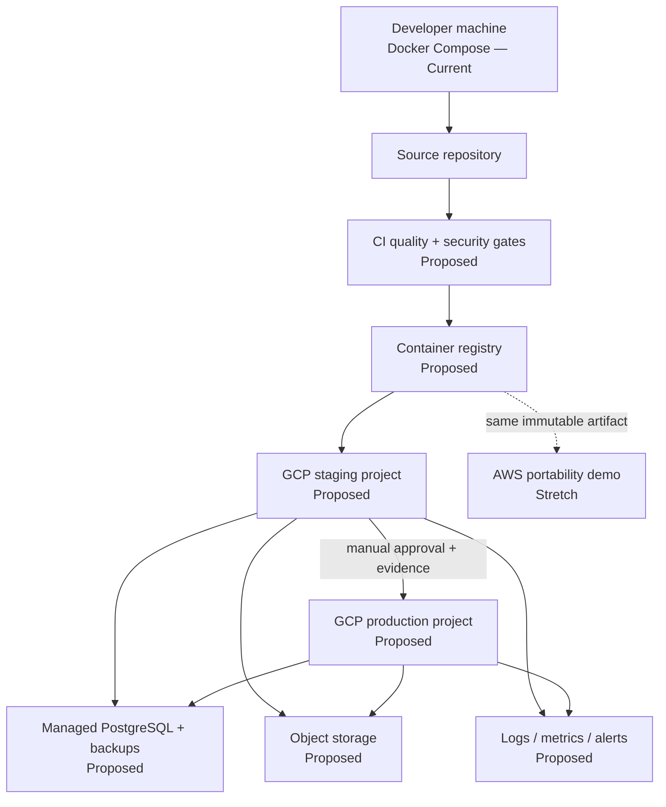

# RE-LOOP Architecture

> Status: Planning baseline — no production implementation is performed by this document.
>
> Evidence priority: confirmed user answers → source/configuration → Prisma schema → discovery findings → still-valid legacy documents → explicitly labelled assumptions.

## 1. Scope and status legend

- **Current**: verified in the repository as of 2026-07-28.
- **Proposed**: target design that still requires implementation and verification.
- **Confirmed requirement**: explicitly confirmed by the user.
- **Temporary working assumption**: selected to make the plan executable; it is not a confirmed business fact.
- **Pending decision**: cannot be finalized until an identified question is answered.
- **Stretch**: optional work after the primary GCP release is stable.

The Release A boundary is the public coursework marketplace for Buyer, Seller, and Admin. Customer work is the main priority. The plan preserves extension seams for future Customer Support (B) and Marketing/Executive/Auction/BI/Risk (C), but does not silently include those future features in Release A.

## 2. Evidence-backed current architecture

### 2.1 Current system context

Evidence:

- `frontend/app/`, `frontend/components/NavBar.js`, `frontend/lib/api.js`, `frontend/lib/auth.js`
- `backend/gateway/src/server.js`
- `backend/services/auth-service/src/`
- `backend/services/*-service/src/app.js`
- `backend/services/auth-service/prisma/schema.prisma`
- `infra/postgres/init-databases.sql`
- `docker-compose.yml`

### 2.2 Current containers and boundaries

| Boundary                  | Current state                                                                                                   | Evidence                                | Limitation                                                                  |
| ------------------------- | --------------------------------------------------------------------------------------------------------------- | --------------------------------------- | --------------------------------------------------------------------------- |
| Customer frontend         | One Next.js application with home, login, register                                                              | `frontend/app/`                         | No marketplace lifecycle                                                    |
| Admin frontend            | Not started                                                                                                     | No admin routes/components found        | Role enum alone is not an Admin feature                                     |
| Shared frontend           | `api.js`, `auth.js`, `NavBar.js` only                                                                           | `frontend/lib/`, `frontend/components/` | No design system, form library, route guard, or test harness                |
| Gateway                   | Proxies `/api/auth`, `/api/products`, `/api/orders`, `/api/chat`, `/api/reviews`; validates bearer access token | `backend/gateway/src/server.js`         | Open CORS; WebSocket upgrade bypasses normal auth middleware                |
| Auth service              | Register, login, refresh, logout, `/me`                                                                         | `backend/services/auth-service/src/`    | Single role, localStorage tokens, plaintext stored refresh JWT, no rotation |
| Product/Order/Chat/Review | Health endpoints only                                                                                           | each service `src/app.js`               | No routes, domain logic, schema, tests                                      |
| Database                  | One PostgreSQL container, one logical database per service; auth tables only                                    | `docker-compose.yml`, Prisma schema     | `db push`, no migration history, four empty databases                       |
| Cache/jobs                | Redis container exists                                                                                          | `docker-compose.yml`                    | No Redis/BullMQ/pub-sub implementation                                      |
| Storage                   | Local named volume declared for product uploads                                                                 | `docker-compose.yml`                    | No upload handler; no private KYC storage                                   |
| Infrastructure            | Docker Compose development topology                                                                             | `docker-compose.yml`                    | No IaC, environments, cloud, CI/CD, backup, monitoring                      |

## 3. Target architecture principles

1. **Deliver Release A first.** Buyer and Seller lifecycle is primary; a minimum safe Admin capability is mandatory because registration is public.
2. **Preserve course-aligned service boundaries.** Under `ADR-001`, the existing gateway plus five domain services remain separate deployables for now. No extra services are introduced for B/C.
3. **Use one shared frontend application for Release A.** Under `ADR-002`, customer and `/admin` route groups share Next.js, shared components, and a single deployment while remaining authorization-separated.
4. **Every Proposed component has a test and operations path.** A component is not production-ready until it has automated checks, metrics/logs, rollback, and ownership.
5. **Adapters isolate uncertain/external choices.** Storage, mock payment, notifications, and recommendation strategies use interfaces so GCP/AWS or algorithm/AI choices do not infect business logic.
6. **No real payment or real KYC documents.** The system must visibly identify itself as a demo. Public account email/profile data may still be personal data and is gated by `ADR-012`; a warning alone does not remove privacy obligations.
7. **Default deny at every trust boundary.** Frontend visibility is not authorization; gateway and owning service enforce permissions.

## 4. Proposed target containers

All nodes in the target diagram are **Proposed** unless the same component is explicitly described as Current in section 2. Managed cloud products and region remain subject to `ADR-005` and `ADR-011`.

## 5. Frontend architecture

### 5.1 Customer frontend

**Current:** App Router JavaScript pages for home/login/register. Session tokens and user data are stored in `localStorage`.

**Proposed:** One responsive Next.js application with route groups for public pages, authenticated customer pages, and seller workspace. The customer application consumes only gateway APIs. It contains:

- shared design tokens and accessible UI primitives;
- public demo/no-real-payment/no-real-document warnings;
- in-memory access token handling and refresh-cookie bootstrap;
- Buyer flows: profile, catalog, filters, recommendation seam, product detail, cart lock, mock checkout, order state, chat, review, report;
- Seller flows: test-KYC submission, listing/media, inventory state, order fulfilment, chat, review visibility;
- explicit loading, empty, error, stale, unauthorized, and retry states.

### 5.2 Admin frontend

**Current:** Not started.

**Proposed:** `/admin` route group in the same Next.js deployable under `ADR-002`, with separate navigation, route guards, permission-aware controls, re-authentication for dangerous actions, and audit correlation. Minimum Release A capabilities:

- safety dashboard;
- test-KYC review and approve/reject;
- user/product/report search and filters;
- ban/unban and content moderation with confirmation;
- dispute evidence viewing and simulated payment hold/release;
- audit-log view;
- bounded bulk actions and safe export/import only after explicit permission and validation.

CS, Marketing, Executive, auction, campaign, BI, and risk screens are extension seams, not Release A features.

### 5.3 Shared frontend packages

**Current:** shared code is only the small `frontend/lib` and `frontend/components` set.

**Proposed:** shared modules remain inside the frontend workspace initially:

- API client and typed/validated response contracts;
- session bootstrap and authorization helpers;
- design system and form/error components;
- feature flags and environment banner;
- audit correlation ID display for support;
- test fixtures.

Extracting a separately published frontend package is out of scope unless reuse by a second application is proven.

## 6. Backend and API architecture

### 6.1 Service ownership

| Service | Owns                                                                                                      | Must not own                                  |
| ------- | --------------------------------------------------------------------------------------------------------- | --------------------------------------------- |
| Gateway | edge routing, coarse authentication, CORS, rate limit, request ID, secure headers                         | business decisions or direct DB access        |
| Auth    | users, multi-role assignments, sessions, seller profile/KYC state, login/audit identity                   | product/order records                         |
| Product | products, media metadata, inventory/listing state, search/filter data, recommendation inputs              | payment/order state                           |
| Order   | cart reservation, order, mock payment, shipping state, dispute financial state                            | authentication source of truth                |
| Chat    | rooms/messages and access checks based on participating users/orders                                      | general notifications or moderation decisions |
| Review  | reviews, reports/moderation cases, seller aggregates, in-app notifications where retained by final design | user passwords or payment details             |

`ARCH-001` must turn this table into versioned API/event contracts before domain implementation.

Admin never becomes a cross-database super-service. Auth owns ban/unban and account status; Product owns listing moderation; Order owns disputes and simulated hold/release/refund; Review owns cases/reports. Each owner writes append-only local privileged audit records. Versioned outbox events feed a Review-owned read-only case/audit projection.

### 6.2 API conventions

**Proposed:** JSON over HTTPS through the gateway, explicit API versioning strategy, schema validation at input boundaries, stable error envelopes, request/correlation IDs, pagination limits, idempotency keys for state-changing transaction endpoints, and allow-listed CORS. WebSocket authentication must be validated during upgrade/handshake and authorization rechecked on room join.

Services validate caller identity and permission themselves. They must not trust arbitrary public `x-user-id` or `x-user-role` headers. Current `requireInternalToken` can fail open when both configuration and header are absent; `API-001` must require startup failure and a missing-env/missing-header regression test. Service-to-service access uses workload identity or a fail-closed secret/mTLS mechanism.

## 7. Authentication and authorization

### 7.1 Proposed authentication flow

This flow is **Proposed but based on a confirmed user choice**. Current code returns both tokens in JSON and stores them in `localStorage`.

### 7.2 Proposed authorization flow

Release A roles are Buyer, Seller, Admin, with one account able to hold multiple roles. Permissions, not role-name checks scattered through code, govern actions. Future roles may be added without changing current role meaning.

## 8. Data architecture and critical data flow

### 8.1 Database

**Current:** Prisma auth schema uses `String @default(uuid())`; documentation describes UUID database types, creating a conflict. `User.role` is a single enum. Refresh JWTs are stored in plaintext. Four domain databases are empty.

**Proposed:**

- managed PostgreSQL with a logical database and least-privilege user per service;
- versioned Prisma migrations, expand/migrate/contract discipline, and forward/rollback notes;
- multi-role join model and permission catalog;
- hashed refresh-token/session records;
- immutable or append-only audit events for privileged actions;
- state-machine constraints and idempotency records for carts/orders/mock payments;
- retention and deletion rules selected under `DISC-001`;
- no cross-database foreign keys; integrity through contracts, events, reconciliation, and audit.

### 8.2 Critical transaction flow

The 10-minute reservation comes from the coursework requirements document. It is a course requirement to validate in `DISC-001`, not treated as a measured production SLO. Concurrency correctness must be verified before launch.

### 8.3 KYC test-file flow

No OCR, real KYC provider, or real KYC document is in scope. Current `VERIFIED` maps to target `APPROVED`; `DB-001` must migrate/backfill it with compatible API rollout.

## 9. Storage, cache, jobs, and notifications

### 9.1 Storage

- **Product media (Proposed):** validated image/video objects, quarantine/scanning policy, controlled public delivery, lifecycle cleanup.
- **Test-KYC (Proposed):** separate private bucket, encryption at rest, short-lived signed access, no public ACL, strict Admin permission, audit, automatic deletion.
- **Adapter boundary:** application code targets `ObjectStorage` contracts. GCS is primary; S3 is a portability stretch.

### 9.2 Cache

Redis is **Current infrastructure only**, not an implemented application dependency. Its Proposed uses must be justified individually: rate limiting, short-lived coordination, Socket.IO scaling, or worker queues. PostgreSQL remains the source of truth. Correctness of inventory/order state must not depend only on cache.

### 9.3 Background processing

Background workers are **Proposed service-owned execution modes**, not one global process with every database credential. Each service worker uses only its owning DB/queue/storage permissions. `ADR-009` selects transactional outbox plus idempotent consumers. The exact queue product remains pending operational/cost validation.

### 9.4 Notifications

Release A starts with in-app status and notification records. Email/SMS/push providers are not confirmed. An adapter seam is retained, but no external provider is selected without requirement and budget.

## 10. Security and network boundaries

Security boundaries and controls:

- Internet → edge: TLS, request-size limits, DDoS/provider controls, public demo banner.
- Web → gateway: allow-listed CORS, CSRF protection for cookie-bearing endpoints, rate limits, schema validation.
- Gateway → service: private ingress where supported, authenticated service identity, header sanitization.
- Service → database/storage: least-privilege identity, encrypted transport, secret manager, no shared all-service `.env`.
- Admin → sensitive resources: permission check, resource check, re-authentication for dangerous actions, reason required, audit record.
- Upload boundary: strict byte allow-list; reject SVG/HTML; image decode/re-encode; strip EXIF/geolocation; pixel/decompression limits; safe PDF rendering or reject PDF until sandboxed; quarantine; scanner owner; safe `Content-Disposition`; private-by-default; tested purge.

Threat modeling and verification are owned by `SEC-001`, not postponed until launch.

## 11. Failure handling and consistency

- Standard error contract separates safe client messages from internal diagnostics.
- Request IDs link gateway, service, worker, and audit records.
- External/adapter calls use timeouts, bounded retries with jitter, and circuit-breaking only where evidence justifies it.
- State-changing retries require idempotency keys.
- Cross-service writes use local transaction + outbox; consumers are idempotent.
- Reconciliation jobs detect stuck reservations/orders/notifications.
- User interfaces show last known status and avoid claiming success until the owning service commits.
- Dead-letter handling requires an operator runbook and replay authorization.

## 12. Scaling

Scaling is Proposed and conditional on measured load:

- stateless web/gateway/services scale horizontally;
- WebSocket/chat requires shared session/pub-sub only when more than one instance is used;
- connection pooling protects PostgreSQL;
- indexes and pagination derive from real query plans;
- autoscaling minimum/maximum values are not invented before traffic and budget are known;
- the course NFR values are validation targets pending `DISC-001`, not confirmed production commitments.

## 13. Proposed deployment architecture

GCP is the confirmed primary cloud. Exact compute products, region, domain, budgets, and SLOs remain gated. The web uses same-origin relative `/api` routing or runtime bootstrap under `ADR-015`, so environments can promote one immutable digest. AWS is only a Level-1 portability demonstration with independent demo data; it is not active-active multi-cloud.

## 14. Logging, monitoring, and audit

**Current:** console logging and health endpoints; no structured logging, central aggregation, dashboards, alerting, or tracing.

**Proposed:**

- structured JSON application logs with severity, service, environment, request ID, event name;
- redaction of tokens, passwords, KYC references, and sensitive payloads;
- metrics for request rate/error/latency, DB/queue health, auth failures, reservation expiry, stuck orders, worker failures;
- availability and transaction dashboards;
- actionable alerts with owner, threshold rationale, runbook, and anti-noise policy;
- audit logs separate from debug logs, protected from ordinary mutation;
- tracing only when cross-service diagnosis cannot be achieved with correlation IDs and metrics.

## 15. Backup and disaster recovery

**Current:** no repository evidence of backup or restore procedures.

**Proposed:**

- automated database backup and point-in-time recovery where supported;
- object lifecycle/versioning appropriate to test data;
- separate environment and access boundary for backups;
- documented restore into an isolated environment;
- restore drill before launch;
- RPO/RTO remain pending confirmation; coursework values (RPO 15 minutes, RTO 4 hours) are not silently treated as funded production commitments;
- application redeployment from immutable artifacts and IaC;
- incident communication and decision authority documented in `deployment.md`.

## 16. Testing architecture

| Layer            | Proposed purpose                                                 | Gate                        |
| ---------------- | ---------------------------------------------------------------- | --------------------------- |
| Unit             | pure domain rules, state transitions, permission predicates      | every service PR            |
| Integration      | Prisma/PostgreSQL, storage/queue adapters, auth sessions         | every affected PR           |
| API/contract     | gateway/service schemas, error and auth contracts                | CI                          |
| Component        | frontend forms/states/accessibility semantics                    | CI                          |
| E2E              | Buyer, Seller, Admin critical flows                              | staging/release             |
| Security         | SAST, dependency/secret scan, authz negative tests, upload abuse | CI + release                |
| Accessibility    | keyboard, labels, contrast, responsive checks                    | CI + manual UAT             |
| Performance/load | reservation concurrency, feed/search, public abuse controls      | before launch               |
| Smoke            | deploy, health, login, core transaction, admin safety            | every deployment            |
| Restore          | backup recovery and application reconciliation                   | before launch and scheduled |

No current automated test suite was found.

## 17. Known limitations and open architecture questions

1. Whether the course rubric mandates separate microservice deployables is unconfirmed; this controls reconsideration of `ADR-001`.
2. GCP region, domain/DNS ownership, budget/credits, and SLOs are pending.
3. The requirements document’s scale, PCI-DSS, PDPA, RPO, and RTO statements need instructor/product validation. Real card data is explicitly out of scope, so PCI scope should normally be avoided.
4. Recommendation strategy is pending; only the interface and measurement plan are designed now.
5. Retention duration for accounts, logs, test-KYC files, product media, chat, and audit data is pending.
6. External email/SMS/shipping providers are not confirmed; Release A uses simulation/manual status where necessary.
7. The current UUID documentation conflicts with Prisma’s database mapping and must be resolved by migration design.
8. Public account privacy/recovery is pending `ADR-012`; synthetic KYC does not make email/profile/chat/order data synthetic.
9. Admin strong authentication/bootstrap/recovery is pending `ADR-013` and blocks Production Admin access.

## 18. Decision register

| Decision  | Architecture impact                                                      | Status                                  |
| --------- | ------------------------------------------------------------------------ | --------------------------------------- |
| `ADR-001` | Preserve current five service boundaries for Release A                   | Temporary working assumption            |
| `ADR-002` | Customer and Admin in one Next.js deployment with separated route groups | Proposed                                |
| `ADR-003` | Multi-role RBAC; memory access token; HttpOnly refresh cookie            | Confirmed direction                     |
| `ADR-004` | Database-per-service with managed PostgreSQL and migrations              | Proposed                                |
| `ADR-005` | GCP primary; AWS portability stretch only                                | Confirmed direction                     |
| `ADR-006` | Separate public-media and private test-KYC storage                       | Proposed                                |
| `ADR-007` | Mock PaymentGateway only                                                 | Confirmed                               |
| `ADR-008` | Swappable Algorithm/AI recommendation strategy; selection pending        | Pending                                 |
| `ADR-009` | Transactional outbox + idempotent consumers                              | Proposed                                |
| `ADR-010` | Public demo safety and automatic test-data cleanup                       | Confirmed direction / retention pending |
| `ADR-011` | Region, domain, SLO, RPO/RTO and launch capacity                         | Pending                                 |
| `ADR-012` | Public account privacy, lifecycle, and retention                         | Pending                                 |
| `ADR-013` | Admin MFA/SSO or restricted ingress                                      | Pending                                 |
| `ADR-014` | Service-local audit with Review-owned read projection                    | Proposed                                |
| `ADR-015` | Same-origin/runtime frontend configuration                               | Proposed                                |

## 19. Related plan sections

- Implementation tasks: `planmain.md`
- Admin-specific plan: `planadminweb.md`
- ADR detail: `decision.md`
- Cloud and release controls: `deployment.md`
- Dependency ordering: `roadmap.md`
