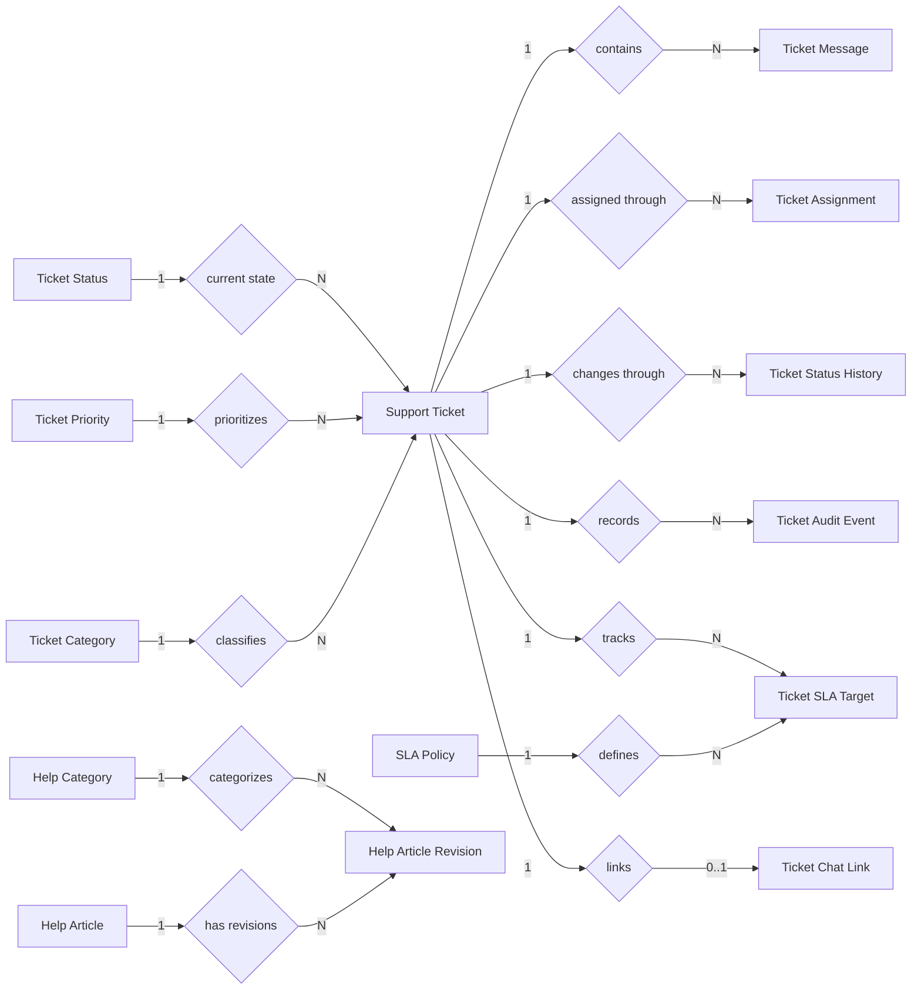

# Customer Service Database Redesign

## 1. เป้าหมาย

ออกแบบฐานข้อมูล `support-service` ใหม่สำหรับ PostgreSQL โดยลดความรับผิดชอบของ
`support_tickets`, รักษาความถูกต้องระดับ 3NF, รองรับประวัติการเปลี่ยนแปลง และไม่สร้าง
ตาราง 1:1 ที่มีไว้เพียงเพื่อลดจำนวนคอลัมน์

ขอบเขตนี้ครอบคลุมเฉพาะข้อมูลที่ `support-service` เป็นเจ้าของ ส่วน User, Order,
Chat Conversation และ Chat Message ยังคงเป็น soft reference เพราะอยู่คนละ service
และไม่สามารถสร้าง database-level FK ข้ามฐานข้อมูลได้

## 2. ปัญหาของโครงสร้างปัจจุบัน

`support_tickets` ปัจจุบันเก็บข้อมูลหลายประเภทในแถวเดียว:

- ข้อมูลหลักของเคส
- current workflow state
- current assignment
- SLA milestone
- lifecycle timestamps เช่น resolved, closed และ escalated
- chat integration link

ตารางไม่ได้ผิด 3NF ทั้งหมด แต่มีข้อเสียด้านการขยายระบบ ได้แก่ nullable columns จำนวนมาก,
เก็บได้เฉพาะสถานะล่าสุด, เปลี่ยน SLA policy ยาก และไม่มี revision history ของ Help Article จริง
แม้ schema จะระบุว่าเป็น published-revision model

## 3. แนวทางที่เลือก

1. `support_tickets` เก็บเฉพาะ core case และ current classification ที่ใช้ค้นหา queue บ่อย
2. Assignment, status transition และ SLA milestone มี lifecycle ของตนเอง จึงแยกตาราง
3. Chat link แยกออกเพื่อบังคับ logical 1:1 ด้วย unique constraint
4. Help Article แยก identity ออกจาก revision เพื่อให้ draft ไม่ทับ published content
5. User/Order/Chat IDs เป็น soft reference แต่ใช้ type และ unique constraint เท่าที่ระบบควบคุมได้
6. เวลาใน PostgreSQL ใช้ `timestamptz`

## 4. Chen-style Logical ER Diagram

## 5. Target Tables

### 5.1 Reference tables

#### `ticket_categories`

| Column | Type | Constraint | ความหมาย |
|---|---|---|---|
| `ticket_category_id` | smallint | PK, identity | Internal key |
| `code` | varchar(30) | UNIQUE, NOT NULL | ORDER, PAYMENT, ACCOUNT, TECHNICAL, OTHER |
| `name_th` | varchar(100) | NOT NULL | ชื่อภาษาไทย |
| `name_en` | varchar(100) | NULL | ชื่อภาษาอังกฤษ |
| `is_active` | boolean | NOT NULL DEFAULT true | เปิดใช้งานหรือไม่ |
| `created_at` | timestamptz | NOT NULL | วันที่สร้าง |
| `updated_at` | timestamptz | NOT NULL | วันที่แก้ไข |

#### `ticket_priorities`

| Column | Type | Constraint | ความหมาย |
|---|---|---|---|
| `ticket_priority_id` | smallint | PK, identity | Internal key |
| `code` | varchar(20) | UNIQUE, NOT NULL | LOW, NORMAL, HIGH, URGENT |
| `name` | varchar(100) | NOT NULL | Display name |
| `rank` | smallint | UNIQUE, NOT NULL | ลำดับสำหรับ sort queue |
| `is_active` | boolean | NOT NULL DEFAULT true | เปิดใช้งานหรือไม่ |
| `created_at` | timestamptz | NOT NULL | วันที่สร้าง |
| `updated_at` | timestamptz | NOT NULL | วันที่แก้ไข |

#### `ticket_statuses`

| Column | Type | Constraint | ความหมาย |
|---|---|---|---|
| `ticket_status_id` | smallint | PK, identity | Internal key |
| `code` | varchar(30) | UNIQUE, NOT NULL | NEW, ASSIGNED, IN_PROGRESS, ESCALATED, RESOLVED, CLOSED |
| `name` | varchar(100) | NOT NULL | Display name |
| `is_terminal` | boolean | NOT NULL DEFAULT false | สถานะปลายทางหรือไม่ |
| `sort_order` | smallint | NOT NULL | ลำดับแสดงผล |
| `created_at` | timestamptz | NOT NULL | วันที่สร้าง |
| `updated_at` | timestamptz | NOT NULL | วันที่แก้ไข |

#### `help_categories`

แยกจาก `ticket_categories` เพราะหมวด FAQ และหมวดเคสมี lifecycle และผู้ดูแลคนละบริบท แม้ code
เริ่มต้นอาจเหมือนกัน

| Column | Type | Constraint | ความหมาย |
|---|---|---|---|
| `help_category_id` | smallint | PK, identity | Internal key |
| `code` | varchar(30) | UNIQUE, NOT NULL | Category code |
| `name_th` | varchar(100) | NOT NULL | ชื่อภาษาไทย |
| `name_en` | varchar(100) | NULL | ชื่อภาษาอังกฤษ |
| `is_active` | boolean | NOT NULL DEFAULT true | เปิดใช้งานหรือไม่ |
| `created_at` | timestamptz | NOT NULL | วันที่สร้าง |
| `updated_at` | timestamptz | NOT NULL | วันที่แก้ไข |

### 5.2 Core ticket

#### `support_tickets`

หนึ่งแถวต่อหนึ่ง support case

| Column | Type | Constraint | ความหมาย |
|---|---|---|---|
| `ticket_id` | uuid | PK | Ticket ID |
| `ticket_number` | varchar(20) | UNIQUE, NOT NULL | Human-readable number |
| `requester_id` | varchar(64) | NOT NULL, soft ref | Opaque Auth Service user ID |
| `subject` | varchar(200) | NOT NULL | หัวข้อ |
| `description` | text | NOT NULL DEFAULT '' | รายละเอียดเริ่มต้น |
| `ticket_category_id` | smallint | FK, NOT NULL | `ticket_categories.ticket_category_id` |
| `ticket_priority_id` | smallint | FK, NOT NULL | `ticket_priorities.ticket_priority_id` |
| `current_status_id` | smallint | FK, NOT NULL | `ticket_statuses.ticket_status_id` |
| `order_id` | varchar(64) | NULL, soft ref | Opaque Order Service order ID |
| `target_user_id` | varchar(64) | NULL, soft ref | Opaque Auth Service user ID ของคู่กรณี |
| `lock_version` | integer | NOT NULL DEFAULT 0 | Optimistic locking |
| `created_at` | timestamptz | NOT NULL | วันที่เปิดเคส |
| `updated_at` | timestamptz | NOT NULL | วันที่แก้ไขล่าสุด |

`current_status_id` เป็น deliberate current-state snapshot สำหรับหน้า queue ส่วนประวัติจริงเก็บใน
`ticket_status_history` และต้องเปลี่ยนทั้งสองส่วนใน transaction เดียวกัน

### 5.3 Assignment and workflow history

#### `ticket_assignments`

| Column | Type | Constraint | ความหมาย |
|---|---|---|---|
| `assignment_id` | uuid | PK | Assignment ID |
| `ticket_id` | uuid | FK, NOT NULL | `support_tickets.id` |
| `assignee_id` | varchar(64) | NOT NULL, soft ref | ผู้รับผิดชอบจาก Auth Service |
| `assigned_by_id` | varchar(64) | NOT NULL, soft ref | ผู้ดำเนินการ assign |
| `assigned_at` | timestamptz | NOT NULL | เวลาเริ่มรับผิดชอบ |
| `ended_at` | timestamptz | NULL | เวลาสิ้นสุด |
| `end_reason` | varchar(200) | NULL | เหตุผล unassign/handoff |

ต้องมี partial unique index บน `ticket_id WHERE ended_at IS NULL` เพื่อให้หนึ่ง Ticket มี active
assignee ได้ไม่เกินหนึ่งคน

#### `ticket_status_history`

| Column | Type | Constraint | ความหมาย |
|---|---|---|---|
| `status_history_id` | uuid | PK | Transition ID |
| `ticket_id` | uuid | FK, NOT NULL | Ticket |
| `from_status_id` | smallint | FK, NULL | NULL เมื่อสร้าง Ticket |
| `to_status_id` | smallint | FK, NOT NULL | สถานะใหม่ |
| `changed_by_id` | varchar(64) | NOT NULL, soft ref | User/service identity ที่เปลี่ยนสถานะ |
| `reason` | text | NULL | เหตุผล |
| `created_at` | timestamptz | NOT NULL | เวลาเปลี่ยนสถานะ |

ตารางนี้แทน `resolved_at`, `closed_at` และ `escalated_at`; เวลาเหล่านี้หาได้จาก transition ที่เกี่ยวข้อง
และทำ index ตาม `ticket_id, created_at DESC`

### 5.4 SLA

#### `sla_policies`

| Column | Type | Constraint | ความหมาย |
|---|---|---|---|
| `sla_policy_id` | uuid | PK | Policy version |
| `ticket_category_id` | smallint | FK, NULL | NULL หมายถึงใช้ได้ทุก category |
| `ticket_priority_id` | smallint | FK, NOT NULL | Priority ที่ policy ใช้ |
| `first_response_minutes` | integer | CHECK > 0 | เป้าหมายตอบครั้งแรก |
| `resolution_minutes` | integer | CHECK > 0 | เป้าหมายแก้ไข |
| `effective_from` | timestamptz | NOT NULL | เริ่มใช้ |
| `effective_to` | timestamptz | NULL | สิ้นสุดการใช้ |
| `created_at` | timestamptz | NOT NULL | วันที่สร้าง policy |

#### `ticket_sla_targets`

| Column | Type | Constraint | ความหมาย |
|---|---|---|---|
| `sla_target_id` | uuid | PK | Target ID |
| `ticket_id` | uuid | FK, NOT NULL | Ticket |
| `policy_id` | uuid | FK, NOT NULL | Policy snapshot ที่ใช้ตอนเปิด Ticket |
| `metric_type` | varchar(30) | NOT NULL, CHECK | FIRST_RESPONSE หรือ RESOLUTION |
| `due_at` | timestamptz | NOT NULL | กำหนดเวลา |
| `achieved_at` | timestamptz | NULL | เวลาที่ทำสำเร็จ |
| `breached_at` | timestamptz | NULL | เวลาที่ถูกระบุว่า breach |
| `created_at` | timestamptz | NOT NULL | วันที่สร้าง |
| `updated_at` | timestamptz | NOT NULL | วันที่แก้ไข |

Unique constraint: `(ticket_id, metric_type)`

### 5.5 Communication and integration

#### `ticket_messages`

| Column | Type | Constraint | ความหมาย |
|---|---|---|---|
| `message_id` | uuid | PK | Support-side message ID |
| `ticket_id` | uuid | FK, NOT NULL | Ticket |
| `author_id` | varchar(64) | NOT NULL, soft ref | Opaque user/service identity เช่น UUID หรือ system |
| `author_role` | varchar(30) | NOT NULL, CHECK | REQUESTER, AGENT, SYSTEM |
| `body` | text | NOT NULL | เนื้อหา |
| `is_internal` | boolean | NOT NULL DEFAULT false | Internal note |
| `chat_message_id` | varchar(64) | UNIQUE, NULL | Opaque Chat Service Message ID |
| `created_at` | timestamptz | NOT NULL | เวลาเขียนข้อความ |

#### `ticket_chat_links`

| Column | Type | Constraint | ความหมาย |
|---|---|---|---|
| `ticket_id` | uuid | PK, FK | Ticket หนึ่งใบมี link ได้สูงสุดหนึ่งรายการ |
| `conversation_id` | varchar(64) | UNIQUE, NOT NULL | Opaque Chat Service Conversation ID |
| `linked_at` | timestamptz | NOT NULL | เวลาเชื่อม |

#### `ticket_audit_events`

| Column | Type | Constraint | ความหมาย |
|---|---|---|---|
| `audit_event_id` | uuid | PK | Event ID |
| `ticket_id` | uuid | FK, NOT NULL | Ticket |
| `actor_id` | varchar(64) | NOT NULL, soft ref | Opaque user/service identity |
| `event_type` | varchar(40) | NOT NULL, CHECK | REPLY, JOIN, HANDOFF และ event อื่น |
| `dedupe_key` | varchar(150) | UNIQUE, NULL | Idempotency key |
| `payload` | jsonb | NOT NULL DEFAULT '{}' | รายละเอียด event ที่ไม่ใช่ source of truth |
| `created_at` | timestamptz | NOT NULL | เวลาเกิด event |

Status และ assignment histories เป็น source of truth สำหรับข้อมูลเฉพาะด้าน ส่วน audit event เป็น
append-only evidence จึงอนุญาต JSONB เพื่อรองรับ event หลายรูปแบบโดยไม่ทำ EAV schema

### 5.6 Knowledge base with real revisions

#### `help_articles`

| Column | Type | Constraint | ความหมาย |
|---|---|---|---|
| `article_id` | uuid | PK | Article identity |
| `slug` | varchar(160) | UNIQUE, NOT NULL | URL slug |
| `status` | varchar(20) | NOT NULL, CHECK | DRAFT, PUBLISHED, ARCHIVED |
| `published_version` | integer | NULL, composite FK | Version ที่ผู้ใช้เห็น |
| `created_by_id` | varchar(64) | NOT NULL, soft ref | ผู้สร้าง |
| `created_at` | timestamptz | NOT NULL | วันที่สร้าง |
| `updated_at` | timestamptz | NOT NULL | วันที่แก้ไข |

#### `help_article_revisions`

| Column | Type | Constraint | ความหมาย |
|---|---|---|---|
| `article_id` | uuid | PK, FK | Owner key จาก Help Article |
| `version` | integer | PK, partial key, CHECK > 0 | Revision number |
| `help_category_id` | smallint | FK, NOT NULL | `help_categories.help_category_id` |
| `title` | varchar(250) | NOT NULL | หัวข้อของ revision |
| `body` | text | NOT NULL | เนื้อหาของ revision |
| `author_id` | varchar(64) | NOT NULL, soft ref | ผู้แก้ไข |
| `search_text` | text | NOT NULL | Trigger-maintained search source |
| `created_at` | timestamptz | NOT NULL | วันที่สร้าง revision |

Composite primary key: `(article_id, version)` ทำให้ `help_article_revisions` เป็น weak entity
ที่ระบุตัวตนผ่านเจ้าของ `help_articles` และ partial key `version`

Composite FK: `help_articles(id, published_version)` อ้างถึง
`help_article_revisions(article_id, version)` เพื่อรับประกันว่า published revision เป็นของ Article
เดียวกัน ไม่ใช่ revision ของ Article อื่น

## 6. Foreign Keys and Delete Rules

| Child | Parent | ON DELETE |
|---|---|---|
| ticket message/history/assignment/SLA/audit/chat link | support ticket | CASCADE |
| support ticket | category/priority/status | RESTRICT |
| SLA target | SLA policy | RESTRICT |
| article revision | help article | CASCADE |
| article revision | help category | RESTRICT |
| help article `(id, published_version)` | article revision `(article_id, version)` | RESTRICT |

ทุก FK column ต้องมี index เนื่องจาก PostgreSQL ไม่สร้าง FK index ให้อัตโนมัติ

## 7. Required Indexes

- `support_tickets(current_status_id, priority_id, created_at DESC)` สำหรับ queue
- `support_tickets(requester_id, created_at DESC)` สำหรับ My Tickets
- `ticket_assignments(ticket_id) WHERE ended_at IS NULL` แบบ UNIQUE
- `ticket_assignments(assignee_id, ended_at)` สำหรับ agent workload
- `ticket_status_history(ticket_id, created_at DESC)`
- `ticket_messages(ticket_id, created_at)`
- `ticket_sla_targets(metric_type, due_at) WHERE achieved_at IS NULL`
- `ticket_audit_events(ticket_id, created_at DESC)`
- GIN trigram index บน `help_article_revisions.search_text`

`ticket_number` ควรออกเลขด้วย PostgreSQL sequence ภายใน transaction ไม่ใช้เลขสุ่มและ retry
เพื่อให้ unique, เรียงลำดับได้ และไม่มี collision เมื่อปริมาณ Ticket โตขึ้น

## 8. Normalization Assessment

- **1NF:** ทุก field เป็น atomic value; ไม่มี repeating message/audit columns
- **2NF:** ทุก non-key attribute ขึ้นกับ primary key ทั้งหมด
- **3NF:** category, priority, status, SLA policy และ article revisions ถูกแยกจาก Ticket
- **Deliberate denormalization:** `support_tickets.current_status_id` เป็น current snapshot เพื่อให้ queue
  query เร็ว ขณะที่ history เป็น append-only evidence การอัปเดตต้องอยู่ transaction เดียวกัน
- **ไม่ทำ:** generic `ticket_attributes(key, value)` เพราะเป็น EAV ซึ่งเสีย type safety และ constraint

## 9. Migration Direction (Expand–Contract)

1. สร้าง reference และ child tables ใหม่แบบ additive โดยยังไม่ลบ column เดิม
2. Seed category, priority และ status จากค่าที่ใช้อยู่
3. Backfill assignment, status history, SLA target และ chat link จาก `support_tickets`
4. เพิ่ม application dual-write ภายใน transaction
5. ตรวจ row count, FK integrity และเปรียบเทียบ old/new reads
6. เปลี่ยน read path ไป schema ใหม่
7. หยุดเขียน legacy columns และเฝ้าดูอย่างน้อยหนึ่ง release window
8. ลบ legacy columns ใน migration แยกต่างหากหลัง backup และ rollback rehearsal

ห้าม drop column ใน migration แรก และ index ของตาราง production ขนาดใหญ่ควรสร้างด้วย
`CREATE INDEX CONCURRENTLY` นอก transaction

## 10. Open Questions

1. Category และ priority ต้องแก้ไขได้จาก Admin UI หรือไม่
2. หนึ่ง Ticket มี active assignee ได้หนึ่งคนหรือหลายคน
3. SLA ต้องนับเฉพาะ business hours/วันทำการหรือเวลาปฏิทิน
4. User IDs และ Order IDs รับประกันว่าเป็น UUID ทุก environment หรือไม่
5. ต้องเก็บ message body ซ้ำใน Support DB นานเท่าใด และ Chat DB เป็นหลักฐานต้นฉบับหรือไม่
6. Help Article ต้องรองรับ localization หรือ approval workflow หรือไม่
