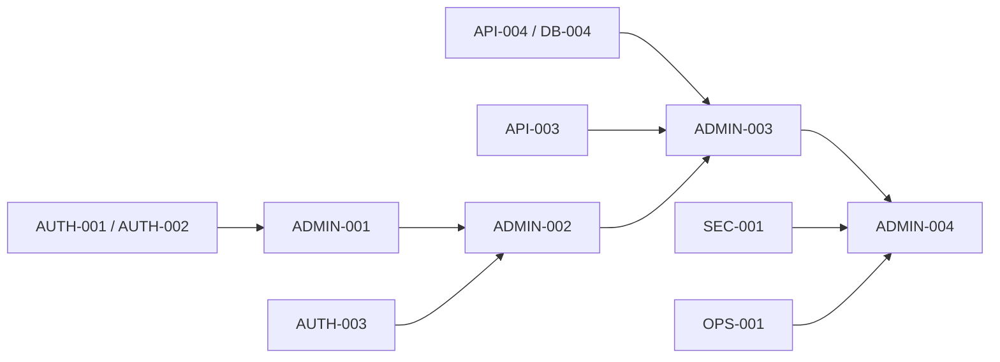

# RE-LOOP Admin Web Plan

> Admin is secondary to the Customer application, but the minimum safety scope is a Production blocker because the demo permits public registration. This plan reuses Shared Backend tasks and does not create duplicate Admin-only databases or business logic.
>
> `progress.md` is the sole mutable status source. Every Admin card inherits Owner/Reviewer/Human approver/Teach-back fields from the standard task contract in `planmain.md`.

## 1. Scope and boundaries

### Release A Admin-specific

- separate `/admin` layout/navigation within the shared Next.js deployable;
- secure Admin session/route behavior;
- test-KYC queue and approve/reject;
- user/product/report search and filters;
- moderation, ban/unban, dispute evidence, simulated payment hold/release;
- audit visibility, reason capture, dangerous-action confirmation;
- bounded bulk actions and safe export/import controls;
- accessibility, error prevention, tests, and operational safety.

### Shared Backend dependencies

`ADMIN-001`–`ADMIN-004` consume `AUTH-001`–`AUTH-005`, `API-001`–`API-004`, `DB-004`, `INT-001`, `INT-004`, `SEC-001`, and `OPS-001`. Admin pages never bypass the gateway or query service databases directly.

### Deferred B/C

Customer Support/SLA, Marketing/Campaign, Executive BI, Auction, and automated Risk are extension seams only. Their roles must not receive Release A permissions accidentally.

## 2. Proposed permission matrix

This is **Proposed** and must be confirmed in `ADMIN-002`; permissions are capabilities, not merely route visibility.

| Capability | Buyer | Seller | Admin | Notes |
|---|---:|---:|---:|---|
| View public catalog | ✓ | ✓ | ✓ | public projection |
| Manage own listing | — | ✓ | moderation only | Seller requires approved test-KYC |
| View own order/chat | ✓ | ✓ | only with case permission/reason | resource check required |
| Submit test-KYC | — | ✓ | — | fake/test document warning |
| Review test-KYC | — | — | ✓ | short-lived private access + audit |
| Search users/products/reports | — | — | ✓ | bounded fields/results |
| Moderate product/report | — | — | ✓ | reason + confirmation + audit |
| Ban/unban account | — | — | ✓ | re-authentication proposed |
| Decide dispute/hold mock payout | — | — | ✓ | simulation only |
| Bulk action/export/import | — | — | conditional | separate permissions, limits, preview |
| Read audit log | — | — | conditional | sensitive view and export controls |

## 3. Dependency and parallel map

- `ADMIN-001` can be designed with `CUST-001`, but cannot complete until `AUTH-001`, `AUTH-002`, and `AUTH-005` pass.
- `ADMIN-002` can run with `CUST-002`/`CUST-003`.
- `ADMIN-003` can run with `CUST-004`/`CUST-005` after the shared APIs exist.
- `ADMIN-004` follows proven single-item operations; bulk/import/export must not be built first.

## 4. Detailed Admin tasks

### ADMIN-001 — Admin shell, session guard, and operational navigation

- **Task ID / Epic / Area / Status:** `ADMIN-001` / Admin Foundation / Admin / Not started
- **Task name:** Build the separated Admin route group and session behavior
- **Objective:** Give authorized Admins a clear, safe workspace without duplicating the Customer app.
- **Beginner explanation:** Build a staff-only door and control room inside the same building.
- **Business reason:** Admin must act quickly without confusing customer and operational controls.
- **Technical reason:** No Admin UI exists; shared frontend/auth must support authorization-aware routing.
- **Scope:** `/admin` layout; navigation; session bootstrap/expiry; 401/403/404 states; environment/demo banner; breadcrumbs; keyboard navigation; error boundary.
- **Out of scope:** feature dashboards and backend permission implementation.
- **Prerequisites:** `AUTH-001`, `AUTH-002` contracts; `CUST-001` shared components.
- **Dependencies:** `AUTH-001`, `AUTH-002`, `AUTH-005`, `CUST-001`, `ADR-002`.
- **Inputs:** permission catalog, Admin information architecture.
- **Detailed implementation steps:** write route/session/accessibility tests; define nav by permission; implement layout/guards; handle expiry/role change; add safe error/request ID; responsive/manual QA.
- **Expected files/components:** `frontend/app/admin`, shared session/navigation/error components, tests.
- **Database impact:** none directly.
- **API impact:** consumes current-user/permission API.
- **Security considerations:** frontend guard is UX only; backend default deny; no privileged data prefetch before permission; recheck on refresh.
- **Privacy considerations:** do not show sensitive counts/content in unauthorized shell or client logs.
- **Performance considerations:** lazy-load Admin routes; avoid prefetching sensitive panels.
- **Observability considerations:** route denial/session expiry/client error metrics with request ID, no sensitive payload.
- **Test cases:** non-Admin direct URL; expired/suspended/role-removed session; multiple roles; keyboard nav; mobile layout; API failure.
- **Acceptance criteria:** unauthorized users never receive Admin data; authorized Admin sees only permitted navigation and recoverable states.
- **Definition of Done:** component/E2E/accessibility/security-negative tests pass and shared Customer routes do not regress.
- **Evidence required:** test report, 401/403 screenshots, accessibility output, reviewer sign-off.
- **Risks:** route hiding may be mistaken for authorization; coupled frontend release.
- **Rollback or recovery approach:** disable Admin route entry and retain backend deny; revert route bundle without changing data.
- **Complexity / Can run in parallel / Blocks:** M / `CUST-002`, `CUST-003` / blocks `ADMIN-002`–`ADMIN-004`.
- **Related Decision / Architecture / Deployment:** `ADR-002`, `ADR-003`, `ADR-013`, `ADR-015` / Architecture 5.2, 7 / Deployment 5, 13, 15.

### ADMIN-002 — Permission matrix, safety dashboard, and test-KYC queue

- **Task ID / Epic / Area / Status:** `ADMIN-002` / Admin Safety / Admin / Not started
- **Task name:** Deliver the minimum Admin dashboard and Seller approval workflow
- **Objective:** Let Admin safely review synthetic KYC and see actionable safety queues.
- **Beginner explanation:** Show the staff inbox and let them stamp a fake application with a recorded reason.
- **Business reason:** Public sellers must not publish before the demo approval process.
- **Technical reason:** Seller/KYC fields exist but no workflow; permission matrix is not implemented.
- **Scope:** confirm matrix; queue counts; KYC list/detail; short-lived private document view; approve/reject with reason; stale/conflict handling; audit link.
- **Out of scope:** real identity verification, OCR, B/C analytics dashboard.
- **Prerequisites:** Admin role owner; synthetic documents; retention policy.
- **Dependencies:** `ADMIN-001`, `AUTH-003`, `INT-001`, `AUTH-001`.
- **Inputs:** KYC API/storage policy and Proposed matrix.
- **Detailed implementation steps:** approve permissions; write queue/action tests; build list/filter/detail; implement secure view; add confirmation/reason; handle concurrent decision; audit; accessibility/UAT.
- **Expected files/components:** Admin dashboard/KYC routes/components/tests; shared API only.
- **Database impact:** none directly; Auth owns state/audit.
- **API impact:** consumes KYC queue/detail/decision APIs.
- **Security considerations:** dedicated permission, short URL expiry, no download by default, re-authentication for decision if approved, server conflict check.
- **Privacy considerations:** synthetic-only banner, mask metadata, no content in logs/screenshots/evidence.
- **Performance considerations:** paginated queue, bounded thumbnails/no eager private-file fetch.
- **Observability considerations:** queue age, decision outcome, failed private access, audit correlation.
- **Test cases:** non-Admin; missing permission; expired URL; approve/reject; required reason; double decision; stale item; file deleted/quarantined.
- **Acceptance criteria:** authorized Admin can decide one pending synthetic application exactly once; every view/decision is auditable.
- **Definition of Done:** permission/API/E2E/accessibility/storage-negative tests pass.
- **Evidence required:** synthetic E2E, audit record, access test, queue metric, human UAT.
- **Risks:** accidental real upload or document leak.
- **Rollback or recovery approach:** block new uploads/reviews, revoke access URLs/IAM, quarantine/delete object under incident runbook.
- **Complexity / Can run in parallel / Blocks:** L / `CUST-002`, `CUST-003` / blocks Seller-publish UAT and Production.
- **Related Decision / Architecture / Deployment:** `ADR-003`, `ADR-006`, `ADR-010` / Architecture 5.2, 8.3, 10 / Deployment 8, 12, 18.

### ADMIN-003 — Moderation, disputes, and dangerous actions

- **Task ID / Epic / Area / Status:** `ADMIN-003` / Admin Operations / Admin / Not started
- **Task name:** Deliver case-based moderation and simulated financial safety controls
- **Objective:** Let Admin investigate and act with evidence, confirmation, and audit.
- **Beginner explanation:** Give staff a case folder, not a magic delete button.
- **Business reason:** Public content, chat, and simulated transactions need a safe response path.
- **Technical reason:** Report table is unused; no case APIs/UI/audit/danger controls exist.
- **Scope:** report queue; user/product/order/chat evidence projections; ban/unban; content remove/restore where policy allows; dispute approve/reject; mock hold/release/refund; reason/confirmation; status history.
- **Out of scope:** real money action, automated fraud decision, Support SLA.
- **Prerequisites:** moderation policy and decision authority confirmed.
- **Dependencies:** `ADMIN-001`, `ADMIN-002`, `API-002`, `API-003`, `API-004`, `DB-004`, `AUTH-001`, `AUTH-005`.
- **Inputs:** case/evidence contracts, order/report state machines.
- **Detailed implementation steps:** define case permissions/transitions; write negative/state tests; build queues/detail; add evidence access audit; implement two-step dangerous action; handle stale/duplicate; add restore/recovery; UAT.
- **Expected files/components:** Admin moderation/dispute routes/components/tests; shared backend APIs only.
- **Database impact:** through owning services; immutable audit/state history.
- **API impact:** consumes Admin case/query/action endpoints.
- **Security considerations:** least privilege per capability; reason and optional re-authentication; server-side state/version check; no arbitrary user impersonation.
- **Privacy considerations:** reveal only case-relevant chat/order fields; audit every sensitive read; protect exports/screenshots.
- **Performance considerations:** paginate evidence; lazy-load chat; prevent unbounded joins/export.
- **Observability considerations:** queue age, action volume/error/conflict, hold states, privileged read/action audit.
- **Test cases:** unauthorized role; insufficient capability; stale case; double click; wrong order state; chat view audit; ban/unban; restore; mock hold/release.
- **Acceptance criteria:** every dangerous action is authorized, previewed, confirmed, reasoned, version-checked, and auditable; no real financial semantics.
- **Definition of Done:** state/security/E2E/accessibility/UAT tests pass and rollback path is rehearsed.
- **Evidence required:** permission matrix output, audit samples, E2E recording, rollback/recovery record.
- **Risks:** over-broad access or irreversible mistaken action.
- **Rollback or recovery approach:** reversible soft state where possible; emergency feature disable; manual correction with append-only audit.
- **Complexity / Can run in parallel / Blocks:** XL / `CUST-004`, `CUST-005` after APIs / blocks public Production launch.
- **Related Decision / Architecture / Deployment:** `ADR-003`, `ADR-007`, `ADR-010` / Architecture 5.2, 7.2, 10 / Deployment 19–21.

### ADMIN-004 — Safe data operations: search, filter, bulk, import, export, audit

- **Task ID / Epic / Area / Status:** `ADMIN-004` / Admin Data Operations / Admin / Deferred/feature-flagged pending Release A approval
- **Task name:** Add bounded operational data tools after single-item actions are proven
- **Objective:** Make repetitive Admin work efficient without creating mass-damage paths.
- **Beginner explanation:** Before using a forklift, prove one box can be moved safely and add brakes, limits, and a manifest.
- **Business reason:** Admin needs findability and controlled batch operations.
- **Technical reason:** Search/filter/bulk/import/export/audit are absent and high-risk.
- **Scope:** indexed search/filter/sort; saved filters if justified; bulk preview/limit/partial-result report; CSV export with field allow-list; import dry-run/validation/idempotency; audit search; dangerous confirmation.
- **Out of scope:** arbitrary SQL, unrestricted full-database export, B/C analytics, bulk payment.
- **Prerequisites:** approved data policy, export/import need, max batch size, retention, and single-item operations.
- **Dependencies:** `ADMIN-003`, `API-004`, `SEC-001`, `OPS-001`; uses `AUTH-001`.
- **Inputs:** permission/data classification matrix and operational scenarios.
- **Detailed implementation steps:** confirm each operation is required; design separate permissions; write abuse tests; implement search/pagination; add dry-run/preview; add bounded execution/idempotency; produce result manifest; audit; load/accessibility/UAT.
- **Expected files/components:** Admin data-operation UI/tests; owning service query/command endpoints; job worker for approved bounded batches.
- **Database impact:** indexes, import job/idempotency/audit records only through migrations.
- **API impact:** bounded Admin query/export/import/bulk endpoints.
- **Security considerations:** separate read/export/import/bulk permissions; CSV formula injection defense; rate/row/size limits; step-up confirmation; signed result access.
- **Privacy considerations:** minimum fields, masking, purpose/retention, no KYC object export, audit downloads.
- **Performance considerations:** cursor pagination, indexed queries, async bounded jobs, cancellation/backpressure.
- **Observability considerations:** duration/rows/failures/export downloads/import rejections and actor audit.
- **Test cases:** wildcard/SQLi input; CSV formula; oversized/duplicate import; partial failure; stale target; unauthorized export; timeout/cancel; audit immutability.
- **Acceptance criteria:** every operation has preview, limits, permission, result manifest, audit, and recoverable behavior; unconfirmed operation remains disabled.
- **Definition of Done:** security/load/E2E/accessibility/UAT tests pass; runbook and cleanup work.
- **Evidence required:** permission tests, dry-run/result samples with synthetic data, load metrics, audit and recovery record.
- **Risks:** mass mutation/data leakage/cost spike.
- **Rollback or recovery approach:** cancel job, disable capability, restore soft state or apply compensating commands from manifest; never silently rewrite audit.
- **Complexity / Can run in parallel / Blocks:** XL / late `TEST-002` preparation / blocks launch only for operations explicitly approved as Release A; otherwise feature remains off.
- **Related Decision / Architecture / Deployment:** `ADR-003`, `ADR-009`–`ADR-011` / Architecture 5.2, 10–11 / Deployment 17–20.

## 5. Admin release criteria

1. Backend permissions deny every matrix-negative case.
2. Minimum KYC/moderation/dispute functions pass synthetic-data UAT.
3. Sensitive reads and dangerous writes record actor, target, time, reason, result, and request ID.
4. Session expiry/role removal takes effect without a stale long-lived Admin session.
5. Bulk/import/export functions are either proven safe or explicitly disabled.
6. Keyboard/responsive/accessibility checks and error-prevention copy pass.
7. No real KYC/payment data appears in UI, logs, fixtures, screenshots, or exports.

## 6. Admin Definition of Done

Admin is not Done when pages exist. It is Done when the matching Shared API, permission-negative tests, audit evidence, recovery path, operational metrics, accessibility, UAT, and public-demo safety gates all pass.
