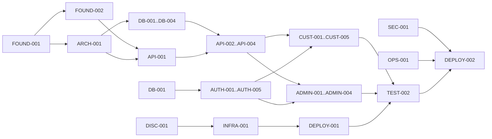

# RE-LOOP Master Implementation Plan

> **Planning only.** This file does not authorize production-code, schema, infrastructure, or deployment changes.
>
> Execution note: when implementation is separately approved, execute one Task ID at a time with an owner, a different reviewer, tests, evidence, and a short team teach-back. Do not start implementation merely because this plan exists.

## 1. Project overview

RE-LOOP is a coursework web marketplace for second-hand fashion. Release A prioritizes the complete Buyer and Seller experience and the minimum Admin controls required to operate a publicly reachable demo safely. Release B (Customer Support) and C (Marketing, Executive, Auction, BI, Risk) are future extensions only.

## 2. Confirmed requirements

1. Customer-facing Buyer and Seller workflow is the primary deliverable; Admin is secondary but minimum safety Admin is required for public access.
2. One account can hold multiple roles. Release A roles are Buyer, Seller, and Admin.
3. Access token is held in browser memory; rotating refresh token uses an HttpOnly cookie; roles/status are refreshed from the database.
4. Payment is simulation only. No real card, bank transfer, payout, refund, or money movement.
5. KYC uses real upload/storage behavior with deliberately fake/test documents only: `PENDING → APPROVED/REJECTED`. No OCR or external KYC provider.
6. Recommendation remains a just-in-time choice between an algorithm and AI; design a replaceable strategy, do not implement both by default.
7. The demo is public and anyone can register. The UI must warn that payment and identity documents are simulations.
8. Google Cloud is primary. AWS is an optional same-container, independent-data portability demo after GCP succeeds.
9. Approximate target is 20 September 2026.
10. Team: six beginners, 5–10 hours/person/week, task-based rotating ownership, AI-assisted implementation, human validation and presentation.

### Requirement traceability

| ID | Confirmed source or unresolved status | Scope | ADR | Tasks | Required evidence |
|---|---|---|---|---|---|
| `REQ-001` | Customer Buyer/Seller first; minimum safe Admin — confirmed conversation | A | `ADR-002`, `ADR-010` | `CUST-*`, `ADMIN-001`–`ADMIN-003` | critical E2E/UAT |
| `REQ-002` | Multi-role Buyer/Seller/Admin — confirmed | A | `ADR-003` | `DB-001`, `AUTH-001` | permission matrix |
| `REQ-003` | Memory access token + HttpOnly refresh — confirmed | A | `ADR-003` | `AUTH-002` | cookie/replay/CSRF tests |
| `REQ-004` | Mock payment only — confirmed | A | `ADR-007` | `DB-003`, `API-003`, `CUST-004` | mock-state E2E; no payment fields |
| `REQ-005` | Synthetic test-KYC upload/decision — confirmed | A | `ADR-006`, `ADR-012` | `AUTH-003`, `INT-001`, `INT-004`, `ADMIN-002` | private access/purge/audit |
| `REQ-006` | Algorithm/AI choice deferred — confirmed | A | `ADR-008` | `INT-003` | JIT approval + benchmark |
| `REQ-007` | Public URL/registration — confirmed; privacy model unresolved | A | `ADR-010`, `ADR-012` | `DISC-001`, `AUTH-004`, `SEC-001`, `DEPLOY-002` | approved lifecycle/privacy model |
| `REQ-008` | GCP primary; AWS portability Stretch — confirmed | A/Stretch | `ADR-005` | `INFRA-001`, `INFRA-002` | GCP release; optional AWS smoke |
| `REQ-009` | Approx. 20 Sep 2026; six rotating beginners — confirmed | constraint | `ADR-001` | all | owner/reviewer/teach-back |
| `REQ-010` | B/C seams only, no Release A implementation — confirmed | future | `ADR-001` | `ARCH-001` | scope review |
| `REQ-011` | Account privacy/recovery/retention | unresolved blocker | `ADR-012` | `DISC-001`, `AUTH-004` | human approval |
| `REQ-012` | Admin strong authentication/bootstrap | unresolved blocker | `ADR-013` | `DISC-001`, `AUTH-005` | human approval + recovery drill |

## 3. Assumptions and constraints

### Temporary working assumptions

- Preserve the current gateway + five backend services under `ADR-001` until the course rubric is verified.
- Use one Next.js deployment with separate Customer and `/admin` routes under `ADR-002`.
- Use one managed PostgreSQL platform per environment with a logical database and user per service.
- In-app notifications are the Release A baseline; external email/SMS/push providers are not assumed.
- Staging may use low-cost explicitly labelled temporary parameters; Production needs human approval of `ADR-011`.

### Constraints and unresolved facts

- Region, domain, budget/credits, expected/peak traffic, availability, data retention, RPO/RTO, monitoring owner, and incident authority are unconfirmed.
- Course NFR figures are candidate validation targets, not confirmed funded production commitments.
- Current source uses JavaScript; a TypeScript migration is not assumed. Type safety may begin with schema validation and checked JSDoc unless separately approved.
- Current requirements contain future B/C features that are out of Release A.

## 4. Scope

### In scope

- Buyer/Seller account, multi-role RBAC, secure sessions, test-KYC.
- Product listing/media, catalog/filter/search, replaceable recommendation seam.
- Reservation/cart, mock payment, order/shipping states.
- Buyer–Seller chat, reviews, reports.
- Shared APIs, service contracts, migrations, background reliability, notifications.
- Minimum Admin plan in `planadminweb.md`.
- Security, testing, GCP staging/production, observability, backup/restore, rollback, documentation.

### Out of scope for Release A

- Real payment, card entry, bank payout, real KYC/PII, OCR, real identity provider.
- Active-active multi-cloud, cross-cloud replication/failover/shared sessions.
- B/C implementation: Support/SLA, Marketing/Campaign, Executive BI, Auction, fraud/risk engine.
- Unconfirmed email/SMS/shipping integrations.
- Building both Algorithm and AI recommendation engines.

## 5. Current state

| Area | Verified state | Evidence |
|---|---|---|
| Frontend | `/`, `/login`, `/register`; localStorage session | `frontend/app/`, `frontend/lib/auth.js` |
| Gateway | Five proxy paths; bearer verification | `backend/gateway/src/server.js` |
| Auth | Register/login/refresh/logout/me | `backend/services/auth-service/src/` |
| Other services | Health endpoints only | `backend/services/*-service/src/app.js` |
| Database | Auth schema only; four empty DBs; `db push` | Prisma schema, `docker-compose.yml` |
| Admin | Not started | no admin route/component |
| Cache/jobs/storage | Containers/volume declarations only | `docker-compose.yml` |
| Tests/CI/IaC/cloud | Not found | repository scan |
| Operations | health endpoints and console logs only | service source |

## 6. Target state

A publicly reachable, clearly labelled demo on GCP with tested Buyer/Seller lifecycle, minimum safe Admin operations, secure browser sessions, multi-role permissions, private test-KYC files, deterministic mock payment, managed data/storage, staged CI/CD, rollback, logs/metrics/alerts, verified backup restore, and evidence-linked operational ownership.

## 7. Workstreams and epics

| Workstream | Epics | Task IDs |
|---|---|---|
| Discovery | Launch and course validation | `DISC-001` |
| Foundation | standards, dependency/test gates | `FOUND-001`, `FOUND-002` |
| Architecture | contracts and ownership | `ARCH-001` |
| Data | auth, product, transaction, interaction schemas | `DB-001`–`DB-004` |
| API | platform, catalog, order, interaction APIs | `API-001`–`API-004` |
| Identity | RBAC, sessions, test-KYC, account lifecycle, Admin assurance | `AUTH-001`–`AUTH-005` |
| Customer | shared shell and Buyer/Seller journeys | `CUST-001`–`CUST-005` |
| Integration | storage, jobs/notification, recommendation choice | `INT-001`–`INT-004` |
| Quality/security | layered tests and hardening | `TEST-001`, `TEST-002`, `SEC-001` |
| Cloud/release/ops | GCP, staging, production, operations, AWS stretch | `INFRA-001`, `DEPLOY-001`, `DEPLOY-002`, `OPS-001`, `INFRA-002` |
| Documentation | evidence and team learning | `DOC-001` |

## 8. Standard task contract

Every task below is a delivery unit for one owner and a different reviewer. “Expected files” predicts likely touch points; it does not authorize changes. Card status is the **initial planning snapshot**; `progress.md` is the sole mutable status source. Every card inherits **Owner: TBD; Reviewer: TBD and different from Owner; Human approver: required for Decision/launch impact; Teach-back owner/date: TBD.** A task cannot move to Done without its Acceptance Criteria, Definition of Done, and Evidence.

## 9. Detailed tasks

### DISC-001 — Validate launch inputs and course constraints

- **Task ID / Epic / Area / Status:** `DISC-001` / Discovery / Shared / Not started
- **Task name:** Validate rubric, Release A boundary, NFRs, cloud inputs, and data policy
- **Objective:** Replace high-impact unknowns with confirmed, recorded answers.
- **Beginner explanation:** Before buying materials for a house, confirm the land rules, budget, and number of rooms.
- **Business reason:** Prevent a demo that misses grading needs or promises impossible reliability.
- **Technical reason:** Region, topology, sizing, retention, recovery, and security controls depend on these answers.
- **Scope:** rubric; microservice cutover checkpoint; domain/region/credits; traffic; SLO; retention/privacy; public account lifecycle; Admin strong auth/bootstrap; RPO/RTO; owner/on-call; recommendation timing; accept/reject `ADR-002`, `ADR-004`, `ADR-006`, `ADR-009`, `ADR-012`–`ADR-015`.
- **Out of scope:** implementing any architecture or feature.
- **Prerequisites:** user/instructor/product owner availability.
- **Dependencies:** none.
- **Inputs:** confirmed answers, `docs/S2G5_RE-LOOP_ISE.md`, `architecture.md`, `ADR-001`, `ADR-011`.
- **Detailed implementation steps:** (1) turn each unknown into a one-answer question; (2) obtain evidence/owner; (3) label course target versus launch commitment; (4) update ADR status and traceability; (5) record rejected scope.
- **Expected files/components:** planning documents only; requirements source remains unchanged unless separately approved.
- **Database/API impact:** none now; later sizing and retention choices.
- **Security / Privacy / Performance / Observability:** confirm data classes and owner; validate rather than invent threat, traffic, alert, and recovery targets.
- **Test cases:** trace every Critical unknown to an answer or explicit blocker; peer-review for invented facts.
- **Acceptance criteria:** rubric/topology, Release A, data policy, region selection method, budget owner, traffic class, SLO/RPO/RTO status, and operational owner are recorded.
- **Definition of Done:** all architecture-blocking questions are answered or explicitly block a named task.
- **Evidence required:** dated answer log, instructor/user citation, updated ADR status, reviewer sign-off.
- **Risks / Rollback or recovery:** late answers cause rework; rollback by retaining parameterized architecture and reverting only the affected ADR.
- **Complexity / Parallel / Blocks:** M / can parallel with `FOUND-001` / blocks production finalization in `INFRA-001`, `DEPLOY-002`, `OPS-001`.
- **Related Decision / Architecture / Deployment:** `ADR-001`, `ADR-008`, `ADR-010`, `ADR-011` / Architecture 17 / Deployment 2–4.

### FOUND-001 — Establish reproducible repository and dependency baseline

- **Task ID / Epic / Area / Status:** `FOUND-001` / Foundation / Shared / Not started
- **Task name:** Lock dependencies, commands, standards, and environment contract
- **Objective:** Make setup and checks reproducible across six people and CI.
- **Beginner explanation:** Give everyone the same recipe and ingredient versions.
- **Business reason:** Reduce time lost to “works on my machine.”
- **Technical reason:** The repo has no lockfile, lint, format, type/static checks, or environment validation.
- **Scope:** package lock strategy, supported Node/npm versions, scripts, formatting/linting, checked-JS/type strategy, `.dockerignore`, env schema, secret-safe examples.
- **Out of scope:** feature refactors or automatic TypeScript conversion.
- **Prerequisites:** `DISC-001` only for rubric-specific tool constraints.
- **Dependencies:** none for baseline; coordinate with `DISC-001`.
- **Inputs:** all `package.json`, Dockerfiles, `.env.example`, current source.
- **Detailed implementation steps:** inventory versions; select minimal tools; create deterministic install; validate env at startup; document commands; run clean install/build/lint baseline; record existing failures separately.
- **Expected files/components:** root/workspace package manifests, lockfile, lint/format config, env validation module, Docker ignore, README/handoff.
- **Database/API impact:** none.
- **Security / Privacy / Performance / Observability:** prevent secrets in examples/logs; dependency audit baseline; avoid tooling that slows feedback without value.
- **Test cases:** clean clone install, missing-env failure, lint/format/static checks, container context inspection.
- **Acceptance criteria:** one documented install and check path succeeds on a clean environment; dependency versions are locked; secrets are not committed.
- **Definition of Done:** commands run locally and are ready for CI.
- **Evidence required:** command logs, lockfile diff, environment-negative test, reviewer sign-off.
- **Risks / Rollback or recovery:** tool churn; revert tool config and lockfile as one change if build behavior regresses.
- **Complexity / Parallel / Blocks:** M / `DISC-001`, `ARCH-001` / blocks `FOUND-002` and reliable feature work.
- **Related Decision / Architecture / Deployment:** `ADR-001` / Architecture 16 / Deployment 10.

### FOUND-002 — Build the automated quality gate

- **Task ID / Epic / Area / Status:** `FOUND-002` / Foundation / Shared / Not started
- **Task name:** Create CI-ready test and static-quality baseline
- **Objective:** Fail fast on syntax, style, dependency, and basic contract regressions.
- **Beginner explanation:** Install a checklist that runs itself before work is accepted.
- **Business reason:** AI-generated code still needs repeatable human-verifiable proof.
- **Technical reason:** No automated tests or CI exist.
- **Scope:** unit/integration/component test frameworks, test DB isolation, coverage reporting, lint/static/dependency/secret scans, PR gate.
- **Out of scope:** full feature tests covered by `TEST-001`/`TEST-002`.
- **Prerequisites / Dependencies:** `FOUND-001`.
- **Inputs:** locked dependency/tooling baseline, current auth behavior.
- **Detailed implementation steps:** select minimal framework; add one test per layer as wiring proof; isolate fixtures; add CI workflow; set initial non-deceptive thresholds; document failures.
- **Expected files/components:** test configs, CI workflow, auth/gateway/frontend smoke tests, scripts.
- **Database/API impact:** disposable test database only; no production data.
- **Security / Privacy / Performance / Observability:** secret scan and dependency scan; CI logs must redact secrets; track suite duration.
- **Test cases:** intentional failing test; clean pass; service-unavailable failure; secret fixture detection.
- **Acceptance criteria:** CI runs deterministic install, lint/static, tests, build, scans, and reports clear failure evidence.
- **Definition of Done:** branch protection can require the gate; no false “tested” claim beyond wired coverage.
- **Evidence required:** CI run URL/log, test list, coverage artifact, scan result.
- **Risks / Rollback or recovery:** flaky integration setup; quarantine only with issue/owner, never silently disable.
- **Complexity / Parallel / Blocks:** L / `ARCH-001` contract drafting / blocks safe domain implementation.
- **Related Decision / Architecture / Deployment:** `ADR-005` / Architecture 16 / Deployment 10, 15.

### ARCH-001 — Freeze service, API, event, and ownership contracts

- **Task ID / Epic / Area / Status:** `ARCH-001` / Architecture / Shared / Not started
- **Task name:** Define Release A boundaries and versioned contracts
- **Objective:** Ensure Customer, Admin, and services do not duplicate or bypass ownership.
- **Beginner explanation:** Decide which shop counter handles each request and what form it accepts.
- **Business reason:** Allows tasks to run in parallel without incompatible assumptions.
- **Technical reason:** Four services are skeletons and current headers/events are informal.
- **Scope:** service ownership, API schemas, error envelope, request ID, idempotency, event catalog, compatibility/deprecation rules, WebSocket auth.
- **Out of scope:** endpoint implementation.
- **Prerequisites / Dependencies:** `DISC-001` for rubric; `FOUND-001` for tooling.
- **Inputs:** gateway routes, shared package, architecture sections 4–11, Release A workflows.
- **Detailed implementation steps:** map workflows to owners; draft contracts and state machines; enumerate failure/retry semantics; threat-review trust headers; contract-test examples; reviewer approval.
- **Expected files/components:** API specification/contracts, shared schema package or generated artifacts, architecture/ADR updates.
- **Database/API impact:** establishes identifiers and ownership; no migration yet.
- **Security / Privacy / Performance / Observability:** default-deny fields/actions; pagination/limits; request/audit IDs; latency/error metrics per contract.
- **Test cases:** valid/invalid schemas, permission negatives, duplicate idempotency key, event replay, WebSocket unauthorized join.
- **Acceptance criteria:** every Release A workflow has one owner and versioned request/response/event contract with failure semantics.
- **Definition of Done:** Customer/Admin/backend reviewers approve; contract tests can be written without guessing.
- **Evidence required:** contract diff, ownership matrix, state diagrams, review record.
- **Risks / Rollback or recovery:** premature detail; version contracts and deprecate rather than break consumers.
- **Complexity / Parallel / Blocks:** L / `FOUND-002` / blocks `DB-002`–`DB-004`, `API-001`–`API-004`, `INT-002`.
- **Related Decision / Architecture / Deployment:** `ADR-001`, `ADR-009` / Architecture 6, 8, 11 / Deployment 13.

### DB-001 — Establish migrations, multi-role identity, and secure sessions

- **Task ID / Epic / Area / Status:** `DB-001` / Database / Shared / Not started
- **Task name:** Replace auth `db push` baseline with reviewed migration history
- **Objective:** Safely evolve current Auth data for RBAC/session/KYC.
- **Beginner explanation:** Keep numbered renovation records instead of reshaping the database invisibly.
- **Business reason:** Protect user/admin access and enable safe deploy/rollback.
- **Technical reason:** Current single-role enum, plaintext refresh JWT, UUID documentation conflict, and no migrations are not production-ready.
- **Scope:** baseline migration; role/permission assignments; hashed session/rotation metadata; KYC test-file metadata; audit fields; UUID decision.
- **Out of scope:** real PII, real KYC, production migration execution.
- **Prerequisites / Dependencies:** `FOUND-001`, `ARCH-001`, `ADR-003`.
- **Inputs:** current Prisma schema and data dictionary.
- **Detailed implementation steps:** snapshot current schema/data; decide UUID mapping; design expand/backfill/contract; create migration; add constraints/indexes; test upgrade/rollback/retry; update data dictionary.
- **Expected files/components:** Auth Prisma schema/migrations, migration scripts, database docs, tests.
- **Database impact:** high, auth-owned tables only.
- **API impact:** roles become arrays/permissions; session responses change under versioned contract.
- **Security / Privacy / Performance / Observability:** hash refresh tokens; least fields for KYC; unique/indexed session lookups; migration telemetry.
- **Test cases:** migrate empty/existing DB; multi-role; revoked/reused refresh; invalid role; rollback rehearsal.
- **Acceptance criteria:** versioned migration preserves existing users and supports `ADR-003`; no plaintext new refresh token.
- **Definition of Done:** migration and rollback/recovery notes pass in disposable DB and are reviewed.
- **Evidence required:** before/after schema, migration logs, tests, backup/restore note.
- **Risks / Rollback or recovery:** lock/data loss; backup first, expand-first migration, restore rehearsal.
- **Complexity / Parallel / Blocks:** L / schema designs `DB-002`–`DB-004` after contracts / blocks `AUTH-001`–`AUTH-003`.
- **Related Decision / Architecture / Deployment:** `ADR-003`, `ADR-004`, `ADR-006` / Architecture 7–8 / Deployment 14.

### DB-002 — Product and media schema

- **Task ID / Epic / Area / Status:** `DB-002` / Database / Shared / Not started
- **Task name:** Define product, listing, media, inventory, filter, and interaction-input data
- **Objective:** Create a constrained product source of truth for Buyer/Seller flows.
- **Beginner explanation:** Design the catalogue shelves and labels before stocking them.
- **Business reason:** Products need trustworthy details, four-view evidence, lifecycle, and search filters.
- **Technical reason:** Product DB is empty.
- **Scope:** product/listing states, media metadata/order, seller ID reference, category/brand/size/condition, price, reservation projection, search indexes, recommendation inputs.
- **Out of scope:** auction/campaign/C features and binary file storage.
- **Prerequisites / Dependencies:** `ARCH-001`.
- **Inputs:** Buyer/Seller Release A requirements and media policy.
- **Detailed implementation steps:** model lifecycle; normalize controlled values; define cross-service IDs; add constraints/indexes; create migrations/seed factory; test query plans and state transitions.
- **Expected files/components:** Product Prisma schema/migrations/seed factory/data dictionary/tests.
- **Database impact:** creates product-owned tables.
- **API impact:** supplies `API-002` and reservation contract.
- **Security / Privacy / Performance / Observability:** no owner private fields in public views; pagination/index budgets; state-change audit/event.
- **Test cases:** minimum media count; invalid price/state; seller ownership; filter combinations; concurrent reserve predicate.
- **Acceptance criteria:** schema supports Release A catalog/listing without future B/C tables and enforces core invariants.
- **Definition of Done:** migration, seed, contract examples, query-plan evidence reviewed.
- **Evidence required:** ERD/dictionary, migration/test logs, representative explain plan.
- **Risks / Rollback or recovery:** over-modeling; add fields through future migration, rollback seed/migration in disposable environment.
- **Complexity / Parallel / Blocks:** L / `DB-003`, `DB-004` / blocks `API-002`, `CUST-002`, `CUST-003`.
- **Related Decision / Architecture / Deployment:** `ADR-004`, `ADR-006`, `ADR-008` / Architecture 6–9 / Deployment 14.

### DB-003 — Order, reservation, mock payment, shipping, dispute schema

- **Task ID / Epic / Area / Status:** `DB-003` / Database / Shared / Not started
- **Task name:** Define transactional state and idempotency records
- **Objective:** Prevent double sale and make simulated money/order transitions auditable.
- **Beginner explanation:** Create a receipt book where every state change has one legal next step.
- **Business reason:** The core Buyer/Seller lifecycle depends on correct reservation and order state.
- **Technical reason:** Order DB is empty and cross-service writes can partially fail.
- **Scope:** reservation expiry, cart, order/items, mock payment, shipping, dispute, hold/release/refund simulation, idempotency/outbox.
- **Out of scope:** real gateway credentials, real payout, carrier integration.
- **Prerequisites / Dependencies:** `ARCH-001`, `ADR-007`, `ADR-009`.
- **Inputs:** workflows and Product reservation contract.
- **Detailed implementation steps:** specify state machines; model immutable history; create constraints/indexes; add idempotency/outbox; create migrations/fixtures; concurrency and recovery tests.
- **Expected files/components:** Order Prisma schema/migrations/state definitions/tests/data dictionary.
- **Database impact:** creates order-owned tables.
- **API impact:** supplies `API-003` and Admin dispute actions.
- **Security / Privacy / Performance / Observability:** no card fields; authorization by party/admin; lock/index hot paths; metrics for stuck/expired states.
- **Test cases:** 500 concurrent reservation candidate test is validated as course target; duplicate request; expiry; retry; invalid transition; mock approve/decline/refund/hold.
- **Acceptance criteria:** exactly one buyer can own a live reservation/order for a one-off product; every transition is persisted and attributable.
- **Definition of Done:** migration and concurrency/recovery tests pass at agreed target.
- **Evidence required:** state diagrams, test/log results, migration and rollback notes.
- **Risks / Rollback or recovery:** race conditions; feature flag transaction endpoints and reconcile from history/outbox.
- **Complexity / Parallel / Blocks:** XL / `DB-002`, `DB-004` / blocks `API-003`, `CUST-004`, `ADMIN-003`.
- **Related Decision / Architecture / Deployment:** `ADR-004`, `ADR-007`, `ADR-009` / Architecture 8, 11 / Deployment 14, 19.

### DB-004 — Chat, review, report, notification, and audit schema

- **Task ID / Epic / Area / Status:** `DB-004` / Database / Shared / Not started
- **Task name:** Define interaction and safety data
- **Objective:** Persist customer communication and moderation evidence with bounded access.
- **Beginner explanation:** Keep conversation, review, and complaint records in labelled locked cabinets.
- **Business reason:** Trust and Admin safety require evidence and history.
- **Technical reason:** Chat/Review DBs are empty; current Report table is in Auth and ownership is ambiguous.
- **Scope:** rooms/messages, review eligibility, reports/cases, seller aggregates, notifications; owner-local append-only privileged audit plus Review read projection; trusted timestamp, writer/reader roles, retention, integrity monitoring, replay; decide Report migration.
- **Out of scope:** B support tickets/SLA, Marketing/Executive analytics.
- **Prerequisites / Dependencies:** `ARCH-001`.
- **Inputs:** workflows, permission model, retention inputs from `DISC-001`.
- **Detailed implementation steps:** assign owner; model access/retention; create constraints/indexes; plan Report migration; add migrations/fixtures; test authorization and deletion/redaction.
- **Expected files/components:** Chat/Review/Auth migrations as decided, schemas, tests, data dictionary.
- **Database impact:** creates interaction data and may migrate current empty/unused Report shape.
- **API impact:** supplies `API-004` and Admin evidence views.
- **Security / Privacy / Performance / Observability:** message/evidence least privilege; audit reads; pagination; moderation queue metrics; log redaction.
- **Test cases:** non-party room denial; one review/order; report lifecycle; admin-read audit; retention expiry.
- **Acceptance criteria:** ownership is unambiguous and all sensitive reads/actions are permissioned and auditable.
- **Definition of Done:** migrations and negative authorization tests pass; retention unknowns are blockers, not defaults.
- **Evidence required:** ownership matrix, ERD, migration/test logs, privacy review.
- **Risks / Rollback or recovery:** evidence leakage; disable sensitive Admin view and preserve immutable audit on incident.
- **Complexity / Parallel / Blocks:** L / `DB-002`, `DB-003` / blocks `API-004`, `CUST-005`, `ADMIN-003`, `ADMIN-004`.
- **Related Decision / Architecture / Deployment:** `ADR-004`, `ADR-009`, `ADR-010` / Architecture 6, 8, 10 / Deployment 19.

### API-001 — Shared API safety and contract foundation

- **Task ID / Epic / Area / Status:** `API-001` / Backend and API / Shared / Not started
- **Task name:** Implement validation, errors, identity propagation, limits, and contract tests
- **Objective:** Give all services one secure, observable API baseline.
- **Beginner explanation:** Make every counter use the same form, queue number, and error language.
- **Business reason:** Consistent failures and permissions reduce user/admin mistakes.
- **Technical reason:** Current gateway has open CORS, informal errors, unsafe trust boundaries, and no rate limits.
- **Scope:** versioning, schema validation, safe errors, request IDs, header sanitization, CORS, body limits, idempotency support, service authentication, WebSocket handshake policy.
- **Out of scope:** domain endpoints.
- **Prerequisites / Dependencies:** `FOUND-002`, `ARCH-001`.
- **Inputs:** API contracts and threat model draft.
- **Detailed implementation steps:** test current failure cases; implement shared middleware; apply gateway/service rules; add contract/negative tests; add structured logs/metrics; document compatibility.
- **Expected files/components:** gateway/shared middleware, service app wiring, schema package, tests/docs.
- **Database impact:** optional idempotency/audit records per owner.
- **API impact:** all Release A APIs.
- **Security / Privacy / Performance / Observability:** default deny, sanitized errors, bounded payloads, request metrics; never log credentials/body by default.
- **Test cases:** invalid JSON/schema; forged headers; CORS denial; oversized body; missing environment plus missing internal header must deny/startup-fail; direct-service access; generic public 5xx with internal request ID; duplicate idempotency; WebSocket unauthorized.
- **Acceptance criteria:** every service passes shared contract and negative-security suite.
- **Definition of Done:** no fail-open path when configuration is missing; logs correlate without secrets.
- **Evidence required:** contract test report, security negatives, configuration matrix.
- **Risks / Rollback or recovery:** breaking existing auth client; version/feature flag and coordinated deploy.
- **Complexity / Parallel / Blocks:** L / `DB-001`–`DB-004` / blocks `API-002`–`API-004`.
- **Related Decision / Architecture / Deployment:** `ADR-001`, `ADR-003`, `ADR-009` / Architecture 6–7, 10–11 / Deployment 12–13.

### API-002 — Catalog, listing, filter, and search APIs

- **Task ID / Epic / Area / Status:** `API-002` / Backend and API / Shared / Not started
- **Task name:** Deliver Product service Release A API
- **Objective:** Support public discovery and authorized Seller listing lifecycle.
- **Beginner explanation:** Build the catalogue desk and seller stock-entry desk.
- **Business reason:** Customer browsing and Seller supply are the marketplace core.
- **Technical reason:** Product service is health-only.
- **Scope:** list/detail/filter/search; Seller create/edit/publish/pause; Product-owned Admin remove/restore/moderation commands; media metadata; ownership; recommendation strategy input/output seam.
- **Out of scope:** auction/campaign; final AI/algorithm.
- **Prerequisites / Dependencies:** `API-001`, `DB-002`, `INT-001` contract.
- **Inputs:** Product schema, API contracts, media policy.
- **Detailed implementation steps:** write failing contract/domain tests; implement query/command layers; enforce state/ownership; integrate storage metadata; add pagination/cache policy; instrument.
- **Expected files/components:** Product routes/controllers/services/models/tests.
- **Database impact:** Product tables and indexes only.
- **API impact:** new versioned Product endpoints.
- **Security / Privacy / Performance / Observability:** public projection allow-list; upload authorization; query limits; search latency/error metrics.
- **Test cases:** anonymous browse; invalid filters; seller cross-edit denial; unpublished visibility; media invariant; pagination stability.
- **Acceptance criteria:** Buyer can discover valid published items; Seller can manage only owned listings; contracts/tests pass.
- **Definition of Done:** API, schema, docs, metrics, and recovery behavior are reviewed.
- **Evidence required:** contract/integration reports, sample sanitized responses, query-plan metrics.
- **Risks / Rollback or recovery:** bad listing exposure; disable publish/search feature and retain data for correction.
- **Complexity / Parallel / Blocks:** L / `AUTH-001`, `INT-001` / blocks `CUST-002`, `CUST-003`.
- **Related Decision / Architecture / Deployment:** `ADR-006`, `ADR-008` / Architecture 6, 8–9 / Deployment 13.

### API-003 — Reservation, order, mock payment, and shipping APIs

- **Task ID / Epic / Area / Status:** `API-003` / Backend and API / Shared / Not started
- **Task name:** Deliver transactional Order service API
- **Objective:** Complete one safe simulated purchase lifecycle.
- **Beginner explanation:** Build checkout and receipt handling without touching real money.
- **Business reason:** Demonstrates Buyer/Seller value end to end.
- **Technical reason:** Order service is health-only and inventory spans services.
- **Scope:** reserve/release, cart, mock checkout, order history/detail, Seller shipping-state update, Buyer receipt/complete, dispute open, Order-owned Admin dispute and simulated hold/release/refund commands.
- **Out of scope:** real payment/carrier/payout.
- **Prerequisites / Dependencies:** `API-001`, `DB-003`, `API-002` reservation contract, `INT-002`.
- **Inputs:** order state machines, mock adapter contract.
- **Detailed implementation steps:** failing state/concurrency tests; implement idempotent commands; integrate Product/outbox; expose projections; add reconciliation; instrument.
- **Expected files/components:** Order routes/controllers/services/models/adapters/tests.
- **Database impact:** Order/idempotency/outbox records.
- **API impact:** versioned Order endpoints and Product internal contract.
- **Security / Privacy / Performance / Observability:** party/admin authorization; no payment secrets; atomic hot path; stuck-order/reservation metrics.
- **Test cases:** simultaneous reserve; duplicate checkout; mock decline/retry; invalid transition; unauthorized order; expiry/recovery.
- **Acceptance criteria:** one product cannot be sold twice; simulated states are explicit; failures recover without silent success.
- **Definition of Done:** concurrency, contract, integration, security, and reconciliation tests pass.
- **Evidence required:** load/concurrency logs, state-transition report, trace/correlation example.
- **Risks / Rollback or recovery:** partial cross-service state; pause checkout, replay outbox, run reconciliation.
- **Complexity / Parallel / Blocks:** XL / `API-004` / blocks `CUST-004`, Admin dispute operations.
- **Related Decision / Architecture / Deployment:** `ADR-007`, `ADR-009` / Architecture 8.2, 11 / Deployment 16, 19.

### API-004 — Chat, review, report, moderation evidence APIs

- **Task ID / Epic / Area / Status:** `API-004` / Backend and API / Shared / Not started
- **Task name:** Deliver trusted interaction APIs
- **Objective:** Enable Buyer/Seller communication and safety workflows.
- **Beginner explanation:** Build private conversation, verified review, and complaint channels.
- **Business reason:** Buyers need confidence; Admin needs evidence.
- **Technical reason:** Chat/Review services are health-only; current WS upgrade is unsafe.
- **Scope:** authorized rooms/messages; review after eligible order; report/case create/status; Review-owned read-only case/audit projection fed from owner outboxes; in-app notifications.
- **Out of scope:** Support SLA/central support chat, AI moderation.
- **Prerequisites / Dependencies:** `API-001`, `DB-004`; order-eligibility contract from `API-003`.
- **Inputs:** interaction schemas, permission matrix, retention decisions.
- **Detailed implementation steps:** write authz/contract tests; implement room/review/report rules; secure WebSocket handshake/join; create Admin projections; add moderation/audit events; instrument.
- **Expected files/components:** Chat/Review routes/services/socket handlers/tests.
- **Database impact:** Chat/Review/audit/notification data.
- **API impact:** HTTP and WebSocket contracts.
- **Security / Privacy / Performance / Observability:** participant-only access; Admin reason/audit; message limits; connection/message/moderation metrics.
- **Test cases:** forged room join; non-buyer review; duplicate review; report lifecycle; Admin access audit; disconnect/reconnect.
- **Acceptance criteria:** only authorized parties see/write interactions; every privileged evidence read is audited.
- **Definition of Done:** API/WS negative tests and retention behavior pass.
- **Evidence required:** contract/security test report, audit sample, connection metrics.
- **Risks / Rollback or recovery:** privacy leak; disable affected projection/room access, revoke sessions, audit incident.
- **Complexity / Parallel / Blocks:** L / `API-003` after eligibility contract / blocks `CUST-005`, `ADMIN-003`, `ADMIN-004`.
- **Related Decision / Architecture / Deployment:** `ADR-003`, `ADR-009`, `ADR-010` / Architecture 6, 10 / Deployment 19.

### AUTH-001 — Multi-role RBAC and permission enforcement

- **Task ID / Epic / Area / Status:** `AUTH-001` / Authentication and Authorization / Shared / Not started
- **Task name:** Implement role assignments, permission catalog, and default-deny checks
- **Objective:** Make Buyer, Seller, and Admin access correct and extensible.
- **Beginner explanation:** A person may wear several staff badges, but each door checks the exact permission.
- **Business reason:** Supports one account acting as Buyer/Seller and safe Admin operations.
- **Technical reason:** Current JWT and schema contain one stale role string.
- **Scope:** role assignments, permissions, policy helpers, current-role/permission responses, resource checks, Admin matrix, Auth-owned suspend/ban/unban commands with audit.
- **Out of scope:** B/C role activation.
- **Prerequisites / Dependencies:** `DB-001`, `API-001`.
- **Inputs:** confirmed roles, `planadminweb.md` permission matrix.
- **Detailed implementation steps:** write policy tests; migrate roles; implement central predicates; update token claims/minimal identity; enforce services; add negative matrix tests; document.
- **Expected files/components:** Auth schema/service, shared auth middleware/policies, service guards, tests.
- **Database impact:** role/permission assignments.
- **API impact:** identity/permission contract changes.
- **Security / Privacy / Performance / Observability:** deny by default, do not trust UI, minimize claims, log denials without sensitive data; cache only with safe invalidation.
- **Test cases:** multi-role; missing permission; suspended user; stale token refresh; cross-resource access; Admin dangerous action.
- **Acceptance criteria:** permission matrix passes positive and negative tests at gateway and owning service.
- **Definition of Done:** no Release A endpoint relies solely on hidden UI or role string.
- **Evidence required:** generated permission test matrix, API test report, review sign-off.
- **Risks / Rollback or recovery:** accidental lockout/escalation; break-glass procedure and reversible assignments with audit.
- **Complexity / Parallel / Blocks:** L / `INT-001` / blocks `AUTH-003`, customer seller actions, all Admin tasks.
- **Related Decision / Architecture / Deployment:** `ADR-003` / Architecture 7, 10 / Deployment 12.

### AUTH-002 — Secure browser session lifecycle

- **Task ID / Epic / Area / Status:** `AUTH-002` / Authentication and Authorization / Shared / Not started
- **Task name:** Replace localStorage refresh flow with rotating cookie session
- **Objective:** Reduce credential theft and make logout/revocation reliable.
- **Beginner explanation:** Keep the short pass in hand, and the renewal key in a locked envelope the browser cannot read.
- **Business reason:** Public and Admin sessions need predictable security.
- **Technical reason:** Current frontend stores both JWTs in localStorage; refresh does not rotate or reload roles.
- **Scope:** cookie issuance, rotation/reuse detection, hashed storage, CSRF, in-memory access token, bootstrap, logout-all/expiry, one validated token-duration source, pinned JWT algorithm/issuer/audience and key rotation, secure cookie/CORS settings.
- **Out of scope:** external identity provider/MFA unless separately confirmed.
- **Prerequisites / Dependencies:** `DB-001`, `API-001`, `AUTH-001`.
- **Inputs:** `ADR-003`, environment/domain decisions.
- **Detailed implementation steps:** threat-model; write session tests; implement server rotation; implement client bootstrap/retry single-flight; add CSRF; configure environment cookies; test revocation and role freshness.
- **Expected files/components:** Auth controller/service, gateway CORS/CSRF, frontend session provider/API client, tests.
- **Database impact:** session rotation/revocation records.
- **API impact:** refresh/logout cookie contract.
- **Security / Privacy / Performance / Observability:** Secure/HttpOnly/SameSite; hash tokens; rate-limit auth; no tokens in logs; auth-failure/reuse alerts.
- **Test cases:** XSS cannot read refresh cookie; CSRF denied; reuse revokes family; logout; suspended role refresh; parallel 401.
- **Acceptance criteria:** no refresh token is exposed to JS/JSON/storage; session rotation and revocation tests pass.
- **Definition of Done:** Customer/Admin session paths work across dev/staging/prod cookie settings.
- **Evidence required:** browser storage/cookie inspection, API/security tests, configuration matrix.
- **Risks / Rollback or recovery:** cookie misconfiguration locks users out; staged flag and session reset endpoint/runbook.
- **Complexity / Parallel / Blocks:** L / `CUST-001` shell scaffolding / blocks public/Admin launch.
- **Related Decision / Architecture / Deployment:** `ADR-003`, `ADR-010` / Architecture 7 / Deployment 7, 12.

### AUTH-003 — Test-KYC seller approval workflow

- **Task ID / Epic / Area / Status:** `AUTH-003` / Authentication and Authorization / Shared / Not started
- **Task name:** Implement private test-file submission and Admin decision state
- **Objective:** Demonstrate Seller approval safely without real identity data.
- **Beginner explanation:** Submit a fake practice document to a locked inbox; Admin stamps approve or reject.
- **Business reason:** Seller trust workflow is required for the demo.
- **Technical reason:** Current table fields exist but no route/storage/approval logic.
- **Scope:** seller profile, non-real-data warning/consent, private upload, `PENDING/APPROVED/REJECTED`, reason, short-lived Admin view, audit, cleanup.
- **Out of scope:** OCR, real PII, identity verification provider.
- **Prerequisites / Dependencies:** `AUTH-001`, `AUTH-002`, `INT-001`, `DB-001`.
- **Inputs:** storage policy, permission matrix, retention answer.
- **Detailed implementation steps:** define transition/limits; write failing tests; implement upload metadata and private object flow; implement Admin decision API; audit; cleanup; UI integration contracts.
- **Expected files/components:** Auth seller/KYC routes/services, storage adapter use, Admin/customer UI tasks, tests.
- **Database impact:** seller/KYC metadata and audit.
- **API impact:** seller submit/status and Admin review/decision endpoints.
- **Security / Privacy / Performance / Observability:** no real data; private IAM; type/size/count validation; signed URL expiry; view/action audit; cleanup metrics.
- **Test cases:** public URL denial; fake extension; oversized file; repeated submit; invalid transition; unauthorized review; cleanup.
- **Acceptance criteria:** test file remains private; Admin decision changes state exactly once with reason/audit; warnings are visible.
- **Definition of Done:** storage, API, Customer, Admin, security, and cleanup tests pass.
- **Evidence required:** IAM/access test, audit sample, lifecycle test, screenshots using synthetic document.
- **Risks / Rollback or recovery:** accidental sensitive upload; quarantine/delete path, access revoke, incident record.
- **Complexity / Parallel / Blocks:** L / `API-002` / blocks Seller publish and `ADMIN-002`.
- **Related Decision / Architecture / Deployment:** `ADR-003`, `ADR-006`, `ADR-010` / Architecture 8.3, 9–10 / Deployment 8, 12, 18.

### AUTH-004 — Public account lifecycle, privacy, and abuse controls

- **Task ID / Epic / Area / Status:** `AUTH-004` / Authentication and Authorization / Shared / Blocked by `ADR-012`
- **Task name / Objective / Beginner explanation:** Implement the selected disposable-or-recoverable account model / make public registration honest and controllable / decide whether the demo gives a temporary pass or recoverable membership.
- **Business / Technical reason:** Email/profile/IP may be personal data; current registration has no verification, recovery, enumeration defense, bot control, deletion/export, or retention.
- **Scope / Out of scope:** data minimization; selected verification/no-recovery/reset behavior; anti-enumeration/throttling; deletion/export/retention; no real KYC/payment.
- **Prerequisites / Dependencies / Inputs:** `DISC-001`, accepted `ADR-012`, `DB-001`, `API-001`; approved privacy/retention owner.
- **Detailed implementation steps:** select model; remove unneeded fields; write abuse/recovery/privacy tests; implement lifecycle; audit; cleanup/export/delete; incident runbook; UAT.
- **Expected files/components / Database / API impact:** Auth schema/migrations/routes/services, account UI/tests; account/session/audit records and lifecycle endpoints.
- **Security / Privacy / Performance / Observability:** per-IP/account/device limits, single-use expiring recovery if selected, minimization, abuse metrics without enumeration.
- **Test cases:** bot burst, enumeration, expired/reused recovery, deletion/export, retention cleanup, compromised account.
- **Acceptance criteria / Definition of Done / Evidence:** selected model works end-to-end with negative tests, cleanup, notice/behavior, human approval, and test/runbook evidence.
- **Risks / Rollback or recovery:** lockout/privacy breach; disable registration/recovery, revoke sessions, purge/restore under approved policy.
- **Complexity / Can run in parallel / Blocks:** L / design with `AUTH-002` / blocks public `DEPLOY-002`.
- **Related Decision / Architecture / Deployment:** `ADR-010`, `ADR-012` / Architecture 7, 10, 17 / Deployment 3, 13, 19.

### AUTH-005 — Admin strong authentication and bootstrap

- **Task ID / Epic / Area / Status:** `AUTH-005` / Authentication and Authorization / Shared / Blocked by `ADR-013`
- **Task name / Objective / Beginner explanation:** Implement Admin MFA/SSO or restricted access plus safe provisioning / prevent privileged takeover / staff keys are issued and recovered differently from customer keys.
- **Business / Technical reason:** Admin actions have high impact; current app has no bootstrap, recovery, or strong assurance.
- **Scope / Out of scope:** selected strong-auth option, non-self-service provisioning, step-up, lost-device recovery, break-glass, revocation, audit; no default/source Admin password.
- **Prerequisites / Dependencies / Inputs:** accepted `ADR-013`, `AUTH-001`, `AUTH-002`, `INFRA-001` identity/ingress capability.
- **Detailed implementation steps:** choose option; threat-model/bootstrap; implement; test normal/recovery/break-glass/revocation; document and rehearse.
- **Expected files/components / Database / API impact:** Auth/Admin session/IaC/runbooks/tests; privileged identity/session/audit only.
- **Security / Privacy / Performance / Observability:** phishing/recovery resistance, least privilege, privileged bootstrap/recovery alerts, acceptable login latency.
- **Test cases:** stolen password, missing factor, lost device, disabled Admin, break-glass expiry, audit.
- **Acceptance criteria / Definition of Done / Evidence:** Production Admin cannot enter without approved assurance; recovery/revocation drill and human security approval pass.
- **Risks / Rollback or recovery:** Admin lockout; tested time-bound audited break-glass, never weaken Customer auth.
- **Complexity / Can run in parallel / Blocks:** L / infrastructure identity setup / blocks Production Admin and `DEPLOY-002`.
- **Related Decision / Architecture / Deployment:** `ADR-003`, `ADR-013` / Architecture 7, 10, 13 / Deployment 10, 19, 21.

### CUST-001 — Customer shell, design system, auth, and profile

- **Task ID / Epic / Area / Status:** `CUST-001` / Customer Web / Customer / Not started
- **Task name:** Build accessible customer application foundation
- **Objective:** Provide reliable navigation, session states, profile, and reusable UI primitives.
- **Beginner explanation:** Build the doors, signs, and common furniture before filling each room.
- **Business reason:** Every Buyer/Seller journey needs understandable responsive navigation and errors.
- **Technical reason:** Current frontend has three basic pages and no design/test system.
- **Scope:** layouts, responsive navigation, demo banners, design tokens/components, auth/profile screens, route state, error/loading/empty states, accessibility baseline.
- **Out of scope:** domain feature pages and full visual rebrand.
- **Prerequisites / Dependencies:** `FOUND-002`, `AUTH-002` contract; may scaffold against mocks.
- **Inputs:** current Next.js app, session/API contracts.
- **Detailed implementation steps:** inventory/reuse; define tokens/components; write component/accessibility tests; implement shell/session bootstrap/profile; responsive/manual QA; document patterns.
- **Expected files/components:** `frontend/app`, `frontend/components`, `frontend/lib`, component tests.
- **Database impact:** none directly.
- **API impact:** Auth/profile consumption.
- **Security / Privacy / Performance / Observability:** no token rendering; safe errors; keyboard/contrast; bundle/image budgets; client error/request-ID reporting.
- **Test cases:** anonymous/authenticated/multi-role/suspended states; 360px layout; keyboard navigation; failed refresh; offline/API error.
- **Acceptance criteria:** common shell works on mobile/desktop, meets agreed WCAG checks, and never stores refresh token in JS storage.
- **Definition of Done:** tests, screenshots, responsive/accessibility evidence, reviewer approval.
- **Evidence required:** component/E2E reports, viewport screenshots, accessibility output.
- **Risks / Rollback or recovery:** shared component regression; version components and revert affected component change.
- **Complexity / Parallel / Blocks:** L / `API-002`, `AUTH-001` / blocks `CUST-002`–`CUST-005`.
- **Related Decision / Architecture / Deployment:** `ADR-002`, `ADR-003`, `ADR-010`, `ADR-015` / Architecture 5, 7 / Deployment 5, 13, 15.

### CUST-002 — Buyer catalog, filters, search, and recommendation seam

- **Task ID / Epic / Area / Status:** `CUST-002` / Customer Web / Customer / Not started
- **Task name:** Deliver Buyer product discovery
- **Objective:** Let Buyers find valid products without committing to AI or algorithm early.
- **Beginner explanation:** Build a catalogue with filters and a replaceable “suggested for you” shelf.
- **Business reason:** Product discovery is the main customer value.
- **Technical reason:** No catalog UI exists; recommendation decision is pending.
- **Scope:** feed/list/detail, filters, search, pagination, style-profile input, labelled fallback/recommendation result, error/empty/stale states.
- **Out of scope:** auction/swipe/campaign and final strategy before `INT-003`.
- **Prerequisites / Dependencies:** `CUST-001`, `API-002`; strategy contract from `ARCH-001`.
- **Inputs:** Product API, `ADR-008`.
- **Detailed implementation steps:** test UI states; build URL-driven filters; integrate pagination/detail; expose strategy/fallback label honestly; measure performance/accessibility; E2E.
- **Expected files/components:** customer catalog/search/product routes and components/tests.
- **Database impact:** none directly; query usage informs indexes.
- **API impact:** consumes Product API and optional strategy metadata.
- **Security / Privacy / Performance / Observability:** output encoding; avoid exposing seller private data; debounce/cancel stale search; Web Vitals/search metrics.
- **Test cases:** anonymous browse; combined filters; no results; slow/failing API; stale request cancellation; keyboard/mobile filters.
- **Acceptance criteria:** Buyer can find and inspect published items; current recommendation mode is never mislabelled as AI.
- **Definition of Done:** API/component/E2E/accessibility/performance checks pass.
- **Evidence required:** E2E video/screenshots, test report, measured search/feed budget.
- **Risks / Rollback or recovery:** poor recommendation quality; fall back to deterministic recent/popular feed.
- **Complexity / Parallel / Blocks:** L / `CUST-003` / blocks complete Buyer discovery milestone.
- **Related Decision / Architecture / Deployment:** `ADR-008`, `ADR-010` / Architecture 5, 9 / Deployment 15.

### CUST-003 — Seller onboarding, listing, and media workspace

- **Task ID / Epic / Area / Status:** `CUST-003` / Customer Web / Customer / Not started
- **Task name:** Deliver Seller application and inventory workflow
- **Objective:** Let an approved Seller create and manage compliant listings.
- **Beginner explanation:** Build the seller’s back counter for approval, photos, product details, and stock status.
- **Business reason:** Marketplace supply is required for Buyer flows.
- **Technical reason:** Seller profile table is unused and no listing/upload UI exists.
- **Scope:** role activation, test-KYC status, listing create/edit/preview/publish/pause, required media/condition, seller inventory view.
- **Out of scope:** real KYC, price AI implementation, auction/campaign.
- **Prerequisites / Dependencies:** `CUST-001`, `AUTH-003`, `API-002`, `INT-001`.
- **Inputs:** Product/KYC contracts and media rules.
- **Detailed implementation steps:** state/UI tests; implement onboarding/status; build validated listing form/upload; ownership/state handling; responsive/a11y QA; E2E approved/rejected paths.
- **Expected files/components:** seller route group, forms, upload/preview/inventory components/tests.
- **Database impact:** via Auth/Product APIs only.
- **API impact:** consumes KYC/Product/media endpoints.
- **Security / Privacy / Performance / Observability:** synthetic-doc warning; upload validation; safe previews; resumable/retry policy; publish/upload failure metrics.
- **Test cases:** unapproved publish denied; four-media rule; invalid type/size; cross-seller edit; retry; rejected KYC resubmit.
- **Acceptance criteria:** approved Seller manages only owned listings; files follow correct public/private boundary.
- **Definition of Done:** critical Seller E2E and negative/security tests pass.
- **Evidence required:** synthetic-file E2E, access tests, responsive screenshots.
- **Risks / Rollback or recovery:** unsafe media exposed; pause listing and revoke/delete object.
- **Complexity / Parallel / Blocks:** L / `CUST-002` / blocks full marketplace seed/demo.
- **Related Decision / Architecture / Deployment:** `ADR-002`, `ADR-006`, `ADR-010` / Architecture 5, 8.3, 9 / Deployment 8.

### CUST-004 — Cart, reservation, mock checkout, order, and shipping

- **Task ID / Epic / Area / Status:** `CUST-004` / Customer Web / Customer / Not started
- **Task name:** Deliver Buyer/Seller transaction UI
- **Objective:** Demonstrate the full simulated purchase and fulfilment lifecycle.
- **Beginner explanation:** Show a timer, fake checkout, receipt, and parcel status without moving money.
- **Business reason:** This is the central Release A workflow.
- **Technical reason:** No transaction UI exists.
- **Scope:** reservation timer/source-of-truth, cart, mock approve/decline, order views, Seller ship-state update, Buyer receive/complete/dispute, status history.
- **Out of scope:** card forms, real payout/refund/carrier.
- **Prerequisites / Dependencies:** `CUST-001`, `API-003`, `ADR-007`.
- **Inputs:** Order API/state diagrams and demo copy.
- **Detailed implementation steps:** map each state to UI; write component tests; integrate idempotent commands; handle expiry/retry/conflict; add Seller/Buyer projections; E2E and concurrency UX.
- **Expected files/components:** cart/checkout/order/seller-fulfilment routes/components/tests.
- **Database impact:** through Order API.
- **API impact:** consumes transaction endpoints.
- **Security / Privacy / Performance / Observability:** no financial inputs; party authorization; server time for expiry; prevent double submits; display request ID on failure.
- **Test cases:** expiry during checkout; double click; competing buyer; decline/retry; unauthorized order; invalid state; network recovery.
- **Acceptance criteria:** UI never reports paid/sold before committed API state; all payment text says simulated.
- **Definition of Done:** Buyer/Seller critical E2E, conflict, accessibility, and smoke tests pass.
- **Evidence required:** end-to-end recording, state screenshots, concurrency test reference.
- **Risks / Rollback or recovery:** misleading transaction state; disable checkout and show maintenance/read-only orders.
- **Complexity / Parallel / Blocks:** XL / `CUST-005` / blocks Release A UAT.
- **Related Decision / Architecture / Deployment:** `ADR-007`, `ADR-009`, `ADR-010` / Architecture 8.2, 11 / Deployment 16.

### CUST-005 — Chat, review, and report customer journeys

- **Task ID / Epic / Area / Status:** `CUST-005` / Customer Web / Customer / Not started
- **Task name:** Deliver trusted post/listing interaction UI
- **Objective:** Let authorized users communicate, review eligible orders, and report issues.
- **Beginner explanation:** Add private messaging, verified feedback, and a complaint button.
- **Business reason:** Improves trust and provides Admin safety signals.
- **Technical reason:** No customer interaction UI exists.
- **Scope:** product-to-chat entry, rooms/messages, reconnect/error, eligible review, report form/status, in-app notification list.
- **Out of scope:** B support center/SLA and AI moderation.
- **Prerequisites / Dependencies:** `CUST-001`, `API-004`, eligibility from `API-003`.
- **Inputs:** interaction contracts and content limits.
- **Detailed implementation steps:** UI/security tests; implement chat lifecycle; review eligibility/confirmation; report validation; notification states; accessibility/reconnect E2E.
- **Expected files/components:** chat/review/report/notification routes/components/tests.
- **Database impact:** via Chat/Review APIs.
- **API impact:** HTTP/WebSocket consumption.
- **Security / Privacy / Performance / Observability:** encode content; participant-only; rate limits; message pagination; connection/failure telemetry.
- **Test cases:** unauthorized room; reconnect; duplicate review; report invalid target; empty/error; keyboard chat.
- **Acceptance criteria:** users access only allowed conversations/orders; moderation submissions are attributable and auditable.
- **Definition of Done:** API/WS/component/E2E/security checks pass.
- **Evidence required:** negative-access report, E2E recording, accessibility output.
- **Risks / Rollback or recovery:** abuse/privacy leak; disable sending while preserving authorized read and incident evidence.
- **Complexity / Parallel / Blocks:** L / `CUST-004` / blocks complete trust/safety UAT.
- **Related Decision / Architecture / Deployment:** `ADR-003`, `ADR-010` / Architecture 5, 10 / Deployment 19.

### INT-001 — Object storage and upload safety

- **Task ID / Epic / Area / Status:** `INT-001` / Integration / Shared / Not started
- **Task name:** Implement portable storage adapters and secure upload pipeline
- **Objective:** Store product media and test-KYC with separate policies.
- **Beginner explanation:** Use two locked storerooms and one labelled clerk interface.
- **Business reason:** Public demo needs media while protecting test identity files.
- **Technical reason:** Current local volume has no handler or cloud durability.
- **Scope:** `ObjectStorage` contract, local test adapter, strict safe-file pipeline, signed-access contract, byte/type/size/count/pixel/decompression checks, image re-encode/EXIF strip, active-format rejection, quarantine/purge contract.
- **Out of scope:** real KYC provider and unconfirmed media transformation service.
- **Prerequisites / Dependencies:** `ARCH-001`, `ADR-006`; cloud credentials only later.
- **Inputs:** file policy, retention from `DISC-001`.
- **Detailed implementation steps:** contract tests; implement local fake; validate/decode/re-encode/strip; reject SVG/HTML and unsafe PDF until sandboxed; quarantine/purge; adversarial tests; hand cloud adapter proof to `INT-004`.
- **Expected files/components:** shared/adapters, Auth/Product upload services, IaC storage resources, tests.
- **Database impact:** object metadata only.
- **API impact:** upload initiation/finalization/view/delete.
- **Security / Privacy / Performance / Observability:** private-by-default; random keys; no active content; upload latency/failure/cleanup metrics; never log signed URLs.
- **Test cases:** spoofed MIME; traversal name; oversized/count; unauthorized URL; expired URL; orphan cleanup.
- **Acceptance criteria:** Product and KYC objects cannot cross policy boundaries; provider contract suite passes.
- **Definition of Done:** local contract and safe-file pipeline pass; cloud IAM/provider proof belongs to `INT-004`.
- **Evidence required:** access matrix, contract/security tests, storage policy export.
- **Risks / Rollback or recovery:** exposure/cost; revoke IAM/URLs, block uploads, quarantine/delete objects.
- **Complexity / Parallel / Blocks:** L / `AUTH-001`, `DB-002` / blocks local `AUTH-003`, `API-002`, `CUST-003`.
- **Related Decision / Architecture / Deployment:** `ADR-005`, `ADR-006`, `ADR-010` / Architecture 9–10 / Deployment 8, 12, 18.

### INT-002 — Reliable jobs, notifications, and reconciliation

- **Task ID / Epic / Area / Status:** `INT-002` / Integration / Shared / Not started
- **Task name:** Implement outbox workers and operational retry
- **Objective:** Make expiry and cross-service events recoverable.
- **Beginner explanation:** Put every delivery note in a durable tray before the courier picks it up.
- **Business reason:** Orders/notifications must not silently disappear.
- **Technical reason:** Redis/event constants exist but no worker or durable delivery exists.
- **Scope:** outbox, dispatcher, idempotent consumers, retry/backoff, dead letter, reservation expiry, in-app notifications, reconciliation, operator replay.
- **Out of scope:** external email/SMS and active multi-cloud queue.
- **Prerequisites / Dependencies:** `ARCH-001`, `DB-003`, `DB-004`, `ADR-009`.
- **Inputs:** event catalog and operational ownership.
- **Detailed implementation steps:** event contract tests; persist outbox; build worker; inject failures; add dedupe/reconciliation; metrics/alerts/runbook; load test.
- **Expected files/components:** service outbox models, worker process/jobs, tests, runbook, deployment config.
- **Database impact:** outbox/inbox/dedupe and notification records.
- **API impact:** asynchronous status visibility and replay admin/ops endpoint if approved.
- **Security / Privacy / Performance / Observability:** signed/authenticated events; minimal payload; bounded retries; lag/dead-letter/replay audit metrics.
- **Test cases:** crash after commit; duplicate event; poison event; queue unavailable; replay; expiry drift.
- **Acceptance criteria:** committed events eventually process once in effect, and stuck work is visible/recoverable.
- **Definition of Done:** failure-injection and replay evidence with runbook.
- **Evidence required:** test logs, lag dashboard, dead-letter/replay record.
- **Risks / Rollback or recovery:** event storm; pause consumers, scale safely, quarantine poison event, reconcile.
- **Complexity / Parallel / Blocks:** L / `API-002` / blocks robust `API-003`, `API-004`, launch.
- **Related Decision / Architecture / Deployment:** `ADR-009` / Architecture 9.3, 11 / Deployment 9, 19.

### INT-004 — GCS storage, IAM, lifecycle, and staging proof

- **Task ID / Epic / Area / Status:** `INT-004` / Integration / Infrastructure / Not started
- **Task name / Objective / Beginner explanation:** Connect the tested storage contract to isolated GCS resources / prove Cloud privacy and cleanup / install the approved storerooms and test every lock.
- **Business / Technical reason:** Local adapters cannot prove GCP IAM, signed URLs, lifecycle, quarantine, cost, or purge.
- **Scope / Out of scope:** separate GCS product/KYC resources and identities, signed access, lifecycle, quarantine/scanner decision, purge/restore evidence; no S3 except Stretch.
- **Prerequisites / Dependencies / Inputs:** `INT-001`, `INFRA-001`, accepted `ADR-006`, retention from `ADR-012`.
- **Detailed implementation steps:** provision via IaC; bind least privilege; deploy adapter; run negative/expiry/purge/adversarial tests; add metrics/budget/runbook.
- **Expected files/components / Database / API impact:** storage IaC/config/adapters/tests; object metadata only; same upload APIs.
- **Security / Privacy / Performance / Observability:** no public KYC, safe rendering/disposition, access/purge audit, upload/egress/scan limits and metrics.
- **Test cases:** public denial, cross-bucket identity, expired URL, malicious quarantine, orphan purge, budget alert.
- **Acceptance criteria / Definition of Done / Evidence:** Staging proves separation/cleanup; IaC/IAM/test/metric evidence reviewed.
- **Risks / Rollback or recovery:** exposure/cost; block upload, revoke IAM/URLs, quarantine/purge, revert adapter.
- **Complexity / Can run in parallel / Blocks:** M / Staging vertical slice / blocks Production KYC/media and `DEPLOY-002`.
- **Related Decision / Architecture / Deployment:** `ADR-005`, `ADR-006`, `ADR-010`, `ADR-012` / Architecture 9–10 / Deployment 8, 18.

### INT-003 — Choose and validate recommendation strategy

- **Task ID / Epic / Area / Status:** `INT-003` / Integration / Shared / Blocked pending just-in-time user answer
- **Task name:** Algorithm-versus-AI decision spike
- **Objective:** Select one strategy using evidence immediately before implementation.
- **Beginner explanation:** Test which map is useful before building two navigation systems.
- **Business reason:** Personalization should help discovery without consuming the project.
- **Technical reason:** Dataset, metric, privacy, latency, and budget are unknown.
- **Scope:** define offline dataset, success metric, algorithm prototype, AI option estimate, privacy/cost/latency comparison, user decision, fallback.
- **Out of scope:** production implementation of both options.
- **Prerequisites / Dependencies:** `DISC-001`, `API-002` data contract, representative synthetic/approved data.
- **Inputs:** `ADR-008`, rubric, measured baseline.
- **Detailed implementation steps:** ask one decision question; create evaluation set; benchmark deterministic option; estimate/test AI safely if authorized; compare; update ADR; implement only selected strategy in a later scoped task.
- **Expected files/components:** experiment/evaluation artifacts, ADR update, strategy adapter implementation only after approval.
- **Database/API impact:** no schema change unless selected option proves it; stable strategy contract.
- **Security / Privacy / Performance / Observability:** no sensitive provider upload; latency/cost/quality metrics; explain selected data use.
- **Test cases:** cold start; no profile; sparse catalog; strategy failure; fallback; reproducibility.
- **Acceptance criteria:** one option is selected with measured evidence and fallback; UI labelling is truthful.
- **Definition of Done:** user approves ADR update and selected implementation has tests/metrics.
- **Evidence required:** comparison table, benchmark, cost/privacy note, approval.
- **Risks / Rollback or recovery:** low quality/cost spike; feature flag back to deterministic fallback.
- **Complexity / Parallel / Blocks:** M / after core catalog, can parallel Admin / blocks only final recommendation claim, not basic catalog.
- **Related Decision / Architecture / Deployment:** `ADR-008` / Architecture 3, 4, 17 / Deployment 17.

### TEST-001 — Layered automated functional tests

- **Task ID / Epic / Area / Status:** `TEST-001` / Testing / Shared / Not started
- **Task name:** Complete unit, integration, API, component, and contract coverage
- **Objective:** Prove domain rules and interfaces continuously.
- **Beginner explanation:** Test each part alone, paired, and through its public button.
- **Business reason:** Humans can review AI-generated work with repeatable evidence.
- **Technical reason:** Test wiring alone from `FOUND-002` is insufficient.
- **Scope:** risk-based unit/integration/API/contract/component tests; fixtures; coverage map; mutation testing only where useful.
- **Out of scope:** performance, security scanning, E2E/UAT covered by `TEST-002`/`SEC-001`.
- **Prerequisites / Dependencies:** `FOUND-002`; incremental with every feature task.
- **Inputs:** acceptance criteria and contracts.
- **Detailed implementation steps:** map risks to tests; require failing test first for bugs/rules; implement per task; maintain isolated fixtures; report coverage gaps; remove flakes.
- **Expected files/components:** tests beside/under each workspace, fixtures, coverage config.
- **Database/API impact:** isolated disposable data only.
- **Security / Privacy / Performance / Observability:** negative permission/validation tests; synthetic data; suite timing/flakiness metrics.
- **Test cases:** all task-specific cases plus error/retry/state boundaries.
- **Acceptance criteria:** every Release A acceptance criterion maps to an automated test or justified manual evidence.
- **Definition of Done:** CI is green, no unexplained skipped/flaky critical test, coverage report reviewed by risk.
- **Evidence required:** traceability matrix, CI reports, coverage/flaky report.
- **Risks / Rollback or recovery:** brittle tests; fix contract/behavior assertions, quarantine only with owner/date.
- **Complexity / Parallel / Blocks:** XL distributed / runs with every implementation task / blocks `DEPLOY-001`, `DEPLOY-002`.
- **Related Decision / Architecture / Deployment:** all relevant ADRs / Architecture 16 / Deployment 15–16.

### TEST-002 — End-to-end, accessibility, performance, load, UAT, and smoke

- **Task ID / Epic / Area / Status:** `TEST-002` / Testing / Shared / Not started
- **Task name:** Validate the system as users and operators experience it
- **Objective:** Prove critical workflows and nonfunctional launch behavior in staging.
- **Beginner explanation:** Walk through the whole shop during normal, busy, and failure conditions.
- **Business reason:** Component success does not guarantee a usable safe demo.
- **Technical reason:** Cross-service/cookie/cloud behavior needs deployed verification.
- **Scope:** Buyer/Seller/Admin E2E; accessibility; responsive; security regression; concurrency/load; UAT; deploy smoke; restore smoke.
- **Out of scope:** invented production traffic target.
- **Prerequisites / Dependencies:** deployable vertical slices, `DEPLOY-001`, confirmed targets from `DISC-001`.
- **Inputs:** critical workflows, WCAG target, performance budgets, launch checklist.
- **Detailed implementation steps:** define test data; automate critical paths; manual accessibility/UAT; load critical endpoints; inject dependencies failures; smoke deploy/rollback/restore; triage.
- **Expected files/components:** E2E/load/a11y suites, UAT scripts, reports.
- **Database/API impact:** isolated staging test accounts/data with cleanup.
- **Security / Privacy / Performance / Observability:** synthetic-only; validate alerts/logs under tests; measure percentiles/error/saturation.
- **Test cases:** register/login/roles/KYC/list/browse/reserve/mock pay/ship/chat/review/report/Admin; abuse; rollback; restore.
- **Acceptance criteria:** agreed targets pass or launch is explicitly blocked; no critical accessibility/security defect.
- **Definition of Done:** signed UAT, repeatable smoke, load and failure evidence linked.
- **Evidence required:** reports, screenshots/video, dashboards, defect disposition, sign-off.
- **Risks / Rollback or recovery:** unstable environment/test pollution; reset from seed/backup and isolate test namespace.
- **Complexity / Parallel / Blocks:** XL / security and ops drills / blocks `DEPLOY-002`.
- **Related Decision / Architecture / Deployment:** `ADR-010`, `ADR-011` / Architecture 12, 16 / Deployment 15–21.

### SEC-001 — Threat model and security hardening

- **Task ID / Epic / Area / Status:** `SEC-001` / Security / Shared / Not started
- **Task name:** Close public-demo and Admin security gaps
- **Objective:** Make launch risk explicit, tested, and owned.
- **Beginner explanation:** Check every door, window, key, camera, and emergency procedure.
- **Business reason:** Anyone can register; Admin and uploads create high-impact abuse paths.
- **Technical reason:** Current open CORS/localStorage/no limits/shared secrets/WS bypass/plain refresh storage are material gaps.
- **Scope:** threat model; auth/session/RBAC; validation/output encoding; CSRF/XSS/SQLi; rates/headers; upload; secrets/IAM; encryption; audit; dependency/secret scans; incident response; least privilege.
- **Out of scope:** formal certification or real payment compliance.
- **Prerequisites / Dependencies:** starts with `ARCH-001`; integrates across every task; final after staging.
- **Inputs:** architecture trust boundaries, data classes, public-demo abuse cases.
- **Detailed implementation steps:** threat model; rank risks; add security acceptance to tasks; implement/test controls; scan; manual review; incident tabletop; residual-risk approval.
- **Expected files/components:** middleware/policies/IaC/tests/runbooks/security report.
- **Database/API impact:** audit/session/limits and least-privilege access.
- **Security / Privacy / Performance / Observability:** this task owns the consolidated review; rate limits must not create avoidable denial; alert on abuse and privilege events.
- **Test cases:** OWASP-relevant negatives, privilege escalation, token replay, CSRF, stored/reflected XSS, SQLi payload, upload abuse, secret leak, WS bypass.
- **Acceptance criteria:** no unresolved Critical/High launch issue; Medium residual risks have owner/date/mitigation.
- **Definition of Done:** automated and manual evidence reviewed; incident contacts/runbooks work.
- **Evidence required:** threat model, scan/test results, remediation links, risk acceptance.
- **Risks / Rollback or recovery:** control breaks workflow; feature flag/deny safely, never re-enable insecure path silently.
- **Complexity / Parallel / Blocks:** XL distributed / all phases / blocks public `DEPLOY-002`.
- **Related Decision / Architecture / Deployment:** `ADR-003`, `ADR-006`, `ADR-010`, `ADR-011` / Architecture 10 / Deployment 12, 17, 20.

### INFRA-001 — GCP environment foundation as code

- **Task ID / Epic / Area / Status:** `INFRA-001` / Infrastructure / Infrastructure / Not started
- **Task name:** Provision isolated GCP dev/test/staging/production foundations
- **Objective:** Create repeatable least-privilege cloud environments.
- **Beginner explanation:** Draw and build the utilities, locks, and addresses before opening the shop.
- **Business reason:** Public deployment must be reproducible and cost-controlled.
- **Technical reason:** Repository has Docker Compose only.
- **Scope:** projects/accounts; region parameter; network/ingress; compute; registry; managed DB; storage; cache/queue choice; secrets/IAM; DNS/TLS; logging/monitoring; budgets; IaC state.
- **Out of scope:** AWS stretch and unconfirmed high availability.
- **Prerequisites / Dependencies:** `DISC-001`, `ADR-005`, architecture review. Non-production can use an approved temporary region/cost cap; Production finalization waits for accepted `ADR-011`–`ADR-013`.
- **Inputs:** deployment criteria, service containers, data/storage topology.
- **Detailed implementation steps:** select products against criteria; bootstrap secure IaC state; create non-prod first; policy/plan review; provision staging; validate IAM/network/cost; parameterize prod; document destroy/recovery.
- **Expected files/components:** `infra/` IaC modules/environments, policies, diagrams, runbooks.
- **Database/API impact:** managed endpoints/credentials; no schema logic.
- **Security / Privacy / Performance / Observability:** separate identities/secrets; private data paths; encryption; sizing from evidence; baseline dashboards/alerts/budgets.
- **Test cases:** IaC validate/plan; forbidden public DB/storage; secret access negative; environment isolation; budget alert; health.
- **Acceptance criteria:** staging is reproducible from reviewed IaC; Production plan has no unapproved unknown values.
- **Definition of Done:** plan/apply evidence, drift check, IAM review, cost estimate, recovery notes.
- **Evidence required:** IaC plans, resource inventory, policy tests, estimate, screenshots/logs.
- **Risks / Rollback or recovery:** cost/exposure; stop traffic, revoke IAM, destroy non-prod from IaC after backup verification.
- **Complexity / Parallel / Blocks:** XL / late feature development using staging contract / blocks `DEPLOY-001`, `DEPLOY-002`.
- **Related Decision / Architecture / Deployment:** `ADR-004`–`ADR-006`, `ADR-011` / Architecture 13–15 / Deployment entire document.

### DEPLOY-001 — CI/CD to staging with safe migrations

- **Task ID / Epic / Area / Status:** `DEPLOY-001` / Deployment / Infrastructure / Not started
- **Task name:** Build immutable artifact and staging release pipeline
- **Objective:** Repeatedly deploy the exact reviewed source and migration set.
- **Beginner explanation:** Use one sealed package that passes inspection before entering the practice shop.
- **Business reason:** Fast feedback and evidence before public launch.
- **Technical reason:** No CI/CD, registry, environment promotion, or migration gate exists.
- **Scope:** CI gates; image build/SBOM/scan/signing if supported; registry; staging deploy; migration precheck/apply; smoke; evidence; manual approval.
- **Out of scope:** automatic production release.
- **Prerequisites / Dependencies:** `FOUND-002`, `INFRA-001`, initial migrations, deployable slice.
- **Inputs:** Dockerfiles, IaC outputs, test/scan commands.
- **Detailed implementation steps:** build once; identify commit/digest; scan; deploy staging; run migrations with lock/backup; smoke; publish evidence; test failed-deploy rollback.
- **Expected files/components:** CI/CD workflow, deployment manifests/config, scripts/runbook.
- **Database/API impact:** controlled staging migrations.
- **Security / Privacy / Performance / Observability:** short-lived CI identity; no long-lived secrets; provenance; deploy metrics/logs/alerts.
- **Test cases:** failed test/scan/migration/smoke; stale artifact; rollback; concurrent deploy prevention.
- **Acceptance criteria:** staging deploy is repeatable from immutable digest and stops safely on every failed gate.
- **Definition of Done:** two repeat deployments plus one rollback rehearsal succeed.
- **Evidence required:** pipeline logs, digest/SBOM/scan, migration/smoke/rollback records.
- **Risks / Rollback or recovery:** partial deploy; traffic rollback and compatible expand-first schema.
- **Complexity / Parallel / Blocks:** L / feature completion / blocks `TEST-002`, `DEPLOY-002`.
- **Related Decision / Architecture / Deployment:** `ADR-005`, `ADR-011` / Architecture 13 / Deployment 10–16.

### DEPLOY-002 — Production launch and rollback

- **Task ID / Epic / Area / Status:** `DEPLOY-002` / Deployment / Infrastructure / Not started
- **Task name:** Launch public GCP demo through explicit approval gates
- **Objective:** Release safely, verify externally, and retain a fast recovery path.
- **Beginner explanation:** Open the real shop only after inspection, with the previous version ready.
- **Business reason:** Meets public-cloud goal without hiding unresolved risk.
- **Technical reason:** Production needs domain/TLS/data migration/traffic/rollback coordination.
- **Scope:** go/no-go; backup; migration; immutable promotion; DNS/TLS; canary/rolling as supported; smoke; monitoring; rollback; post-deploy verification.
- **Out of scope:** AWS and active multi-cloud.
- **Prerequisites / Dependencies:** `TEST-001`, `TEST-002`, `SEC-001`, `OPS-001`, Admin safety tasks, `DEPLOY-001`, approved `ADR-011`.
- **Inputs:** release checklist, signed evidence, incident contacts.
- **Detailed implementation steps:** freeze digest; confirm blockers; backup/restore point; deploy/migrate; shift traffic; external smoke; monitor; record; rollback on threshold breach.
- **Expected files/components:** production pipeline/config, checklist, release record, runbooks.
- **Database/API impact:** approved Production migrations only.
- **Security / Privacy / Performance / Observability:** TLS/public controls; demo warnings; on-call dashboards/alerts; cost guard.
- **Test cases:** external register/core flow/Admin safety; TLS/headers; alert; rollback; migration compatibility.
- **Acceptance criteria:** release criteria pass, monitoring is quiet/understood, rollback works, public warnings are visible.
- **Definition of Done:** human go-live owner signs evidence and post-launch review has no unresolved launch blocker.
- **Evidence required:** release record, digest, URLs/screenshots, smoke/metrics/alert/rollback evidence.
- **Risks / Rollback or recovery:** outage/data issue/abuse; stop registration/checkout/upload, revert traffic, restore/reconcile per runbook.
- **Complexity / Parallel / Blocks:** L / none on critical launch step / blocks only AWS stretch and continuous improvement.
- **Related Decision / Architecture / Deployment:** `ADR-005`, `ADR-010`, `ADR-011` / Architecture 13–15 / Deployment 20–21.

### OPS-001 — Operations, observability, backup, and incident readiness

- **Task ID / Epic / Area / Status:** `OPS-001` / Monitoring and Operations / Infrastructure / Not started
- **Task name:** Make the system diagnosable and recoverable
- **Objective:** Detect, understand, and recover from failures within confirmed objectives.
- **Beginner explanation:** Install gauges, alarms, spare copies, and an emergency instruction book.
- **Business reason:** Public availability without ownership creates unmanaged risk.
- **Technical reason:** Current console logs/health endpoints are insufficient.
- **Scope:** structured logs; metrics; correlation; dashboards; alerts; health/readiness; runbooks; backup/PITR; restore drill; DR; incident roles; capacity/cost; tracing decision.
- **Out of scope:** unconfirmed 24/7 support promise.
- **Prerequisites / Dependencies:** begins with `INFRA-001`; service instrumentation throughout; objectives from `DISC-001`.
- **Inputs:** critical user journeys, error budgets if confirmed, provider capabilities.
- **Detailed implementation steps:** define signals/owners; instrument; redact; create dashboards/alerts; configure backup; restore isolated; tabletop incident/rollback; tune noise; document.
- **Expected files/components:** observability config, dashboards/alerts, runbooks, restore scripts/docs.
- **Database/API impact:** backup/restore and health/readiness only; no debug admin backdoor.
- **Security / Privacy / Performance / Observability:** redact sensitive fields; restrict logs/backups; alert on privilege/abuse; measure overhead and cost.
- **Test cases:** service/DB/queue/storage outage; alert delivery; log correlation; backup restore; secret redaction; cost threshold.
- **Acceptance criteria:** critical failure produces owned actionable alert; restore drill and reconciliation meet confirmed objectives or block launch.
- **Definition of Done:** human can follow runbook from alert to recovery using evidence.
- **Evidence required:** dashboard/alert captures, restore timings, incident tabletop, cost report.
- **Risks / Rollback or recovery:** noisy/costly telemetry; reduce sampling/retention without dropping required audit.
- **Complexity / Parallel / Blocks:** XL distributed / all implementation phases / blocks `DEPLOY-002`.
- **Related Decision / Architecture / Deployment:** `ADR-004`, `ADR-010`, `ADR-011` / Architecture 14–15 / Deployment 18–20.

### INFRA-002 — AWS portability demonstration

- **Task ID / Epic / Area / Status:** `INFRA-002` / Infrastructure / Infrastructure / Not started — Stretch
- **Task name:** Deploy the same artifact to an independent AWS demo
- **Objective:** Demonstrate Level-1 portability after GCP is complete.
- **Beginner explanation:** Open a temporary second practice shop using the same sealed package, not a shared warehouse.
- **Business reason:** Optional learning/stretch value.
- **Technical reason:** Proves adapter/container portability without pretending to provide failover.
- **Scope:** minimal AWS IaC; same image digest/artifact; independent DB/seed/storage/secrets; smoke; teardown/cost.
- **Out of scope:** replication, shared sessions, DNS failover, active-active, real DR.
- **Prerequisites / Dependencies:** successful `DEPLOY-002`, spare time/budget, no open launch blockers.
- **Inputs:** provider-neutral contracts, GCP artifact, S3 adapter mapping.
- **Detailed implementation steps:** approve stretch; map services; provision isolated resources; deploy same artifact; seed synthetic data; smoke; document differences; teardown or budget-cap.
- **Expected files/components:** AWS IaC environment and portability report.
- **Database/API impact:** independent disposable demo data only.
- **Security / Privacy / Performance / Observability:** separate IAM/secrets; no Production data copy; basic logs/budget; no resilience claim.
- **Test cases:** artifact digest match; clean seed; storage contract; core smoke; teardown.
- **Acceptance criteria:** independent AWS demo passes smoke with same artifact and documentation explicitly denies failover semantics.
- **Definition of Done:** evidence plus cost/teardown decision; GCP remains unchanged.
- **Evidence required:** digest, IaC plan, smoke, architecture comparison, bill/teardown log.
- **Risks / Rollback or recovery:** distraction/cost; stop and destroy isolated AWS resources.
- **Complexity / Parallel / Blocks:** L / only after launch; blocks nothing.
- **Related Decision / Architecture / Deployment:** `ADR-005` / Architecture 13 / Deployment 22.

### DOC-001 — Living evidence, handoff, and rotating teach-back

- **Task ID / Epic / Area / Status:** `DOC-001` / Documentation / Shared / In progress for planning baseline
- **Task name:** Keep plans, status, commands, evidence, and team knowledge synchronized
- **Objective:** Let any beginner or AI agent continue without inventing context.
- **Beginner explanation:** Keep the map, diary, checklist, and lesson notes in sync after every trip.
- **Business reason:** Rotating ownership requires shared understanding.
- **Technical reason:** Existing README/plan/schema paths and current-versus-target claims conflict.
- **Scope:** update architecture/ADR/task/progress/handoff/teachme/deployment; evidence links; owner/reviewer/teach-back; command verification labels; changelog.
- **Out of scope:** changing requirements history silently or marking work complete from file presence.
- **Prerequisites / Dependencies:** starts now and accompanies every task.
- **Inputs:** source, tests, deploy evidence, decisions, human answers.
- **Detailed implementation steps:** update task status only from evidence; keep IDs stable; record decisions/conflicts; verify commands; add teach-back; cross-link; run consistency checks.
- **Expected files/components:** the nine planning files, README/schema/log references when separately approved.
- **Database/API impact:** documentation only.
- **Security / Privacy / Performance / Observability:** redact evidence; document controls/measurements honestly.
- **Test cases:** link/ID/status/command checks; current/proposed label audit; human newcomer walkthrough.
- **Acceptance criteria:** all nine documents agree on IDs/status/next task and evidence; newcomer can identify safe next action.
- **Definition of Done:** consistency verification passes after each completed task.
- **Evidence required:** verification report, reviewer sign-off, teach-back note.
- **Risks / Rollback or recovery:** stale docs; revert incorrect claim and restore last evidence-backed status.
- **Complexity / Parallel / Blocks:** M recurring / all tasks / blocks honest handoff and completion claims.
- **Related Decision / Architecture / Deployment:** all ADRs / all Architecture sections / all Deployment sections.

## 10. Admin integration tasks

Admin-specific task cards are canonical in `planadminweb.md`:

- `ADMIN-001` Admin shell, session guard, and operational navigation.
- `ADMIN-002` Permission matrix, safety dashboard, and test-KYC queue.
- `ADMIN-003` Moderation, disputes, and dangerous actions.
- `ADMIN-004` Search/filter, bounded bulk actions, import/export, and audit operations.

They reuse `AUTH-001`–`AUTH-003`, `API-001`, `API-003`, `API-004`, `DB-004`, `SEC-001`, and do not duplicate Shared Backend.

## 11. Dependency graph and critical path

Critical path: `DISC-001` + `FOUND-001` → `ARCH-001` + `FOUND-002` → schemas/API foundation → Auth/Product/Order vertical slices → minimum Admin safety → staging → system/security/restore evidence → production.

### Execution-safe dependency edges

| Task | Completion dependencies |
|---|---|
| `FOUND-002` | `FOUND-001` |
| `ARCH-001` | `FOUND-001`; decisions from `DISC-001` where available |
| `DB-001`–`DB-004` | `ARCH-001` |
| `API-001` | `FOUND-002`, `ARCH-001` |
| `API-002` | `API-001`, `DB-002`, `INT-001` |
| `API-003` | `API-001`, `DB-003`, Product reservation contract, `INT-002` |
| `API-004` | `API-001`, `DB-004`, Order eligibility contract |
| `AUTH-001`, `AUTH-002` | `DB-001`, `API-001` |
| `AUTH-003` | `AUTH-001`, `AUTH-002`, `DB-001`, `INT-001` |
| `AUTH-004` | accepted `ADR-012`, `DB-001`, `API-001` |
| `AUTH-005` | accepted `ADR-013`, `AUTH-001`, `AUTH-002`, infrastructure identity/ingress |
| `CUST-001` | `FOUND-002`, `AUTH-002` |
| `CUST-002` | `CUST-001`, `API-002` |
| `CUST-003` | `CUST-001`, `AUTH-003`, `API-002`, `INT-001` |
| `CUST-004` | `CUST-001`, `API-003` |
| `CUST-005` | `CUST-001`, `API-003` eligibility, `API-004` |
| `ADMIN-001` | `CUST-001`, `AUTH-001`, `AUTH-002`, `AUTH-005` |
| `ADMIN-002` | `ADMIN-001`, `AUTH-003`, `INT-001` |
| `ADMIN-003` | `ADMIN-001`, `ADMIN-002`, `API-002`, `API-003`, `API-004`, `DB-004` |
| `ADMIN-004` | explicit Release A approval, `ADMIN-003`, `SEC-001`, `OPS-001` |
| `INT-001` | `ARCH-001` |
| `INT-002` | `ARCH-001`, `DB-003`, `DB-004` |
| `INT-003` | JIT `ADR-008`, `API-002`, representative approved data |
| `INT-004` | `INT-001`, `INFRA-001`, accepted retention/storage decisions |
| `INFRA-001` | `DISC-001` non-prod inputs, architecture review |
| `DEPLOY-001` | `FOUND-002`, `INFRA-001`, first deployable slice and migrations |
| `TEST-002` | `DEPLOY-001`, deployable critical journeys |
| `SEC-001` final | Staging plus all public/Admin trust boundaries |
| `OPS-001` final | `INFRA-001`, service instrumentation, confirmed objectives |
| `DEPLOY-002` | `INT-004`, `TEST-001`, `TEST-002`, `SEC-001`, `OPS-001`, minimum `ADMIN-001`–`ADMIN-003`, accepted `ADR-011`–`ADR-013` |
| `INFRA-002` | successful `DEPLOY-002`, spare time/budget |

`DOC-001` accompanies every edge but does not block technical execution until the task’s evidence/status/handoff update is due. This edge table is the canonical DAG input; the Mermaid diagram is only a readable summary.

## 12. Parallel work

- After `ARCH-001`: `DB-001`, `DB-002`, `DB-003`, and `DB-004` may be owned separately but reviewed together for identifiers/events.
- After `API-001`: Product, Order, and Interaction APIs may proceed in parallel where their contracts are frozen.
- `CUST-002` and `CUST-003` can run together; `CUST-004` and `CUST-005` can overlap after APIs exist.
- Admin UI can run beside Customer UI after `AUTH-001` and its APIs; it must not reimplement backend logic.
- `SEC-001`, `TEST-001`, `DOC-001`, and instrumentation portions of `OPS-001` accompany every phase.
- `INFRA-002` is never parallelized ahead of unresolved GCP production blockers.

## 13. Integration points

| Consumer | Provider | Contract |
|---|---|---|
| Frontend | Gateway | versioned HTTP/WS, session cookie, safe errors |
| Gateway/services | Auth | verified identity and permission policy |
| Order | Product | atomic reservation/mark-sold/release |
| Chat/Review | Order | participant/review eligibility |
| Auth/Product | Object storage | separate private/public adapter contracts |
| Services | Worker/outbox | versioned idempotent events |
| Customer/Admin | Shared backend | same APIs with different permissions/projections |

## 14. Release criteria

1. Confirmed Release A and launch parameters recorded; pending decisions do not hide Production assumptions.
2. All critical Buyer, Seller, and minimum Admin workflows pass E2E/UAT with synthetic data.
3. No unresolved Critical/High security defect; residual risk is accepted by a named human.
4. Migrations, backup, restore, rollback, and reconciliation are rehearsed.
5. Public TLS, demo/no-real-payment/no-real-KYC warnings, rate/upload controls, Admin moderation, logs/alerts, and cost guard work.
6. Immutable artifact and evidence link to the released commit/digest.
7. Accessibility and agreed performance/load targets pass or launch is blocked.

## 15. System Definition of Done

The system is Done only when implementation, tests, security review, documentation, deployment evidence, operations ownership, rollback, and human UAT all agree. A page, endpoint, schema, or successful local build alone is not system completion.

## 16. Production readiness checklist

- [ ] Requirements/rubric/Release A approved (`DISC-001`)
- [ ] Locked dependencies, standards, CI gates (`FOUND-001`, `FOUND-002`)
- [ ] Contracts/ownership/ADRs approved (`ARCH-001`)
- [ ] Versioned migrations and restore evidence (`DB-001`–`DB-004`, `OPS-001`)
- [ ] Secure multi-role sessions/RBAC/KYC (`AUTH-001`–`AUTH-003`)
- [ ] Public account privacy/lifecycle and Admin strong-auth decisions implemented (`AUTH-004`, `AUTH-005`)
- [ ] Customer and minimum Admin workflows pass (`CUST-*`, `ADMIN-*`)
- [ ] Mock-only payment and honest UI (`ADR-007`)
- [ ] Upload/storage separation and cleanup (`INT-001`)
- [ ] GCS IAM/lifecycle/quarantine/purge proven in Staging (`INT-004`)
- [ ] Durable jobs/reconciliation (`INT-002`)
- [ ] Automated/system/security/accessibility/load/UAT/smoke evidence (`TEST-*`, `SEC-001`)
- [ ] GCP IaC, CI/CD, TLS, secrets, IAM, budgets (`INFRA-001`, `DEPLOY-001`)
- [ ] Logs, metrics, alerts, runbooks, backup/restore/incident drill (`OPS-001`)
- [ ] Go/no-go and rollback rehearsal (`DEPLOY-002`)
- [ ] Progress/handoff/teachme evidence synchronized (`DOC-001`)
