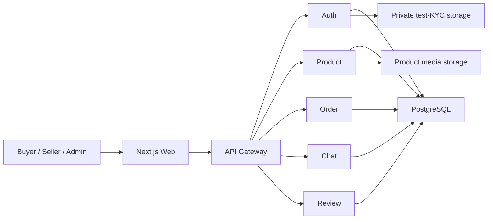

# เรียนรู้การสร้าง RE-LOOP จากศูนย์จนถึง Production

> เอกสารนี้ใช้แนวทาง `super-genius-teacher`: เริ่มจากศูนย์ นิยามศัพท์ก่อนใช้ ใช้ตัวอย่างชีวิตประจำวัน และไม่ทำให้ง่ายจนผิด  
> **Current** หมายถึงมีหลักฐานใน Repository แล้ว ส่วน **Proposed** หมายถึงแบบที่วางไว้แต่ยังไม่ได้สร้าง

## สารบัญ

1. คำศัพท์พื้นฐาน
2. ภาพรวม RE-LOOP
3. วิธีอ่าน Architecture, Decision, Task และ Evidence
4. เส้นทางเรียน Phase 0–12
5. แผนที่ Epic และ Task
6. ห้องทดลองของ Task สำคัญ
7. วิธี Debug และคิดแบบ Senior Engineer

## 1. คำศัพท์พื้นฐาน

### Web Application คืออะไร

Web Application คือโปรแกรมที่เราเปิดผ่านเว็บ เช่น ร้านค้าออนไลน์ มันต่างจากหน้าเว็บที่มีแต่ข้อมูลตรงที่ผู้ใช้กด สมัคร ส่งข้อมูล ซื้อของ หรือเปลี่ยนสถานะได้ RE-LOOP คือ Web Application เพราะผู้ซื้อ ผู้ขาย และ Admin ทำงานกับข้อมูลเดียวกันผ่าน Browser

### Browser คืออะไร

Browser คือโปรแกรมอย่าง Chrome หรือ Edge มันรับ HTML, CSS และ JavaScript แล้วประกอบเป็นหน้าจอ Browser ไม่ควรได้รับ Secret ของ Server และไม่ใช่ที่เก็บ Refresh Token แบบที่ JavaScript อ่านได้

### Frontend คืออะไร

Frontend คือส่วนที่ผู้ใช้มองเห็นและกดใช้งาน เปรียบเหมือนหน้าร้าน RE-LOOP ใช้ Next.js ใน `frontend/` ปัจจุบันมีเพียงหน้า Home, Login และ Register

### Backend คืออะไร

Backend คือส่วนหลังร้านที่ตรวจข้อมูล ตัดสินกฎ และคุยกับฐานข้อมูล RE-LOOP มี Gateway และ Service ห้าตัว แต่ปัจจุบันมีเฉพาะ Auth ที่ทำงานด้านธุรกิจจริง อีกสี่ตัวมีเพียง Health Check

### Database คืออะไร

Database คือสมุดทะเบียนที่ค้นหาและแก้ไขอย่างมีระบบ PostgreSQL เป็น Database ของ RE-LOOP ข้อมูลสำคัญต้องมีข้อบังคับ เช่น Email ห้ามซ้ำ และ Order ห้ามข้ามสถานะมั่ว

### HTTP คืออะไร

HTTP คือกติกาส่งข้อความระหว่าง Browser กับ Server เช่น `GET` ใช้ขอข้อมูล และ `POST` ใช้ส่งคำสั่ง HTTPS คือ HTTP ที่เข้ารหัสระหว่างทาง

### API คืออะไร

API คือเมนูและแบบฟอร์มมาตรฐานที่ Frontend ใช้คุยกับ Backend เช่น `POST /api/auth/login` API ที่ดีระบุ Input, Output, Error, สิทธิ์ และพฤติกรรมเมื่อส่งซ้ำ

### Authentication คืออะไร

Authentication แปลว่า “พิสูจน์ว่าคุณคือใคร” เช่นตรวจ Email และ Password แล้วออก Session ปัจจุบัน RE-LOOP ทำ Login ได้ แต่รูปแบบเก็บ Token ยังไม่พร้อม Production

### Authorization คืออะไร

Authorization แปลว่า “เมื่อรู้แล้วว่าคุณเป็นใคร คุณทำอะไรได้บ้าง” Buyer ดู Order ของตนได้ แต่ดูของคนอื่นไม่ได้ Admin อาจดูหลักฐานได้เฉพาะเมื่อมี Permission และเหตุผล

### Git คืออะไร

Git คือระบบเก็บประวัติการเปลี่ยนไฟล์ เปรียบเหมือน Save Game ที่เห็นว่าใครเปลี่ยนอะไร การ Commit ไม่ได้แปลว่าโค้ดถูก จึงต้องมี Test และ Review

### Environment คืออะไร

Environment คือสถานที่และค่าที่ระบบทำงาน Local คือเครื่องนักพัฒนา Test ใช้ทดสอบ Staging คือสนามซ้อมที่คล้าย Production และ Production คือระบบจริงที่ผู้ใช้เข้าได้

### Test คืออะไร

Test คือการตรวจแบบทำซ้ำได้ Unit Test ตรวจชิ้นเล็ก Integration Test ตรวจการต่อกับของจริง API Test ตรวจสัญญา Component Test ตรวจ UI และ E2E Test เดินทั้งกระบวนการเหมือนผู้ใช้

### Container คืออะไร

Container คือกล่องบรรจุโปรแกรมและสิ่งที่ต้องใช้ เพื่อให้รันใกล้เคียงกันหลายเครื่อง Docker สร้าง Container ได้ แต่ Container ไม่ได้ทำให้ระบบปลอดภัยหรือ Production-ready อัตโนมัติ

### Cloud คืออะไร

Cloud คือการเช่า Compute, Database, Storage และ Network จากผู้ให้บริการ RE-LOOP ยืนยันใช้ Google Cloud เป็นหลัก ส่วน AWS เป็น Stretch เท่านั้น

### CI/CD คืออะไร

CI คือระบบตรวจงานอัตโนมัติเมื่อมีการเปลี่ยนโค้ด CD คือระบบส่ง Artifact ที่ผ่านตรวจไปยัง Environment ถัดไป เปรียบเหมือนสายตรวจคุณภาพและสายส่งสินค้า

### Logging คืออะไร

Logging คือบันทึกเหตุการณ์ เช่น Request ล้มเหลวหรือ Order เปลี่ยนสถานะ Log ต้องค้นหาได้และห้ามบันทึก Password, Token หรือเอกสาร KYC

### Monitoring คืออะไร

Monitoring คือการเฝ้าดูตัวเลขและอาการ เช่น Error rate, Latency, Worker ค้าง และแจ้งเตือนคนรับผิดชอบ Log เหมือนไดอารี ส่วน Monitoring เหมือนหน้าปัดกับสัญญาณเตือน

### Production คืออะไร

Production คือ Environment ที่ผู้ใช้จริงเข้าถึงได้ “เปิดหน้าเว็บได้” ยังไม่พอ ต้องมี Security, Backup, Restore, Alert, Owner, Rollback และหลักฐานการทดสอบ

### Production View

มือใหม่มักมองระบบเป็นชุดหน้าเว็บ ผู้เชี่ยวชาญมองเป็นวงจรข้อมูล สิทธิ์ ความล้มเหลว และการกู้คืน ทุกคำศัพท์ด้านบนจึงเชื่อมกัน: Frontend ส่ง API, Backend บังคับกฎ, Database เก็บความจริง, Test ตรวจ, Cloud รัน และ Operations ดูแล

## 2. RE-LOOP ทำงานอย่างไร

ภาพนี้คือ Target แบบ **Proposed** รายละเอียดจริงอยู่ใน `architecture.md` ปัจจุบัน Product, Order, Chat และ Review ยังไม่มี Business Logic

Customer คือ Buyer กับ Seller Buyer ค้นสินค้า จอง ชำระแบบจำลอง ดู Order แชท รีวิว และ Report Seller ส่ง KYC ทดสอบ ลงสินค้า จัดส่ง และคุยกับ Buyer

Admin คือผู้ดูแลความปลอดภัยขั้นต่ำ เช่นอนุมัติ KYC ทดสอบ ตรวจ Report ระงับบัญชี ตัดสิน Dispute แบบจำลอง และดู Audit ไม่ใช่ผู้มีสิทธิ์ทุกอย่างโดยอัตโนมัติ

Shared Platform คือ Gateway, Auth, Permission, API Contract, Database, Storage, Job, Notification, Test, Security และ Cloud ทั้ง Customer และ Admin ใช้ส่วนนี้ร่วมกัน ห้ามสร้าง Backend ซ้ำ

### ข้อมูลเดินทางอย่างไร

เมื่อ Buyer กดจอง Frontend ส่ง API ผ่าน Gateway Order Service ขอ Product Service ล็อกสินค้าด้วยเงื่อนไขแบบ Atomic ซึ่งหมายถึงเปลี่ยนสำเร็จเป็นก้อนเดียวเพื่อลดการขายซ้ำ จากนั้น Mock Payment เปลี่ยนสถานะจำลองและ Worker ส่งงานต่อแบบกู้คืนได้ รายละเอียดอยู่ใน `architecture.md` ส่วน Critical Data Flow

### Production View

ผู้เชี่ยวชาญไม่ได้ถามเพียง “Happy Path ใช้ได้ไหม” แต่ถามต่อว่า Request ซ้ำเกิดอะไร Server ล่มตรงกลางเกิดอะไร คนไม่มีสิทธิ์ลอง URL ตรงเกิดอะไร และเราจะรู้/กู้คืนอย่างไร

## 3. วิธีอ่านเอกสารและทำหนึ่ง Task

- `decision.md` ตอบว่าเลือกอะไร ทำไม และเมื่อใดควรทบทวน
- `architecture.md` ตอบว่าส่วนต่าง ๆ อยู่ตรงไหนและคุยกันอย่างไร
- `planmain.md` กับ `planadminweb.md` ตอบว่าต้องทำงานอะไร
- `roadmap.md` ตอบว่าทำก่อนหลังและทำคู่ขนานอะไรได้
- `deployment.md` ตอบว่าจะส่งขึ้น Cloud และกู้คืนอย่างไร
- `progress.md` ตอบว่าหลักฐานล่าสุดบอกว่างานอยู่สถานะใด
- `handoff.md` ช่วยคนถัดไปเริ่มโดยไม่เดา

ทุก Task ใช้คำถาม 26 ข้อนี้:

1. มันคืออะไร
2. อยู่ตรงไหน
3. แก้ปัญหาอะไร
4. ทำเพื่ออะไร
5. ทำไมต้องทำ
6. ก่อนหรือหลังอะไร
7. Input คืออะไร
8. ขั้นตอนคืออะไร
9. เครื่องมืออะไร
10. Technology คืออะไร
11. Technology ทำงานอย่างไร
12. ทำไมเลือก
13. ทางเลือกอะไร
14. ข้อดีข้อเสีย
15. ตัวอย่างใน RE-LOOP
16. Output คืออะไร
17. ตรวจถูกอย่างไร
18. ทดสอบอย่างไร
19. มือใหม่พลาดอะไร
20. Debug อย่างไร
21. Security อะไร
22. Performance อะไร
23. ไม่ทำเกิดอะไร
24. ทำผิดเกิดอะไร
25. Definition of Done คืออะไร
26. Senior Engineer คิดอย่างไร

อย่าเริ่มจากแก้ไฟล์ ให้เริ่มจากอ่าน Task card แล้วเขียน Test ที่พิสูจน์ Acceptance Criteria เมื่อทำเสร็จต้องมี Owner, Reviewer, Evidence และ Teach-back

### Production View

Senior Engineer ลด “การตีความใหม่” ระหว่างลงมือ เขาจะทำให้ Input, ขอบเขต, Failure, Evidence และ Recovery ชัดก่อน แล้วส่งงานขนาดที่อีกคนตรวจได้

## 4. เส้นทางเรียน Phase 0–12

แต่ละ Phase ด้านล่างใช้กรอบ 26 ข้อแบบเดียวกัน เพื่อไม่ให้ช่วงท้ายถูกสรุปลวก

### Phase 0 — Discovery และ Requirement Validation (`DISC-001`)

1. **คืออะไร:** การยืนยันโจทย์ก่อนเลือกแบบ
2. **อยู่ตรงไหน:** จุดเริ่ม Roadmap
3. **แก้ปัญหา:** Requirement/งบ/Region/SLO ที่ยังไม่รู้
4. **ทำเพื่อ:** ไม่สร้างผิดวิชาและผิดเป้าหมาย
5. **ทำไม:** Architecture ขึ้นกับคำตอบเหล่านี้
6. **ลำดับ:** ก่อน Production IaC; ทำคู่ `FOUND-001` ได้
7. **Input:** Source, Config, Schema, User answer, Rubric
8. **ขั้นตอน:** แยก Fact/Assumption → ถามทีละข้อ → บันทึก ADR
9. **เครื่องมือ:** Repository search, interview, decision log
10. **Technology:** ยังไม่เลือก Technology ใหม่
11. **การทำงาน:** เปลี่ยน Unknown เป็น Answer หรือ Blocker
12. **เหตุผล:** ถูกกว่าการรื้อระบบทีหลัง
13. **ทางเลือก:** เดาแล้วทำ หรือรอทุกอย่าง
14. **ข้อดี/เสีย:** ยืนยันก่อนลด rework แต่ต้องรอคนตอบ
15. **ตัวอย่าง:** Microservices เป็นข้อบังคับวิชาหรือไม่
16. **Output:** ADR และ Requirement ที่มีเจ้าของ
17. **ตรวจ:** ทุก Critical unknown มีสถานะ
18. **Test:** Reviewer หา Fact ที่ไม่มี Evidence
19. **พลาด:** ถามสิ่งที่อ่านจาก Repo ได้
20. **Debug:** ไล่ claim กลับไป Source
21. **Security:** ยืนยันชนิดข้อมูล/Retention
22. **Performance:** ยืนยัน Load target ไม่เดา
23. **ไม่ทำ:** เลือก Cloud/DB ผิด
24. **ทำผิด:** Assumption กลายเป็น Fact
25. **DoD:** เกณฑ์ใน `DISC-001` ครบ
26. **Senior View:** Unknown ที่สำคัญคือ Risk ไม่ใช่ช่องว่างที่ซ่อนได้

**Production View:** Production ที่ดีเริ่มจากคำมั่นที่วัดได้และมีเจ้าของ ไม่ใช่รายการ Technology

### Phase 1 — Architecture และ Foundation (`FOUND-001`, `FOUND-002`, `ARCH-001`)

1. คือการล็อกเครื่องมือ Contract และ Quality Gate
2. อยู่ที่ Root package, CI และ Shared contract
3. แก้ “เครื่องฉันรันได้” และ Service เดาคนละแบบ
4. ทำเพื่อให้หกคนกับ Agent ทำงานร่วมกัน
5. ต้องทำเพราะไม่มี Lockfile/Test/CI
6. หลัง Phase 0 บางส่วน ก่อน Schema/API
7. Input คือ Current package, Gateway และ Workflow
8. Pin version → Test wiring → Contract/State/Error
9. npm, lint/static/test, CI, API schema
10. Lockfile และ Contract คือกติกาที่ Machine ตรวจได้
11. CI รันกติกาเดิมทุก Change
12. เลือกของน้อยแต่ชัดเพราะทีมเล็ก
13. ทางเลือกคือ Manual check หรือ Tool จำนวนมาก
14. Automated gate สม่ำเสมอแต่ต้องดูแล
15. ตัวอย่างคือ Error envelope และ Idempotency key
16. Output คือ Setup ที่ทำซ้ำได้และ Contract ที่ Review แล้ว
17. ตรวจด้วย Clean install และ Contract test
18. ทดสอบให้ Gate ล้มเมื่อใส่ Error ตั้งใจ
19. พลาดโดยตั้ง Coverage สูงแต่ Test ไม่มีคุณค่า
20. Debug จาก Gate แรกที่ล้ม
21. Secret scan และ Fail-closed config
22. วัดเวลาของ CI ไม่ให้ Feedback ช้าเกิน
23. ไม่ทำแล้ว Integration พังปลายทาง
24. ทำผิดแล้ว Tool ขวางงานโดยไม่ลด Risk
25. DoD ตามสาม Task card
26. Senior มอง Contract เป็นเครื่องมือประสานทีม

**Production View:** Foundation ไม่ใช่งานตกแต่ง มันคือระบบป้องกันความผิดพลาดซ้ำ

### Phase 2 — UX/UI และ Design System (`CUST-001`, `ADMIN-001`)

1. คือส่วนประกอบ UI และโครงหน้าที่ใช้ซ้ำ
2. อยู่ใน `frontend/app`, `components`, `lib`
3. แก้ Navigation/Form/Error/Session ที่ไม่สม่ำเสมอ
4. ทำเพื่อให้ Customer/Admin ใช้ง่าย
5. ต้องทำก่อน Feature UI จำนวนมาก
6. ทำหลัง Session/API contract; Mock ได้
7. Input คือ Brand, Contract, Accessibility target
8. Token → Component → Layout → State → Test
9. Next.js, React, Tailwind, component test
10. Design token คือค่ากลางของสี/ระยะ/ตัวอักษร
11. Component รับข้อมูลและแสดง State
12. ใช้ App เดียวตาม `ADR-002` เพื่อลดงานซ้ำ
13. ทางเลือกคือ Admin App แยก
14. App เดียวง่ายกว่าแต่ Release ผูกกัน
15. ตัวอย่างคือ Demo banner และ 403 page
16. Output คือ Shell ที่ Responsive/Keyboard ใช้ได้
17. ตรวจที่ 360px และ Desktop
18. Component, Accessibility และ Session E2E
19. พลาดโดยซ่อนปุ่มแล้วคิดว่าปลอดภัย
20. Debug DOM, Network, Console และ Request ID
21. Backend ต้องบังคับ Permission
22. Lazy-load Admin และจำกัด Bundle
23. ไม่ทำแล้วทุกหน้าสร้าง Pattern เอง
24. ทำผิดแล้ว Shared component พังหลายหน้า
25. DoD คือ Test + Screenshot + A11y Evidence
26. Senior ออกแบบ Error/Empty/Loading พร้อม Happy Path

**Production View:** UI Production-grade ป้องกันการกดผิดและอธิบายสถานะจริง ไม่ใช่แค่สวย

### Phase 3 — Database และ Core Backend (`DB-001`–`DB-004`, `API-001`)

1. คือแหล่งความจริงและประตูรับคำสั่ง
2. อยู่ใน Prisma/Migration/Service/Gateway
3. แก้ DB ว่าง ไม่มี Migration และ Trust boundary หลวม
4. ทำเพื่อเก็บ State ถูกและเปลี่ยนได้ปลอดภัย
5. ต้องทำก่อน Domain API
6. หลัง Contract ก่อน Customer Feature
7. Input คือ State machine, Owner, Retention
8. Model → Constraint/Index → Migration → API safety → Test
9. PostgreSQL, Prisma, Express, schema validator
10. Migration คือประวัติการเปลี่ยน Schema
11. Transaction ทำหลายการเปลี่ยนให้สำเร็จ/ล้มด้วยกัน
12. แยก DB ตาม Service เพราะ Current topology
13. ทางเลือกคือ Shared DB หรือหลาย Instance
14. Logical DB ลด Cost แต่แชร์ Failure domain
15. ตัวอย่างคือ Reservation ห้ามซ้ำ
16. Output คือ Schema/API foundation ที่ Versioned
17. ตรวจ Migration จาก DB เก่าและว่าง
18. Integration, constraint, contract, concurrency test
19. พลาดโดยใช้ `db push` บน Production
20. Debug จาก Migration log, SQL plan, Request ID
21. Least privilege, validation, safe error
22. Index จาก Query จริง ไม่ใส่สุ่ม
23. ไม่ทำแล้วข้อมูลเสีย/Deploy ย้อนยาก
24. ทำผิดแล้ว Lock table หรือข้อมูลหาย
25. DoD คือ Migration/Recovery/Test/Review
26. Senior ออกแบบข้อมูลจาก Invariant และ Failure

**Production View:** Database ไม่ใช่ที่เทข้อมูล มันเป็นด่านสุดท้ายของความถูกต้อง

### Phase 4 — Authentication และ Authorization (`AUTH-001`–`AUTH-003`)

1. คือการรู้ว่าใครและอนุญาตอะไร
2. อยู่ Auth, Gateway, Service, Frontend session
3. แก้ Single role, localStorage, stale token
4. ทำเพื่อ Customer/Admin ปลอดภัย
5. Public demo ทำให้เป็น Critical path
6. หลัง `DB-001`/`API-001` ก่อน Sensitive feature
7. Input คือ Role/Permission/Cookie/KYC policy
8. Policy test → Schema → Session rotation → KYC
9. JWT, HttpOnly cookie, bcrypt, RBAC
10. JWT คือใบรับรองที่มีลายเซ็น; Cookie คือช่องส่งข้อมูลของ Browser
11. Refresh จะโหลด Role ล่าสุดและหมุน Session
12. เลือกตาม `ADR-003` ที่ผู้ใช้ยืนยัน
13. ทางเลือกคือ Opaque server session
14. JWT ใช้กับ API ง่ายแต่ต้องจัดการ Revocation/CSRF
15. ตัวอย่าง Buyer+Seller ในบัญชีเดียว
16. Output คือ Session/RBAC/KYC ที่ทดสอบได้
17. ตรวจ Storage/Cookie/Permission matrix
18. Token replay, CSRF, stale role, unauthorized KYC
19. พลาดโดยเชื่อ Role จาก Frontend
20. Debug Cookie attributes, CORS, Auth log ที่ Redact
21. Hash refresh, rate limit, default deny
22. ลด DB lookup ด้วยวิธีที่ไม่ทำ Role ค้าง
23. ไม่ทำแล้ว Account/Admin ถูกยึดง่าย
24. ทำผิดแล้ว Lockout หรือ Privilege escalation
25. DoD ตาม `AUTH-*`
26. Senior แยก Authentication, Authorization และ Resource ownership

**Production View:** “Login ได้” เป็นเพียงจุดเริ่ม Session ต้องยกเลิกได้ สิทธิ์ต้องสด และทุกทางเข้าต้องบังคับ

### Phase 5 — Customer Web (`API-002`–`API-004`, `CUST-002`–`CUST-005`)

1. คือ Buyer/Seller lifecycle
2. อยู่ Product/Order/Chat/Review และ Customer UI
3. แก้ปัญหาค้น-ขาย-ซื้อ-คุย-รีวิว
4. ทำเพื่อ Value หลักของ Release A
5. เป็นเป้าหมายที่ผู้ใช้ให้ความสำคัญสูงสุด
6. หลัง Foundation/Auth/Data
7. Input คือ Product/Order/Interaction contracts
8. ทำ Vertical slice จาก Test → API → UI → E2E
9. Next.js, Express, Prisma, WebSocket, Worker
10. Vertical slice คือทำเส้นบางที่ผ่านทุกชั้น
11. แต่ละ Service เป็นเจ้าของ State ของตน
12. เลือก Customer-first ตาม Confirmed requirement
13. ทางเลือกคือสร้างทุก Backend ก่อน UI
14. Slice ได้ Feedback เร็วแต่ต้องล็อก Contract
15. ตัวอย่าง Browse → Reserve → Mock pay → Ship
16. Output คือ Demo journey จริง
17. ตรวจจาก State/API/DB ไม่ดู UI อย่างเดียว
18. E2E, concurrency, authorization, accessibility
19. พลาดโดย Timer ฝั่ง Browser เป็นความจริง
20. Debug ด้วย Request ID และ State history
21. Output encoding, party permission, no financial data
22. Pagination, indexes, cancel stale request
23. ไม่ทำแล้วไม่มี Product value
24. ทำผิดแล้วขายซ้ำหรือแสดง Paid เท็จ
25. DoD คือ Customer E2E + Recovery
26. Senior ให้ Owning service เป็นผู้ตัดสิน State

**Production View:** UI ต้องสะท้อน State ที่ Server Commit แล้ว ไม่ใช่ความหวังของปุ่มที่เพิ่งกด

### Phase 6 — Admin Web (`ADMIN-002`–`ADMIN-004`)

1. คือเครื่องมือปฏิบัติการที่มีสิทธิ์สูง
2. อยู่ `/admin` แต่ใช้ Shared Backend
3. แก้ KYC, Moderation, Dispute และ Audit
4. ทำเพื่อให้ Public demo ดูแลได้
5. Admin ขั้นต่ำเป็น Launch blocker
6. หลัง RBAC/API; Single action ก่อน Bulk
7. Input คือ Permission/Policy/Case state
8. Queue → Detail → Preview → Confirm → Audit → Recover
9. Next.js, Admin API, audit log, worker
10. Audit log คือหลักฐานใครทำอะไรเมื่อไร
11. Server ตรวจ Permission และ Version ก่อนเปลี่ยน
12. เลือก Case-based UI ลดการกดผิด
13. ทางเลือกคือปุ่มตรงจากตาราง
14. Case ช้ากว่านิดแต่ตรวจสอบ/กู้คืนง่าย
15. ตัวอย่าง Approve test-KYC พร้อมเหตุผล
16. Output คือ Safety operation ที่ตรวจย้อนหลังได้
17. ตรวจ Permission negative และ Audit
18. E2E, stale conflict, dangerous-action recovery
19. พลาดโดยสร้าง Bulk ก่อน Single action ปลอดภัย
20. Debug จาก Case history/Request ID
21. Least privilege, re-auth, sensitive-read audit
22. Pagination และ async bounded job
23. ไม่ทำแล้ว Public abuse ไม่มีทางแก้
24. ทำผิดแล้ว Ban/Export จำนวนมากผิดคน
25. DoD คือ Permission+Confirmation+Audit+Rollback
26. Senior มอง Admin เป็น Safety-critical product

**Production View:** หลังบ้านไม่ควร “สะดวกที่สุด” หากความสะดวกทำให้ความเสียหายขยายได้

### Phase 7 — External Integration (`INT-001`–`INT-003`)

1. คือขอบต่อกับ Storage, Worker และ Recommendation
2. อยู่ Adapter/Worker ไม่กระจายทั่ว Domain
3. แก้ Provider lock-in และงานล้มกลางทาง
4. ทำเพื่อเปลี่ยน Provider/Strategy ได้
5. Choice บางอย่างยังไม่ยืนยัน
6. Storage/Worker เร็ว; Recommendation JIT
7. Input คือ Contract, data, budget, metric
8. Fake adapter → Contract test → Provider → Failure test
9. GCS, optional S3, outbox/queue, strategy interface
10. Adapter คือปลั๊กแปลงภาษาของระบบ
11. Domain เรียก Interface ไม่รู้ Provider
12. เลือกเพื่อลดการผูกกับ GCP/AI
13. ทางเลือกคือเรียก SDK ตรงทุกจุด
14. Adapter เพิ่มชั้นแต่ Test/เปลี่ยนง่าย
15. ตัวอย่าง `RecommendationStrategy`
16. Output คือ Integration ที่สลับ/กู้ได้
17. ตรวจด้วย Contract suite
18. Timeout, duplicate, outage, fallback
19. พลาดโดย Implement Algorithm และ AI พร้อมกัน
20. Debug ที่ Boundary และ Provider response แบบ Redact
21. ไม่ส่งข้อมูลส่วนตัวให้ Provider โดยไม่อนุมัติ
22. วัด Latency/Cost/Queue lag
23. ไม่ทำแล้ว Failure สูญงาน
24. ทำผิดแล้ว Vendor lock-in/ค่าใช้จ่ายพุ่ง
25. DoD คือ Failure/Fallback/Metric
26. Senior ซื้อ Optionality เฉพาะจุดที่ไม่แน่นอนจริง

**Production View:** Integration ที่ดีถูกออกแบบจากวันที่ Provider ช้า ล่ม หรือแพง ไม่ใช่แค่วันที่ตอบ 200

### Phase 8 — Testing และ Security Hardening (`TEST-001`, `TEST-002`, `SEC-001`)

1. คือการพิสูจน์และโจมตีสมมติฐาน
2. อยู่ทุกชั้นและ Staging
3. แก้ False confidence
4. ทำเพื่อ Go/No-go ที่มีหลักฐาน
5. AI code ต้องมี Human-verifiable evidence
6. ทำทุก Phase; Phase 8 จบเฉพาะส่วนที่ไม่ต้องใช้ Cloud แล้วไปปิด `TEST-002`/`SEC-001` ใน Phase 10
7. Input คือ Risk/Acceptance/Threat model
8. Map risk → test → run → triage → rerun
9. Test framework, browser E2E, scanner, load tool
10. Threat model คือแผนที่ผู้โจมตี/ทรัพย์สิน/ทางเข้า
11. Test สร้าง Input แล้วเปรียบเทียบผลจริง
12. เลือก Risk-based ไม่ไล่ Coverage ตัวเลขอย่างเดียว
13. ทางเลือกคือ Manual demo
14. Automation ทำซ้ำได้แต่ Manual ยังจำเป็นกับ UAT
15. ตัวอย่างแข่ง Reserve สินค้าเดียว
16. Output คือ Report/Defect/Risk acceptance
17. ตรวจ Traceability ทุก Acceptance
18. Unit ถึง Restore drill
19. พลาดโดย Skip test แล้วไม่บอก
20. Debug ทำให้ Reproduce ได้เล็กที่สุด
21. OWASP/Authz/Upload/Secret
22. Percentile/Error/Saturation
23. ไม่ทำแล้วปัญหาไปเจอใน Public
24. ทำผิดแล้ว Test ผ่านแต่ไม่ทดสอบ Risk
25. DoD ระยะนี้คือ pre-Staging evidence ครบ; DoD ทั้งระบบอยู่ Phase 10
26. Senior ใช้ Test เพื่อลดความไม่แน่นอน

**Production View:** จำนวน Test ไม่สำคัญเท่ากับ Risk สำคัญมีหลักฐานหรือยัง

### Phase 9 — Cloud Infrastructure (`INFRA-001`)

1. คือทรัพยากร Cloud ที่สร้างด้วย Code
2. อยู่ GCP Project/Network/Compute/Data/Storage
3. แก้ Manual drift และ Shared secret
4. ทำเพื่อ Environment ที่ทำซ้ำและ Audit ได้
5. Public URL ต้องมี IAM/TLS/Cost guard
6. หลัง Architecture/Input ก่อน Staging
7. Input คือ Region/Budget/SLO/Topology
8. Select criteria → IaC non-prod → policy test → staging
9. IaC tool, GCP, registry, Secret Manager
10. IaC คือไฟล์บอก Desired infrastructure
11. Tool เปรียบเทียบ Current กับ Desired แล้ว Apply
12. GCP เพราะผู้ใช้ยืนยันเป็นหลัก
13. ทางเลือก AWS หรือ manual console
14. IaC เรียนยากกว่าแต่กู้/Review ได้
15. ตัวอย่าง private DB และสอง Storage
16. Output คือ Staging ที่ Recreate ได้
17. ตรวจ Plan/Drift/IAM negative
18. Policy, network, budget, health test
19. พลาดโดยเปิด DB/Storage Public
20. Debug Audit log, IaC plan, service health
21. Least privilege, short-lived CI identity
22. Concurrency/connection/cold-start/cost
23. ไม่ทำแล้ว Deploy ซ้ำไม่ได้
24. ทำผิดแล้วข้อมูลรั่วหรือ Bill พุ่ง
25. DoD คือ IaC+Security+Cost+Recovery
26. Senior เลือก Managed service เพื่อลดงานที่ไม่สร้าง Value

**Production View:** Cloud ไม่ใช่ Computer คนอื่นอย่างเดียว แต่เป็นระบบสิทธิ์ ค่าใช้จ่าย และ Failure domain

### Phase 10 — Staging และ UAT (`DEPLOY-001`, `TEST-002`, `OPS-001`)

1. คือการซ้อม Production
2. อยู่ GCP Staging
3. แก้ความต่างระหว่าง Local กับ Cloud
4. ทำเพื่อพิสูจน์ Deploy/Operate/Recover
5. Cookie/Network/Migration พังได้เฉพาะ Environment จริง
6. หลัง Infrastructure/vertical slices ก่อน Production
7. Input คือ immutable artifact และ runbook
8. Deploy → `INT-004` ทดสอบ GCS/IAM → migrate → smoke → ปิด `TEST-002`/`SEC-001` → UAT/load/failure → rollback/restore
9. CI/CD, registry, browser/load/monitor tools
10. Immutable artifact คือ package เดิมที่ไม่แก้ระหว่างทาง
11. Pipeline promote Digest เดียว
12. เลือก Build once ลด “Staging กับ Prod คนละของ”
13. ทางเลือกคือ Build ใหม่ทุก Environment
14. Digest เดียวเชื่อถือได้แต่ Config ต้องแยก
15. ตัวอย่างหมุน Cookie บน HTTPS จริง
16. Output คือ Release evidence
17. ตรวจ Digest/Migration/Smoke/Dashboard
18. E2E/UAT/Load/Alert/Rollback/Restore
19. พลาดโดยใช้ข้อมูลจริงทดสอบ
20. Debug จาก Request ID และ Revision
21. Synthetic data, isolated secrets
22. วัด p95/error/worker lag/cost
23. ไม่ทำแล้ว Production เป็นการทดลอง
24. ทำผิดแล้ว Staging ไม่คล้าย Prod
25. DoD คือซ้อม Deploy/Recover สำเร็จ
26. Senior ใช้ Staging เพื่อตรวจสมมติฐานที่ Local ตรวจไม่ได้

**Production View:** Staging มีค่าเมื่อมันตอบคำถาม ไม่ใช่เมื่อมันแค่เปิดได้อีก URL

### Phase 11 — Production Launch (`DEPLOY-002`)

1. คือการเปิด Traffic สู่ Release ที่อนุมัติ
2. อยู่ GCP Production/DNS/TLS
3. แก้การปล่อยแบบไม่มี Gate
4. ทำเพื่อ Public coursework demo
5. ผู้ใช้จริงและผู้โจมตีเข้าได้
6. หลังทุก Launch blocker ปิด
7. Input คือ signed evidence/digest/checklist
8. Go/no-go → backup → deploy → traffic → smoke → monitor
9. CD, DNS/TLS, monitoring, rollback
10. Rollback คือพา Traffic กลับ Revision ก่อน
11. Schema ต้อง Compatible ระหว่าง Revision
12. เลือก Manual approval เพราะ Impact สูง
13. ทางเลือก Fully automatic
14. Manual ช้ากว่าแต่เหมาะทีม/วิชา
15. ตัวอย่างปิด Checkout หาก Order error
16. Output คือ public URL และ release record
17. ตรวจจากภายนอกและ Dashboard
18. Smoke/alert/rollback
19. พลาดโดยฉลองก่อน Monitoring window
20. Debug Revision/Request/Migration
21. TLS, rate, demo warning, Admin safety
22. Error/latency/saturation/cost
23. ไม่ทำอย่างมีระบบแล้วกู้ช้า
24. ทำผิดแล้วข้อมูล/ความเชื่อมั่นเสีย
25. DoD คือ Human sign-off และ Stable window
26. Senior เตรียม Rollback ก่อนกด Deploy

**Production View:** Launch คือการตัดสินใจด้าน Risk ของมนุษย์ ไม่ใช่คำสั่งสุดท้ายของ AI

### Phase 12 — Monitoring และ Continuous Improvement (`OPS-001`, `DOC-001`, Stretch `INFRA-002`)

1. คือการดูแลหลังเปิด
2. อยู่ Dashboard/Alert/Runbook/Backlog
3. แก้ปัญหา Production เปลี่ยนตลอด
4. ทำเพื่อ Stable, Cost-aware learning
5. Production ไม่จบเมื่อ Deploy
6. หลัง Launch ต่อเนื่อง
7. Input คือ Metrics/Incident/Feedback
8. Observe → prioritize → change → verify → document
9. monitoring, issue tracker, restore drill
10. SLI คือค่าที่วัดบริการ; Alert คือสัญญาณให้คนลงมือ
11. Feedback จริงปรับ Priority
12. เลือก Improvement จาก Evidence
13. ทางเลือกคือ Feature-driven อย่างเดียว
14. Evidence ลดงานฟุ่มเฟือยแต่ต้องมี Owner
15. ตัวอย่าง Worker lag หรือค่า Egress
16. Output คือ tuned system และ backlog
17. ตรวจ Outcome หลัง Change
18. regression/smoke/restore schedule
19. พลาดโดย Alert ทุกอย่างจนไม่มีใครอ่าน
20. Debug จาก Timeline และ Correlation
21. Incident/secret/data handling
22. Capacity/Cost trend
23. ไม่ทำแล้วระบบเสื่อมเงียบ
24. ทำผิดแล้ว Noise และ Cost สูง
25. DoD คือ Action มี Owner/Evidence
26. Senior ปรับระบบจาก Signal ไม่ใช่ความรู้สึก

**Production View:** AWS Stretch เริ่มได้เมื่อ GCP ไม่มี Blocker เท่านั้น และต้องบอกตรง ๆ ว่าเป็น Portability demo ไม่ใช่ Failover

## 5. แผนที่ Epic และ Task

| Epic | มันแก้อะไร / อยู่ตรงไหน | Task | Input → Output | Test/Security/Performance | ถ้าไม่ทำ / DoD / Senior view |
|---|---|---|---|---|---|
| Discovery | Unknown ที่บังคับ Architecture | `DISC-001` | Answer → ADR | Evidence review | เดา Requirement / ทุก Critical ชัด / ลด irreversible choice |
| Foundation | งานทำซ้ำไม่ได้ | `FOUND-001`, `FOUND-002` | Repo → deterministic gate | clean install, scan, CI time | Integration แตก / gate ผ่าน / feedback เร็ว |
| Architecture | Owner/Contract ไม่ชัด | `ARCH-001` | workflow → contract | contract/negative/replay | Service ชนกัน / reviewer approve / boundary ชัด |
| Database | ไม่มี migration/domain schema | `DB-001`–`DB-004` | invariant → schema | migration/concurrency/privacy | data เสีย / restore ได้ / DB บังคับกฎ |
| API | skeleton ไม่มีธุรกิจ | `API-001`–`API-004` | contract → endpoints | validation/authz/load | UI หลอก / contract pass / owner ตัดสิน |
| Auth | session/role ไม่ปลอดภัย | `AUTH-001`–`AUTH-003` | identity policy → secure session/KYC | CSRF/replay/permission/upload | takeover / negative pass / default deny |
| Customer | ไม่มี Buyer/Seller journey | `CUST-001`–`CUST-005` | APIs → usable lifecycle | E2E/a11y/conflict | ไม่มี Value / UAT pass / server state truthful |
| Admin | ไม่มี safety operation | `ADMIN-001`–`ADMIN-004` | case → audited action | permission/stale/recovery | public risk / audit+rollback / limit blast radius |
| Integration | provider/failure ผูกแน่น | `INT-001`–`INT-003` | adapter/data → provider result | contract/fallback/cost | lost work / replay/fallback / choose JIT |
| Test/Security | confidence ไม่มีหลักฐาน | `TEST-*`, `SEC-001` | risk → evidence | all relevant layers | launch blind / no blocker / test risk |
| Infra/Deploy/Ops | local-only | `INFRA-*`, `DEPLOY-*`, `OPS-001` | artifact/IaC → operated service | smoke/rollback/restore/alert | public chaos / recoverable / design operations |
| Documentation | คนถัดไปต้องเดา | `DOC-001` | evidence → synced docs | ID/link/status check | knowledge loss / handoff works / docs are interface |

ทุก Epic ใช้กรอบ 26 ข้อในส่วน 3 และรายละเอียดจริงของ Input, Step, Technology, Alternative, Risk, Rollback และ DoD อยู่ใน Task card ที่อ้าง

## 6. ห้องทดลองของ Task สำคัญ

### Lab A — `AUTH-002`: ทำไม Token ปัจจุบันต้องเปลี่ยน

Current เก็บ Access และ Refresh Token ใน `localStorage` JavaScript จึงอ่านได้ หากเกิด XSS ซึ่งคือการที่ Script อันตรายรันในหน้าเว็บ มันอาจขโมย Token

Proposed เก็บ Access Token ใน Memory จึงหายเมื่อ Reload/ปิดหน้า ส่วน Refresh Token อยู่ใน HttpOnly Cookie ที่ JavaScript อ่านไม่ได้ Server หมุน Token ทุกครั้งและตรวจ Role ล่าสุด

Input คือ User/Role/Session policy Output คือ Session ที่ Login, Refresh, Logout, Revoke และ Role change ได้ Technology คือ JWT, Cookie, Hash และ CSRF control ทางเลือกคือ Opaque session ซึ่งยังเป็นทางเลือกที่ดี แต่ไม่ใช่ตัวที่ผู้ใช้ยืนยัน

ตรวจด้วย Browser storage, Cookie attributes, CSRF negative, Token reuse, parallel 401 และ suspended user มือใหม่พลาดเมื่อแก้ Cookie แต่ลืม CORS/SameSite/HTTPS Debug จาก Network tab และ Server log ที่ไม่พิมพ์ Token

Security คือเป้าหมายหลัก Performance ต้องป้องกัน Refresh storm ถ้าไม่ทำ Account เสี่ยงถูกยึด ถ้าทำผิดผู้ใช้ Login ไม่ได้หรือ Session ถูกปลอม DoD อยู่ใน `AUTH-002`

**Production View:** ผู้เชี่ยวชาญมอง Session เป็นวงจรชีวิตที่ยกเลิกและตรวจย้อนหลังได้ ไม่ใช่ String ที่ออกครั้งเดียว

### Lab B — `API-003`: ป้องกันขายสินค้าชิ้นเดียวสองครั้ง

Input คือ Product `AVAILABLE` และ Request ของ Buyer สองคน Output ที่ถูกคือมีคนเดียวได้ Reservation Database ต้องใช้ Conditional update/transaction ไม่ใช้เพียง Timer ใน Browser

ขั้นตอนคือ Test การแข่ง → Reserve แบบ Atomic → บันทึก Idempotency → Mock pay → Outbox → Mark sold/release → Reconcile Technology คือ PostgreSQL transaction, API contract และ Worker

ทางเลือกคือ Lock ใน Redis อย่างเดียวซึ่งเร็วแต่หาก Cache หายอาจผิดความจริง จึงให้ PostgreSQL เป็น Source of truth ข้อเสียคือ Transaction path ต้องออกแบบและ Load test

ตรวจด้วย Concurrent request, Duplicate idempotency, Crash หลัง Commit, Expiry และ Reconciliation Security ตรวจ Order ownership Performance วัด Lock contention ถ้าไม่ทำเกิด Double sale ถ้าทำผิดอาจค้าง `RESERVED`

**Production View:** Senior ออกแบบ State machine และ Recovery ก่อน UI Checkout เพราะ Transaction ที่แก้ย้อนหลังไม่ได้มีราคาแพงที่สุด

### Lab C — `ADMIN-003`: ทำไม Admin ต้องมี Case และ Audit

Admin action มี Blast radius หรือขนาดความเสียหายสูง Input จึงไม่ควรมีเพียง Target ID แต่ต้องมี Case, Evidence, Permission, Current version และ Reason

UI แสดง Preview แล้วให้ยืนยัน Server ตรวจ Permission/State ซ้ำ จากนั้นบันทึก Action กับ Request ID และมี Recovery เช่น Unban หรือ Restore เมื่อ Policy อนุญาต

ทดสอบคนไม่มี Permission, Case เก่า, Double click, Wrong state, Chat evidence read และ Rollback Security คือ Least privilege/reauth/privacy Performance คือ Pagination และ lazy evidence

ถ้าไม่ทำ Public abuse ไม่มีทางจัดการ ถ้าทำผิด Admin อาจเห็นข้อมูลเกินจำเป็นหรือเปลี่ยนหลายรายการผิด DoD คือ Permission, Confirmation, Audit, Recovery, E2E และ UAT

**Production View:** ผู้เชี่ยวชาญออกแบบหลังบ้านเหมือนเครื่องมือควบคุมเครื่องจักร ไม่ใช่ CRUD table ธรรมดา

### Lab D — `DEPLOY-002`: Deploy กับ Launch ต่างกันอย่างไร

Deploy คือวาง Revision ใหม่ใน Environment Launch คืออนุญาตให้ผู้ใช้จริงเข้าถึง การ Deploy อาจสำเร็จแต่ Launch ยังห้ามได้ถ้า Test, Alert, Backup หรือ Owner ไม่พร้อม

Input คือ Digest ที่ผ่าน Gate, Migration, Checklist และ Human approval ขั้นตอนคือ Backup → Deploy → Migrate แบบ Compatible → Traffic → Smoke → Monitor → Rollback เมื่อเกิน Threshold

เครื่องมือจริงยัง Pending `INFRA-001`; ห้ามแต่ง Command ทางเลือกคือ Fully automatic Production แต่ทีม/Impact นี้เหมาะกับ Manual approval

ตรวจ Digest, URL, TLS, Cookie, Critical journey, Dashboard, Alert และ Rollback ถ้าไม่ทำ Launch กลายเป็นการทดลอง ถ้าทำผิดอาจต้อง Restore data DoD อยู่ใน `DEPLOY-002`

**Production View:** Senior ไม่วัดความเก่งจาก Deploy เร็วอย่างเดียว เขาวัดจากการรู้ว่าเมื่อใดไม่ควร Deploy และกู้กลับได้เร็วเพียงใด

## 7. วิธี Debug และคิดแบบ Senior Engineer

Debug แปลว่าหาสาเหตุ ไม่ใช่ลองแก้สุ่ม เริ่มจากทำให้ปัญหาเกิดซ้ำ ลดให้เหลือกรณีเล็กที่สุด ดูเส้นทาง Browser → Gateway → Service → Database/Storage/Worker แล้วใช้ Request ID เชื่อมหลักฐาน

ถ้า UI ผิด ให้ดู Network response ก่อน ถ้า API ผิด ให้ดู Contract/Validation/Permission ถ้า State ผิด ให้ดู Transaction/History/Outbox ถ้า Cloud ผิด ให้ดู Revision, Config, IAM, Health และ Provider audit

อย่าแก้ข้อมูล Production ด้วยมือเพื่อทำให้อาการหายก่อนรู้สาเหตุ หากต้อง Recovery ให้ใช้ Runbook, Backup, Compensating action และ Audit

### World-Class View

สิ่งที่แยกผู้เชี่ยวชาญออกจากมือใหม่ไม่ใช่การจำ Technology ได้มากกว่า แต่คือการมองเห็น Invariant, Boundary, Failure และ Evidence เขาจะลดความเสียหายเมื่อผิดพลาด ทำทางย้อนกลับ และไม่เรียกสิ่งที่ยังไม่ได้พิสูจน์ว่า “เสร็จ”  

### Production View สุดท้าย

เส้นทางจากศูนย์ถึง Production ของ RE-LOOP คือ: ยืนยันโจทย์ → ทำกติกาที่ตรวจได้ → สร้างข้อมูล/สิทธิ์อย่างปลอดภัย → ส่งมอบ Customer/Admin เป็น Vertical slice → ทดสอบ Failure → สร้าง Cloud ด้วย Code → ซ้อม Deploy/Restore → ให้มนุษย์อนุมัติ Launch → ดูแลด้วย Signal และ Runbook
